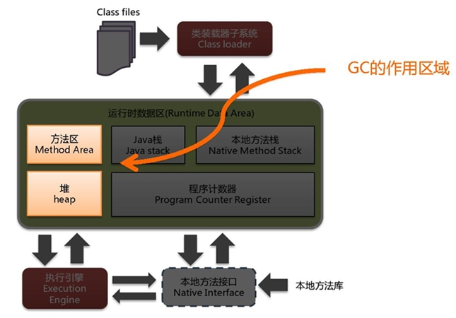

## 概述

垃圾收集，不是Java语言的伴生产物。早在1960年，第一门开始使用内存动态分配和垃圾收集技术的Lisp语言诞生。

关于垃圾收集有三个经典问题：

- 哪些内存需要回收？
- 什么时候回收？
- 如何回收？

垃圾收集机制是Java的招牌能力，极大地提高了开发效率。如今，垃圾收集几乎成为现代语言的标配，即使经过如此长时间的发展，Java的垃圾收集机制仍然在不断的演进中，不同大小的设备、不同特征的应用场景，对垃圾收集提出了新的挑战，这当然也是面试的热点。 

### 面试题

- 讲讲JVM的gc  (携程)
- GC是什么？为什么要有GC？ (蚂蚁金服)
- 垃圾回收的优点和原理。  (蚂蚁金服)
- 垃圾回收机制等 (支付宝)
- GC回收的是哪部分的垃圾？（vivo）
- 垃圾回收的优点和原理？基本原理是什么？（瓜子）
- GC是什么？为什么要有GC？ (美团)
- 简述Java垃圾回收机制  (美团)
- 垃圾回收的优点和原理。(美团)

 ### 什么是垃圾？

什么是垃圾（ Garbage) 呢？

垃圾是指在运行程序中没有任何指针指向的对象，这个对象就是需要被回收的垃圾。

外文：An object is considered garbage when it can no longer be reached from any pointer in the running program.

如果不及时对内存中的垃圾进行清理，那么，这些垃圾对象所占的内存空间会一直保留到应用程序结束，被保留的空间无法被其他对象使用。甚至可能导致内存溢出。

 ### 为什么需要GC?

对于高级语言来说，一个基本认知是如果不进行垃圾回收，内存迟早都会被消耗完，因为不断地分配内存空间而不进行回收，就好像不停地生产生活垃圾而从来不打扫一样。

除了释放没用的对象，垃圾回收也可以清除内存里的记录碎片。碎片整理将所占用的堆内存移到堆的一端，以便 JVM 将整理出的内存分配给新的对象。

随着应用程序所应付的业务越来越庞大、复杂，用户越来越多，没有GC就不能保证应用程序的正常进行。而经常造成STW的GC又跟不上实际的需求，所以才会不断地尝试对GC进行优化。

另一方面：
对于Java开发人员而言，自动内存管理就像是一个黑匣子，如果过度依赖于“自动”，那么这将会是一场灾难，最严重的就会弱化Java开发人员在程序出现内存溢出时定位问题和解决问题的能力。

此时，了解JVM的自动内存分配和内存回收原理就显得非常重要，只有在真正了解JVM是如何管理内存后，我们才能够在遇见OutOfMemoryError时，快速地根据错误异常日志定位问题和解决问题。

当需要排查各种内存溢出、内存泄漏问题时，当垃圾收集成为系统达到更高并发量的瓶颈时，我们就必须对这些“自动化”的技术实施必要的监控和调节。

### Java中垃圾回收的重点区域是？

- 垃圾回收器可以对年轻代回收，也可以对老年代回收，甚至是全堆和方法区的回收.其中，ava堆是垃圾收集器的工作重点。

- 从次数上讲：
  - 频繁收集Young区
  - 较少收集Old区
  - 基本不动Perm区（或元空间）

