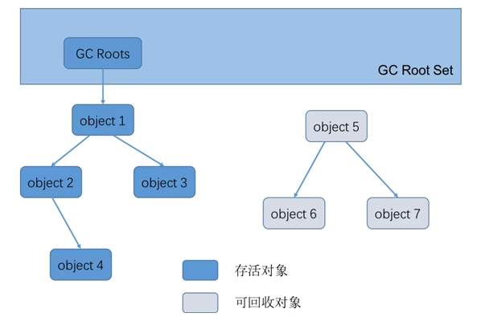
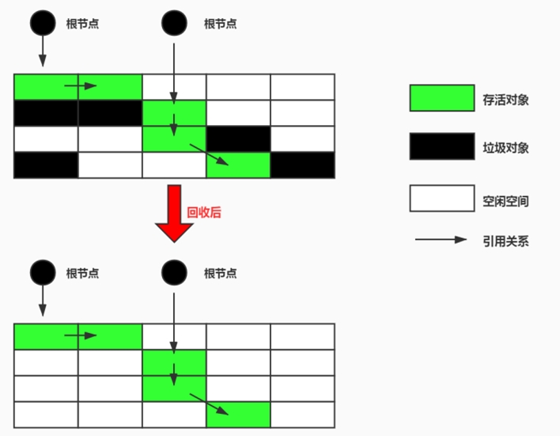
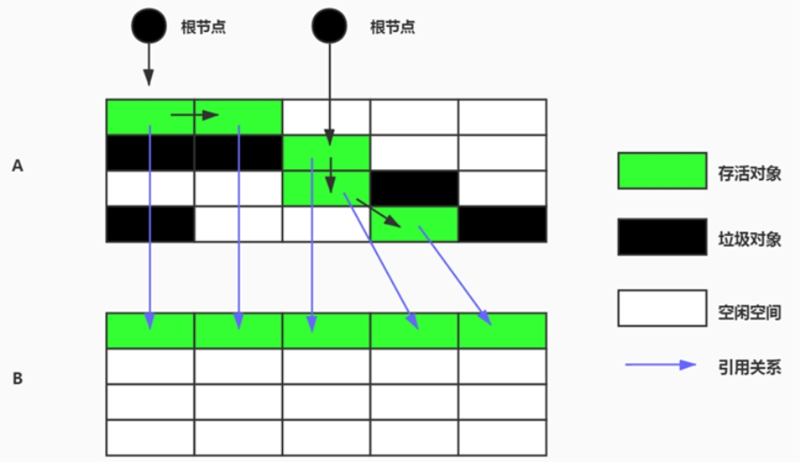
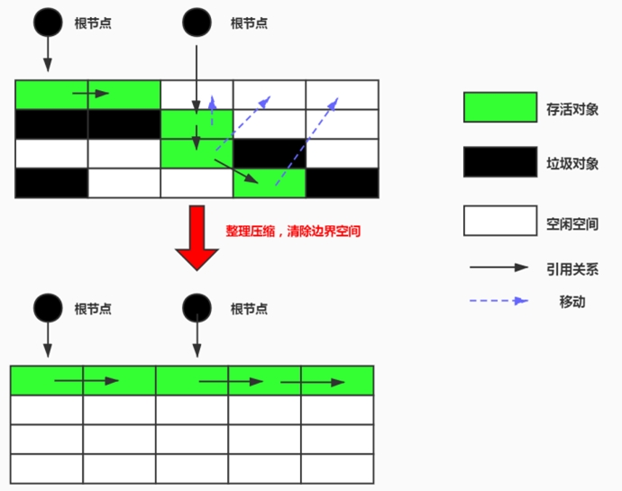
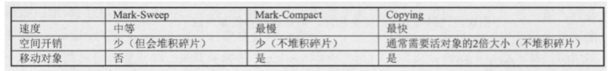

## 垃圾判别阶段算法

在堆里存放着几乎所有的java对象实例，在GC 执行垃圾回收之前，首先需要区分出内存中哪些是存活对象，哪些是已经死亡的对象。只有被标记为己经死亡的对象， GC 才会在执行垃圾回收时，释放掉其所占用的内存空间， 因此这个过程我们可以称为垃圾标记阶段。

那么在JVM中究竟是如何标记一个死亡对象呢？

简单来说，当一个对象已经不再被任何的存活对象继续引用时，就可以宣判为已经死亡。

### 引用计数算法

引用计数算法(Reference Counting)比较简单，对每个对象保存一个整型的引用计数器属性。用于记录对象被引用的情况。

#### 原理

对于一个对象A，只要有任何一个对象引用了A ，则A 的引用计数器就加1，当引用失效时，引用计数器就减1。只要对象A 的引用计数器的值为0，即表示对象A不可能再被使用，可进行回收。

#### 优缺点

优点：实现简单，垃圾对象便于辨识；判定效率高，回收没有延迟性。

缺点：

缺点1：它需要单独的字段存储计数器，这样的做法增加了存储空间的开销。

缺点2：每次赋值都需要更新计数器，伴随着加法和减法操作，这增加了时间开销。

缺点3：引用计数器有一个严重的问题，即无法处理循环引用的情况。这是一条致命缺陷，导致在Java 的垃圾回收器中没有使用这类算法。

### 可达性分析算法

- 相对于引用计数算法而言，可达性分析算法不仅同样具备实现简单和执行高效等特点，更重要的是该算法可以有效地解决在引用计数算法中循环引用的问题，防止内存泄漏的发生。

- 相较于引用计数算法，这里的可达性分析就是Java、C#选择的。这种类型的垃圾收集通常也叫作追踪性垃圾收集（Tracing Garbage Collection）。

#### 原理与基本思路

其原理简单来说，就是将对象及其引用关系看作一个图，选定活动的对象作为 GC Roots，然后跟踪引用链条，如果一个对象和GC Roots之间不可达，也就是不存在引用链条，那么即可认为是可回收对象。

基本思路：

- 可达性分析算法是以根对象集合(GC Roots)为起始点，按照从上至下的方式搜索被根对象集合所连接的目标对象是否可达。
- 使用可达性分析算法后，内存中的存活对象都会被根对象集合直接或间接连接着，搜索所走过的路径称为引用链(Reference Chain)
- 如果目标对象没有任何引用链相连，则是不可达的，就意味着该对象己经死亡，可以标记为垃圾对象。
- 在可达性分析算法中，只有能够被根对象集合直接或者间接连接的对象才是存活对象。

### 优点

实现简单，执行高效 ，有效的解决循环引用的问题，防止内存泄漏。

### GC Roots

在Java 语言中， GC Roots 包括以下几类元素：

- 虚拟机栈中引用的对象

  比如：各个线程被调用的方法中使用到的参数、局部变量等。

- 本地方法栈内JNI(通常说的本地方法)引用的对象

- 类静态属性引用的对象

  比如：Java类的引用类型静态变量

- 方法区中常量引用的对象

  比如：字符串常量池（String Table）里的引用

- 所有被同步锁synchronized持有的对象

- Java虚拟机内部的引用。

  基本数据类型对应的Class对象，一些常驻的异常对象（如：NullPointerException、OutOfMemoryError），系统类加载器。

- 反映java虚拟机内部情况的JMXBean、JVMTI中注册的回调、本地代码缓存等。

- 除了这些固定的GC Roots集合以外，根据用户所选用的垃圾收集器以及当前回收的内存区域不同，还可以有其他对象“临时性”地加入，共同构成完整GC Roots集合。比如：分代收集和局部回收（Partial GC）。

- 如果只针对Java堆中的某一块区域进行垃圾回收（比如：典型的只针对新生代），必须考虑到内存区域是虚拟机自己的实现细节，更不是孤立封闭的，这个区域的对象完全有可能被其他区域的对象所引用，这时候就需要一并将关联的区域对象也加入GC Roots集合中去考虑，才能保证可达性分析的准确性。

- 小技巧：

  由于Root 采用栈方式存放变量和指针，所以如果一个指针，它保存了堆内存里面的对象，但是自己又不存放在堆内存里面，那它就是一个Root 。

 #### 面试题

- Java GC机制？GC Roots有哪些？ (拼多多)
- JVM怎样判断一个对象是否可回收，怎样的对象才能作为GC root  (腾讯)
- Java GC机制？GC Roots有哪些？ (字节跳动)
- 哪些部分可以作为GC Root？ (字节跳动)
- Java GC机制？GC Roots有哪些？ (抖音)
- Java GC机制？GC Roots有哪些？ (京东)
- GC root如何确定，哪些对象可以作为GC Root?  (美团)

### 注意点

如果要使用可达性分析算法来判断内存是否可回收，那么分析工作必须在一个能保障一致性的快照中进行。这点不满足的话分析结果的准确性就无法保证。

这点也是导致GC进行时必须“Stop The World”的一个重要原因。

即使是号称（几乎）不会发生停顿的CMS收集器中，枚举根节点时也是必须要停顿的。

## 垃圾清除阶段算法

当成功区分出内存中存活对象和死亡对象后， GC 接下来的任务就是执行垃圾回收，释放掉无用对象所占用的内存空间，以便有足够的可用内存空间为新对象分配内存。目前在JVM中比较常见的三种垃圾收集算法是 标记－清除算法（ Mark-Sweep ）、复制算法（ Copying ）、标记 - 压缩算法（ Mark-Compact ） 

### 标记-清除算法（Mark - Sweep）

**背景：**

标记 - 清除算法（ Mark-Sweep ）是一种非常基础和常见的垃圾收集算法，该算法被J.McCarthy等人在1960年提出并并应用于Lisp语言。

**执行过程：**

当堆中的有效内存空间（available memory）被耗尽的时候，就会停止整个程序（也被称为stop the world），然后进行两项工作，第一项则是标记，第二项则是清除。 

标记：Collector从引用根节点开始遍历，标记所有被引用的对象。一般是在对象的Header中记录为可达对象。

清除：Collector对堆内存从头到尾进行线性的遍历，如果发现某个对象在其Header中没有标记为可达对象，则将其回收。

（很多书、视频讲错了！说是标记的垃圾对象。这里要注意了！）

#### 缺点

1、效率比较低：递归与全堆对象遍历两次

2、在进行GC的时候，需要停止整个应用程序，导致用户体验差

3、这种方式清理出来的空闲内存是不连续的，产生内存碎片。

注意：何为清除?

这里所谓的清除并不是真的置空，而是把需要清除的对象地址保存在空闲的地址列表里。下次有新对象需要加载时，判断垃圾的位置空间是否够，如果够，就存放。

### 复制算法

核心思想：

将活着的内存空间分为两块，每次只使用其中一块，在垃圾回收时将正在使用的内存中的存活对象复制到未被使用的内存块中，之后清除正在使用的内存块中的所有对象，交换两个内存的角色，最后完成垃圾回收。

 

 #### 优缺点

**优点：**

没有标记和清除过程，实现简单，运行高效

复制过去以后保证空间的连续性，不会出现“碎片”问题。

**缺点：**

此算法的缺点也是很明显的，就是需要**两倍的内存空间**。

对于G1这种分拆成为大量region的GC，**复制而不是移动**，意味着GC需要维护region之间对象引用关系，不管是内存占用或者时间开销也不小。 

特别的：

如果系统中的存活对象很多，复制算法不会很理想。因为复制算法需要复制的存活对象数量并不会太大,或者说非常低才行。

 #### 应用场景

在新生代，对常规应用的垃圾回收，一次通常可以回收70%-99%的内存空间。回收性价比很高。所以现在的商业虚拟机都是用这种收集算法回收新生代。

## 标记-压缩（或标记-整理、Mark - Compact）算法

**背景：**

复制算法的高效性是建立在存活对象少、垃圾对象多的前提下的。这种情况在新生代经常发生，但是在老年代，更常见的情况是大部分对象都是存活对象。如果依然使用复制算法，由于存活对象较多，复制的成本也将很高。因此，基于老年代垃圾回收的特性，需要使用其他的算法。

标记－清除算法的确可以应用在老年代中，但是该算法不仅执行效率低下，而且在执行完内存回收后还会产生内存碎片，所以JVM 的设计者需要在此基础之上进行改进。标记 - 压缩（Mark - Compact）算法由此诞生。

**执行过程：**

第一阶段和标记-清除算法一样，从根节点开始标记所有被引用对象

第二阶段将所有的存活对象压缩到内存的一端，按顺序排放。

之后， 清理边界外所有的空间。

标记-压缩算法的最终效果等同于标记-清除算法执行完成后，再进行一次内存碎片整理，因此，也可以把它称为标记-清除-压缩(Mark-Sweep-Compact)算法。 

二者的本质差异在于标记-清除算法是一种非移动式的回收算法，标记-压缩是移动式的。是否移动回收后的存活对象是一项优缺点并存的风险决策。

可以看到，标记的存活对象将会被整理，按照内存地址依次排列，而未被标记的内存会被清理掉。如此一来，当我们需要给新对象分配内存时，JVM只需要持有一个内存的起始地址即可，这比维护一个空闲列表显然少了许多开销。 

 #### 指针碰撞（Bump the Pointer）

如果内存空间以规整和有序的方式分布，即已用和未用的内存都各自一边，彼此之间维系着一个记录下一次分配起始点的标记指针，当为新对象分配内存时，只需要通过修改指针的偏移量将新对象分配在第一个空闲内存位置上，这种分配方式就叫做指针碰撞（Bump the Pointer）。

#### 优缺点

优点：（此算法消除了“标记-清除”和“复制”两个算法的弊端。）

- 消除了标记/清除算法当中，内存区域分散的缺点，我们需要给新对象分配内存时，JVM只需要持有一个内存的起始地址即可。
- 消除了复制算法当中，内存减半的高额代价。

缺点：

- 从效率上来说，标记-压缩算法要低于复制算法。
  - 效率不高，不仅要标记所有存活对象，还要整理所有存活对象的引用地址。
  - 对于老年代每次都有大量对象存活的区域来说，极为负重。
- 移动对象的同时，如果对象被其他对象引用，则还需要调整引用的地址。
- 移动过程中，需要全程暂停用户应用程序。即：STW

### 分代收集算法

三种算法的对比：

效率上来说，复制算法是当之无愧的老大，但是却浪费了太多内存。
而为了尽量兼顾上面提到的三个指标，标记-整理算法相对来说更平滑一些，但是效率上不尽如人意，它比复制算法多了一个标记的阶段，比标记-清除多了一个整理内存的阶段。

分代收集算法，是基于这样一个事实：不同的对象的生命周期是不一样的。因此，不同生命周期的对象可以采取不同的收集方式，以便提高回收效率。一般是把Java堆分为新生代和老年代，这样就可以根据各个年代的特点使用不同的回收算法，以提高垃圾回收的效率。

在Java程序运行的过程中，会产生大量的对象，其中有些对象是与业务信息相关，比如Http请求中的Session对象、线程、Socket连接，这类对象跟业务直接挂钩，因此生命周期比较长。但是还有一些对象，主要是程序运行过程中生成的临时变量，这些对象生命周期会比较短，比如：String对象，由于其不变类的特性，系统会产生大量的这些对象，有些对象甚至只用一次即可回收。

#### 面试题

- JVM的垃圾回收为什么采用分代GC。跟语言有关系吗？（阿里-钉钉）
- 分代的意义说一下 （阿里-钉钉）
- GC分代算法（花旗银行）
- 说一下gc算法，分代回收说下  (百度)
- Java怎么进行垃圾回收的？什么对象会进老年代？ 垃圾回收算法有哪些？为什么新生代使用复制算法？ (京东)
- 分代垃圾回收过程？ (美团)
- GC如何分代的？各代用什么算法回收？  (美团)

#### 分析

目前几乎所有的GC都是采用分代收集（Generational Collecting）算法执行垃圾回收的。

在HotSpot中，基于分代的概念，GC所使用的内存回收算法必须结合年轻代和老年代各自的特点。

- **年轻代(Young Gen)**

  年轻代特点：区域相对老年代较小，对象生命周期短、存活率低，回收频繁。

  这种情况复制算法的回收整理，速度是最快的。复制算法的效率只和当前存活对象大小有关，因此很适用于年轻代的回收。而复制算法内存利用率不高的问题，通过hotspot中的两个survivor的设计得到缓解。

- 老年代(Tenured Gen)

  老年代特点：区域较大，对象生命周期长、存活率高，回收不及年轻代频繁。

  这种情况存在大量存活率高的对象，复制算法明显变得不合适。一般是由标记-清除或者是标记-清除与标记-整理的混合实现。

  Mark阶段的开销与存活对象的数量成正比。

  Sweep阶段的开销与所管理区域的大小成正相关。

  Compact阶段的开销与存活对象的数据成正比。

以HotSpot中的CMS回收器为例，CMS是基于Mark-Sweep实现的，对于对象的回收效率很高。而对于碎片问题，CMS采用基于Mark-Compact算法的Serial Old回收器作为补偿措施：当内存回收不佳（碎片导致的Concurrent Mode Failure时），将采用Serial Old执行Full GC以达到对老年代内存的整理。

分代的思想被现有的虚拟机广泛使用。几乎所有的垃圾回收器都区分新生代和老年代。

### 增量收集算法

上述现有的算法，在垃圾回收过程中，应用软件将处于一种Stop the World 的状态。在Stop the World 状态下，应用程序所有的线程都会挂起，暂停一切正常的工作，等待垃圾回收的完成。如果垃圾回收时间过长，应用程序会被挂起很久，将严重影响用户体验或者系统的稳定性。为了解决这个问题，即对实时垃圾收集算法的研究直接导致了增量收集（Incremental Collecting）算法的诞生。

**基本思想**

如果一次性将所有的垃圾进行处理，需要造成系统长时间的停顿，那么就可以让垃圾收集线程和应用程序线程交替执行。每次，垃圾收集线程只收集一小片区域的内存空间，接着切换到应用程序线程。依次反复，直到垃圾收集完成。

总的来说，增量收集算法的基础仍是传统的标记-清除和复制算法。增量收集算法通过对线程间冲突的妥善处理，允许垃圾收集线程以分阶段的方式完成标记、清理或复制工作。

####  缺点

使用这种方式，由于在垃圾回收过程中，间断性地还执行了应用程序代码，所以能减少系统的停顿时间。但是，因为线程切换和上下文转换的消耗，会使得垃圾回收的总体成本上升，造成系统吞吐量的下降。

### 分区算法

G1 GC使用的算法

分代算法将按照对象的生命周期长短划分成两个部分，分区算法将整个堆空间划分成连续的不同小区间。

每一个小区间都独立使用，独立回收。这种算法的好处是可以控制一次回收多少个小区间。

一般来说，在相同条件下，堆空间越大，一次GC时所需要的时间就越长，有关GC产生的停顿也越长。为了更好地控制GC产生的停顿时间，将一块大的内存区域分割成多个小块，根据目标的停顿时间，每次合理地回收若干个小区间，而不是整个堆空间，从而减少一次GC所产生的停顿。

 

