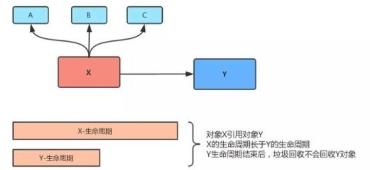
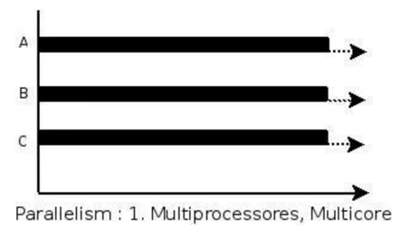
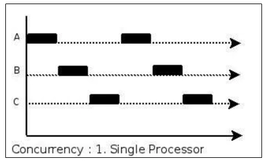
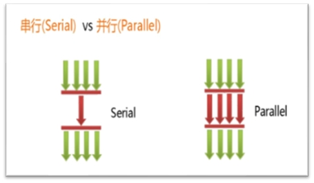
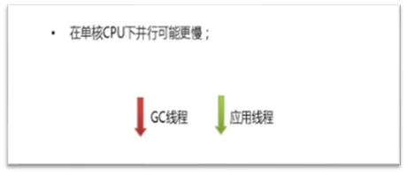

## System.gc()

- 在默认情况下，通过System.gc()或者Runtime.getRuntime().gc()的调用，<font color = 'red'>会显式触发Full GC</font>，同时对老年代和新生代进行回收，尝试释放被丢弃对象占用的内存。

- 然而System.gc()调用附带一个免责声明，无法保证对垃圾收集器的调用。

- JVM实现者可以通过System.gc()调用来决定JVM的GC行为。<font color = 'red'>而一般情况下，垃圾回收应该是自动进行的，无须手动触发，否则就太过于麻烦了</font>。在一些特殊情况下，如我们正在编写一个性能基准，我们可以在运行之间调用System.gc()。

### 面试题

System.gc()和Runtime.getRunTime().gc()会做什么事情？  (字节跳动)

##内存泄漏与内存溢出

### 面试题

- 什么是内存泄漏和什么是内存溢出 (陌陌)
- Java存在内存泄漏吗，内存泄漏的场景有哪些，如何避免(百度)
- Java 中会存在内存泄漏吗，简述一下？(猎聘)
- 内存泄漏是怎么造成的？(拼多多、字节跳动)
- 内存泄漏与内存溢出的区别  (字节跳动)
- Java存在内存溢出的现象吗  (字节跳动)
- Java中会存在内存泄漏吗，请简单描述。   (美团)  

### 内存溢出

- 内存溢出相对于内存泄漏来说，尽管更容易被理解，但是同样的，内存溢出也是引发程序崩溃的罪魁祸首之一。
- 由于GC一直在发展，所有一般情况下，除非应用程序占用的内存增长速度非常快，造成<font color = 'red'>垃圾回收已经跟不上内存消耗的速度</font>，否则不太容易出现OOM的情况。
- 大多数情况下，GC会进行各种年龄段的垃圾回收，实在不行了就放大招，来一次独占式的Full GC操作，这时候会回收大量的内存，供应用程序继续使用。
- javadoc中对OutOfMemoryError的解释是，没有空闲内存，并且垃圾收集器也无法提供更多内存。

#### 内存不够的原因？

首先说没有空闲内存的情况：说明Java虚拟机的堆内存不够。原因有二：

（1）Java虚拟机的堆内存设置不够。

比如：可能存在内存泄漏问题；也很有可能就是堆的大小不合理，比如我们要处理比较可观的数据量，但是没有显式指定JVM堆大小或者指定数值偏小。我们可以通过参数-Xms、-Xmx来调整。

（2）代码中创建了大量大对象，并且长时间不能被垃圾收集器收集（存在被引用）

对于老版本的Oracle JDK，因为永久代的大小是有限的，并且JVM对永久代垃圾回收（如，常量池回收、卸载不再需要的类型）非常不积极，所以当我们不断添加新类型的时候，永久代出现OutOfMemoryError也非常多见，尤其是在运行时存在大量动态类型生成的场合；类似intern字符串缓存占用太多空间，也会导致OOM问题。对应的异常信息， 会标记出来和永久代相关：“java.lang.OutOfMemoryError: PermGen space”。

随着元数据区的引入，方法区内存已经不再那么窘迫，所以相应的OOM有所改观，出现OOM，异常信息则变成了：“java.lang.OutOfMemoryError: Metaspace”。直接内存不足，也会导致OOM。

#### OOM前必有GC?

- 这里面隐含着一层意思是，在抛出OutOfMemoryError之前，通常垃圾收集器会被触发，尽其所能去清理出空间。
  - 例如：在引用机制分析中，涉及到JVM会去尝试回收<font color = 'red'>软引用指向的对象等。</font>
  - 在java.nio.BIts.reserveMemory()方法中，我们能清楚的看到，System.gc()会被调用，以清理空间。

- 当然，<font color = 'red'>也不是在任何情况下垃圾收集器都会被触发的</font>
  - 比如，我们去分配一个超大对象，类似一个超大数组超过堆的最大值，JVM可以判断出垃圾收集并不能解决这个问题，所以直接抛出OutOfMemoryError。

### 内存泄漏(Memory Leak)

也称作“存储渗漏”。严格来说，<font color = 'blue'>只有对象不会再被程序用到了，但是GC又不能回收他们的情况，才叫内存泄漏。</font>

但实际情况很多时候一些不太好的实践（或疏忽）会导致对象的生命周期变得很长甚至导致OOM，也可以叫做<font color = 'red'>宽泛意义上的“内存泄漏”。</font>

尽管内存泄漏并不会立刻引起程序崩溃，但是一旦发生内存泄漏，程序中的可用内存就会被逐步蚕食，直至耗尽所有内存，最终出现OutOfMemory异常，导致程序崩溃。

注意，这里的存储空间并不是指物理内存，而是指虚拟内存大小，这个虚拟内存大小取决于磁盘交换区设定的大小。

#### 内存泄漏（memory leak）的理解

严格来说，只有对象不会再被程序用到了，但是GC又不能回收他们的情况，才叫内存泄漏。

但实际情况很多时候一些不太好的实践（或疏忽）会导致对象的生命周期变得很长甚至导致OOM，也可以叫做宽泛意义上的“内存泄漏”。



对象 X 引用对象 Y，X 的生命周期比 Y 的生命周期长；

那么当Y生命周期结束的时候，X依然引用着Y，这时候，垃圾回收期是不会回收对象Y的；
如果对象X还引用着生命周期比较短的A、B、C，对象A又引用着对象 a、b、c，这样就可能造成大量无用的对象不能被回收，进而占据了内存资源，造成内存泄漏，直到内存溢出。

#### Java中内存泄漏的8种情况

**1- 静态集合类**

静态集合类，如HashMap、LinkedList等等。如果这些容器为静态的，那么它们的生命周期与JVM程序一致，则容器中的对象在程序结束之前将不能被释放，从而造成内存泄漏。简单而言，<font color = 'red'>长生命周期的对象持有短生命周期对象的引用，尽管短生命周期的对象不再使用，但是因为长生命周期对象持有它的引用而导致不能被回收。</font>

```java
public class MemoryLeak {
    static List list = new ArrayList();

    public void oomTests() {
        Object obj = new Object();//局部变量
        list.add(obj);
    }
}
```

**2- 单例模式**

单例模式，和静态集合导致内存泄露的原因类似，因为单例的静态特性，它的生命周期和 JVM 的生命周期一样长，所以如果单例对象如果持有外部对象的引用，那么这个外部对象也不会被回收，那么就会造成内存泄漏。

 **3- 内部类持有外部类**

内部类持有外部类，如果一个外部类的实例对象的方法返回了一个内部类的实例对象。
这个内部类对象被长期引用了，即使那个外部类实例对象不再被使用，但由于<font color = 'red'>内部类持有外部类的实例对象，这个外部类对象将不会被垃圾回收</font>，这也会造成内存泄漏。

**4- 各种连接，如数据库连接、网络连接和IO连接等**

在对数据库进行操作的过程中，首先需要建立与数据库的连接，当不再使用时，需要调用close方法来释放与数据库的连接。只有连接被关闭后，垃圾回收器才会回收对应的对象。否则，如果在访问数据库的过程中，对Connection、Statement或ResultSet不显性地关闭，将会造成大量的对象无法被回收，从而引起内存泄漏。

```java
public static void main(String[] args) {
    try {
        Connection conn = null;
        Class.forName("com.mysql.jdbc.Driver");
        conn = DriverManager.getConnection("url", "", "");
        Statement stmt = conn.createStatement();
        ResultSet rs = stmt.executeQuery("....");
    } catch (Exception e) { //异常日志
    
    } finally {   
        //1.关闭结果集 Statement   
        // 2.关闭声明的对象 ResultSet   
        // 3.关闭连接 Connection
    }
}
```

**5- 变量不合理的作用域**

变量不合理的作用域。一般而言，一个变量的定义的作用范围大于其使用范围，很有可能会造成内存泄漏。另一方面，如果没有及时地把对象设置为null，很有可能导致内存泄漏的发生。

```java
public class UsingRandom {
     private String msg;
     public void receiveMsg(){
        //private String msg;
        readFromNet();// 从网络中接受数据保存到msg中
        saveDB();// 把msg保存到数据库中
        //msg = null;
     }
}
```

如上面这个伪代码，通过readFromNet方法把接受的消息保存在变量msg中，然后调用saveDB方法把msg的内容保存到数据库中，此时msg已经就没用了，由于msg的生命周期与对象的生命周期相同，此时msg还不能回收，因此造成了内存泄漏。

实际上这个msg变量可以放在receiveMsg方法内部，当方法使用完，那么msg的生命周期也就结束，此时就可以回收了。还有一种方法，在使用完msg后，把msg设置为null，这样垃圾回收器也会回收msg的内存空间。

#### 6- 改变哈希值

改变哈希值，当一个对象被存储进HashSet集合中以后，就不能修改这个对象中的那些参与计算哈希值的字段了。

否则，对象修改后的哈希值与最初存储进HashSet集合中时的哈希值就不同了，在这种情况下，即使在contains方法使用该对象的当前引用作为的参数去HashSet集合中检索对象，也将返回找不到对象的结果，这也会导致<font color = 'red'>无法从HashSet集合中单独删除当前对象，造成内存泄漏。</font>

这也是 String 为什么被设置成了不可变类型，我们可以放心地把 String 存入 HashSet，或者把 String 当做 HashMap 的 key 值；

**7- 缓存泄漏**

内存泄漏的另一个常见来源是缓存，一旦你把对象引用放入到缓存中，他就很容易遗忘

**8- 监听器和回调**

内存泄漏另一个常见来源是监听器和其他回调，如果客户端在你实现的API中注册回调，却没有显式的取消，那么就会积聚。

需要确保回调立即被当作垃圾回收的最佳方法是只保存它的弱引用，例如将他们保存成为WeakHashMap中的键。

### STW

Stop-the-World ，简称STW，指的是GC事件发生过程中，会产生应用程序的停顿。停顿产生时整个应用程序线程都会被暂停，没有任何响应，有点像卡死的感觉，这个停顿称为STW。

<font color = 'red'>可达性分析算法中枚举根节点（GC Roots）会导致所有Java执行线程停顿。</font>

- 分析工作必须在一个能确保一致性的快照中进行
- 一致性指整个分析期间整个执行系统看起来像被冻结在某个时间点上
- 如果出现分析过程中对象引用关系还在不断变化，则分析结果的准确性无法保证

被STW中断的应用程序线程会在完成GC之后恢复，频繁中断会让用户感觉像是网速不快造成电影卡带一样，所以我们需要减少STW的发生。

STW事件和采用哪款GC无关，所有的GC都有这个事件。

哪怕是G1也不能完全避免Stop-the-world 情况发生，只能说垃圾回收器越来越优秀，回收效率越来越高，尽可能地缩短了暂停时间。

STW是JVM在后台自动发起和自动完成的。在用户不可见的情况下，把用户正常的工作线程全部停掉。

开发中不要用System.gc();会导致Stop-the-world的发生。

 ### 垃圾回收的并行与并发

并发和并行，在谈论垃圾收集器的上下文语境中，它们可以解释如下： 

- 并行（Parallel）：指多条垃圾收集线程并行工作，但此时用户线程仍处于等待状态。

  如ParNew、Parallel Scavenge、Parallel Old；

  
  当系统有一个以上CPU时，<font color = 'blue'>当一个CPU执行一个进程时，另一个CPU可以执行另一个进程，两个进程互不抢占CPU资源</font>，可以同时进行，我们称之为并行(Parallel)。

  其实决定并行的因素不是CPU的数量，而是CPU的核心数量，比如一个CPU多个核也可以并行。

  适合科学计算，后台处理等弱交互场景

- 串行（Serial）

  相较于并行的概念，单线程执行。

  如果内存不够，则程序暂停，启动jvm垃圾回收器进行垃圾回收。回收完，再启动程序的线程。

- 并发（Concurrent）：指用户线程与垃圾收集线程同时执行（但不一定是并行的，可能会交替执行），垃圾回收线程在执行时不会停顿用户程序的运行。

  用户程序在继续运行，而垃圾收集程序线程运行于另一个CPU上； 

  如：CMS、G1

  

  在操作系统中，是指<font color = 'blue'>一个时间段中</font>有几个程序都处于已启动运行到运行完毕之间，且这几个程序都是在<font color = 'blue'>同一个处理器上</font>运行。

  并发不是真正意义上的“同时进行”，只是CPU把一个时间段划分成几个时间片段(时间区间)，然后在这几个时间区间之间来回切换，由于CPU处理的速度非常快，只要时间间隔处理得当，即可让用户感觉是多个应用程序同时在进行。

#### 并行与并发对比

并发，**指的是多个事情**，在<font color = 'red'>**同一时间段**内同时发生了。 </font>

并行，**指的是多个事情**，在<font color = 'red'>**同一时间点**上同时发生了。</font>


并发的多个任务之间是互相抢占资源的。 

并行的多个任务之间是不互相抢占资源的。


只有在多CPU或者一个CPU多核的情况中，才会发生并行。否则，看似同时发生的事情，其实都是并发执行的。

并发和并行，在谈论垃圾收集器的上下文语境中，它们可以解释如下： 

并行（Parallel）：指多条垃圾收集线程并行工作，但此时用户线程仍处于等待状态。如ParNew、Parallel Scavenge、Parallel Old；

串行（Serial）:相较于并行的概念，单线程执行。

如果内存不够，则程序暂停，启动JVM垃圾回收器进行垃圾回收。回收完，再启动程序的线程。





并发（Concurrent）：指<font color = 'red'>用户线程与垃圾收集线程同时执行</font>（但不一定是并行的，可能会交替执行），垃圾回收线程在执行时不会停顿用户程序的运行。

用户程序在继续运行，而垃圾收集程序线程运行于另一个CPU上； 如：CMS、G1


### 4种引用

- <font color = 'blue'>强引用（StrongReference）</font>：最传统的“引用”的定义，是指在程序代码之中普遍存在的引用赋值，即类似“Object obj=new Object()”这种引用关系。<font color = 'red'>无论任何情况下，只要强引用关系还存在，垃圾收集器就永远不会回收掉被引用的对象。  </font>  
- <font color = 'blue'>软引用（SoftReference）</font>：在系统将要发生内存溢出之前，将会把这些对象列入回收范围之中进行第二次回收。如果这次回收后还没有足够的内存，才会抛出内存溢出异常。  
- <font color = 'blue'>弱引用（WeakReference）</font>：被弱引用关联的对象只能生存到下一次垃圾收集之前。当垃圾收集器工作时，无论内存空间是否足够，都会回收掉被弱引用关联的对象。  
- <font color = 'blue'>虚引用（PhantomReference）</font>：一个对象是否有虚引用的存在，完全不会对其生存时间构成影响，也无法通过虚引用来获得一个对象的实例。为一个对象设置虚引用关联的<font color = 'red'>唯一目的就是能在这个对象被收集器回收时收到一个系统通知。</font>


 
