## GC分类

### 串行vs并行

- 按**线程数分**，可以分为串行垃圾回收器和并行垃圾回收器。

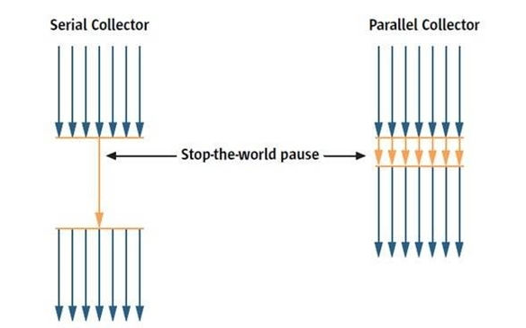

- 串行回收指的是在同一时间段内只允许有一个CPU用于执行垃圾回收操作，此时工作线程被暂停，直至垃圾收集工作结束。
  - 在诸如单CPU处理器或者较小的应用内存等硬件平台不是特别优越的场合，串行回收器的性能表现可以超过并行回收器和并发回收器。所以，串行回收默认被应用在客户端的Client模式下的JVM中
  - 在并发能力比较强的CPU上，并行回收器产生的停顿时间要短于串行回收器。
    和串行回收相反，并行收集可以运用多个CPU同时执行垃圾回收，因此提升了应用的吞吐量，不过并行回收仍然与串行回收一样，采用独占式，使用了“Stop-the-world”机制。

### 并发式vs独占式

按照**工作模式分**，可以分为并发式垃圾回收器和独占式垃圾回收器。

- 并发式垃圾回收器与应用程序线程交替工作，以尽可能减少应用程序的停顿时间。
- 独占式垃圾回收器(Stop the world)一旦运行，就停止应用程序中的所有用户线程，直到垃圾回收过程完全结束。

 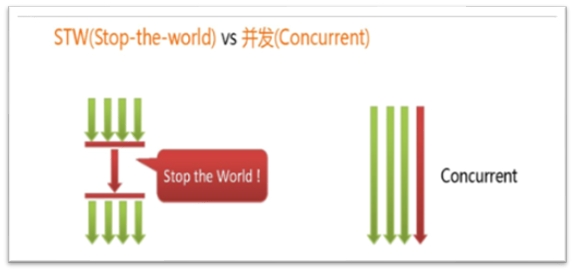

### 压缩式vs非压缩式

- 按**碎片处理方式分**，可分为压缩式垃圾回收器和非压缩式垃圾回收器。

- 压缩式垃圾回收器会在回收完成后，对存活对象进行压缩整理，消除回收后的碎片。

  再分配对象空间使用：指针碰撞

- 非压缩式的垃圾回收器不进行这步操作。

  再分配对象空间使用：空闲列表

### 年轻代vs老年代

按**工作的内存区间分**，又可分为年轻代垃圾回收器和老年代垃圾回收器。

## GC评估指标

吞吐量：程序的运行时间（程序的运行时间＋内存回收的时间）。

垃圾收集开销：吞吐量的补数，垃圾收集器所占时间与总时间的比例。

暂停时间：执行垃圾收集时，程序的工作线程被暂停的时间。

收集频率：相对于应用程序的执行，收集操作发生的频率。

内存占用： Java 堆区所占的内存大小。

快速： 一个对象从诞生到被回收所经历的时间。

红色的三项共同构成一个“不可能三角”。三者总体的表现会随着技术进步而越来越好。一款优秀的收集器通常最多同时满足其中的两项。

这三项里，暂停时间的重要性日益凸显。因为随着硬件发展，内存占用多些越来越能容忍，硬件性能的提升也有助于降低收集器运行时对应用程序的影响，即提高了吞吐量。而内存的扩大，对延迟反而带来负面效果。

简单来说，主要抓住两点：

吞吐量 --->吞吐量越大越好！

暂停时间（或响应时间） --> 追求低延迟

### 吞吐量

评估GC的性能指标：吞吐量(throughput)

- 吞吐量就是CPU用于运行用户代码的时间与CPU总消耗时间的比值，即吞吐量 = 运行用户代码时间 /（运行用户代码时间 + 垃圾收集时间）。

  比如：虚拟机总共运行了100分钟，其中垃圾收集花掉1分钟，那吞吐量就是99%。

- 这种情况下，应用程序能容忍较高的暂停时间。因此，高吞吐量的应用程序有更长的时间基准，快速响应是不必考虑的。

吞吐量优先，意味着在单位时间内，STW的时间最短：0.2 + 0.2 = 0.4

 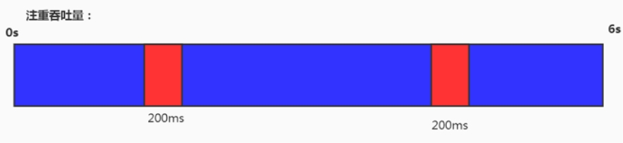

### 暂停时间

评估GC的性能指标：暂停时间(pause time)

- “暂停时间”是指一个时间段内应用程序线程暂停，让GC线程执行的状态
- 例如，GC期间100毫秒的暂停时间意味着在这100毫秒期间内没有应用程序线程是活动的。
- 暂停时间优先，意味着尽可能让单次STW的时间最短：0.1 + 0.1 + 0.1 + 0.1 + 0.1 = 0.5

 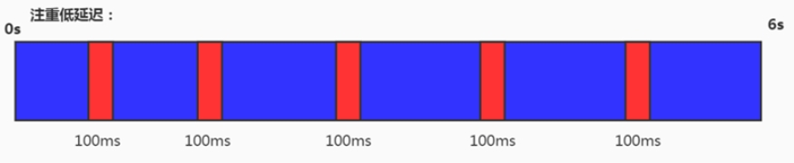

### 小结

评估GC的性能指标：吞吐量vs暂停时间

高吞吐量较好因为这会让应用程序的最终用户感觉只有应用程序线程在做“生产性”工作。直觉上，吞吐量越高程序运行越快。 

低暂停时间（低延迟）较好因为从最终用户的角度来看不管是GC还是其他原因导致一个应用被挂起始终是不好的。这取决于应用程序的类型，有时候甚至短暂的200毫秒暂停都可能打断终端用户体验。因此，具有低的较大暂停时间是非常重要的，特别是对于一个交互式应用程序。

不幸的是”高吞吐量”和”低暂停时间”是一对相互竞争的目标（矛盾）。

因为如果选择以吞吐量优先，那么必然需要降低内存回收的执行频率，但是这样会导致GC需要更长的暂停时间来执行内存回收。

相反的，如果选择以低延迟优先为原则，那么为了降低每次执行内存回收时的暂停时间，也只能频繁地执行内存回收，但这又引起了年轻代内存的缩减和导致程序吞吐量的下降。

在设计（或使用）GC算法时，我们必须确定我们的目标：一个GC算法只可能针对两个目标之一（即只专注于较大吞吐量或最小暂停时间），或尝试找到一个二者的折衷。

现在JVM调优标准：在最大吞吐量优先的情况下，降低停顿时间。

## 垃圾回收器都有哪些

串行回收器：Serial、Serial Old
并行回收器：ParNew、Parallel Scavenge、Parallel Old
并发回收器：CMS、G1

 ### 7种GC组合关系

不同厂商、不同版本的虚拟机实现差别很大。HotSpot虚拟机在JDK7/8后所有收集器及组合（连线），如下图：（更新到了JDK14）

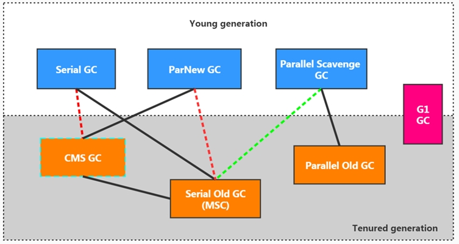

1. 两个收集器间有连线，表明它们可以搭配使用：
Serial/Serial Old、Serial/CMS、ParNew/Serial Old、ParNew/CMS、Parallel Scavenge/Serial Old、Parallel Scavenge/Parallel Old、G1；
2. 其中Serial Old作为CMS出现"Concurrent Mode Failure"失败的后备预案。
3. (红色虚线)由于维护和兼容性测试的成本，在JDK 8时将Serial+CMS、ParNew+Serial Old这两个组合声明为废弃（JEP 173），并在JDK 9中完全取消了这些组合的支持（JEP214），即：移除。
4. (绿色虚线)JDK 14中：弃用Parallel Scavenge和SerialOld GC组合 （JEP 366）
5. (青色虚线)JDK 14中：删除CMS垃圾回收器 （JEP 363）

 ### 为什么这么多GC

为什么要有很多收集器，一个不够吗？因为Java的使用场景很多，移动端，服务器等。所以就需要针对不同的场景，提供不同的垃圾收集器，提高垃圾收集的性能。

虽然我们会对各个收集器进行比较，但并非为了挑选一个最好的收集器出来。没有一种放之四海皆准、任何场景下都适用的完美收集器存在，更加没有万能的收集器。所以我们选择的只是对具体应用最合适的收集器。

### 如何查看默认GC

-  -XX:+PrintCommandLineFlags：查看命令行相关参数（包含使用的垃圾收集器）
- 使用命令行指令：jinfo –flag 相关垃圾回收器参数 进程ID

### Serial GC：串行回收

#### 概述

- Serial收集器是最基本、历史最悠久的垃圾收集器了。JDK1.3之前回收新生代唯一的选择。

- Serial收集器作为HotSpot中Client模式下的默认新生代垃圾收集器。

- Serial 收集器采用复制算法、串行回收和”Stop-the-World”机制的方式执行内存回收。

- 除了年轻代之外，Serial收集器还提供用于执行老年代垃圾收集的Serial Old收集器。Serial Old 收集器同样也采用了串行回收和”Stop the World”机制，只不过内存回收算法使用的是标记-压缩算法。

  - Serial Old是运行在Client模式下默认的老年代的垃圾回收器

  - Serial Old在Server模式下主要有两个用途：① 与新生代的Parallel Scavenge配合使用 ② 作为老年代CMS收集器的后备垃圾收集方案

    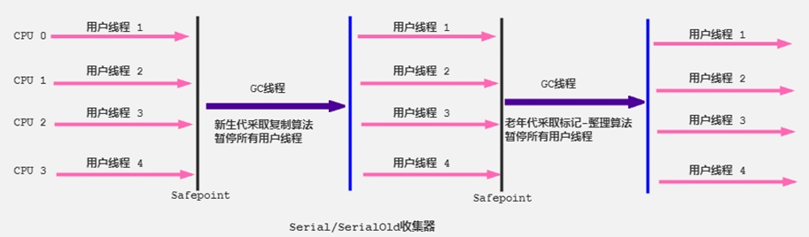

这个收集器是一个单线程的收集器，但它的“单线程”的意义并不仅仅说明它只会使用一个 CPU 或一条收集线程去完成垃圾收集工作，更重要的是在它进行垃圾收集时，必须暂停其他所有的工作线程，直到它收集结束（Stop The World）。

#### 优势

- 优势：简单而高效（与其他收集器的单线程比），对于限定单个 CPU 的环境来说，Serial收集器由于没有线程交互的开销，专心做垃圾收集自然可以获得最高的单线程收集效率。
  - 运行在Client模式下的虚拟机是个不错的选择。

- 在用户的桌面应用场景中，可用内存一般不大（几十MB至一两百MB），可以在较短时间内完成垃圾收集（几十ms至一百多ms）,只要不频繁发生，使用串行回收器是可以接受的。

#### 参数

在HotSpot虚拟机中，使用 -XX:+UseSerialGC 参数可以指定年轻代和老年代都使用串行收集器。

等价于 新生代用Serial GC，且老年代用Serial Old GC

#### 小结

这种垃圾收集器大家了解，现在已经不用串行的了。而且在限定单核cpu才可以用。现在都不是单核的了。

对于交互较强的应用而言，这种垃圾收集器是不能接受的。一般在Java web应用程序中是不会采用串行垃圾收集器的。

### ParNew GC：并行回收

#### 概述

- 如果说Serial GC是年轻代中的单线程垃圾收集器，那么ParNew收集器则是Serial收集器的多线程版本。
  - Par是Parallel的缩写，New：只能处理的是新生代

- ParNew 收集器除了采用并行回收的方式执行内存回收外，两款垃圾收集器之间几乎没有任何区别。ParNew收集器在年轻代中同样也是采用复制算法、"Stop-the-World"机制。

- ParNew 是很多JVM运行在Server模式下新生代的默认垃圾收集器。

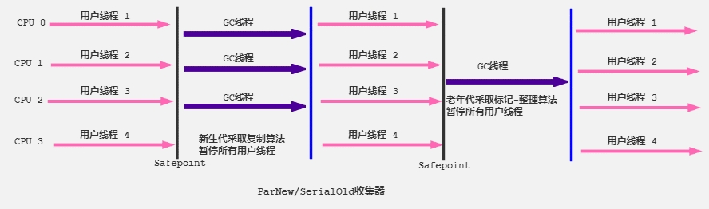

- 对于新生代，回收次数频繁，使用并行方式高效。
- 对于老年代，回收次数少，使用串行方式节省资源。（CPU并行需要切换线程，串行可以省去切换线程的资源）

#### ParNewGC更好吗

由于ParNew收集器是基于并行回收，那么是否可以断定ParNew收集器的回收效率在任何场景下都会比Serial收集器更高效？ 

ParNew 收集器运行在多CPU的环境下，由于可以充分利用多CPU、多核心等物理硬件资源优势，可以更快速地完成垃圾收集，提升程序的吞吐量。

但是在单个CPU的环境下，ParNew收集器不比Serial 收集器更高效。虽然Serial收集器是基于串行回收，但是由于CPU不需要频繁地做任务切换，因此可以有效避免多线程交互过程中产生的一些额外开销。

因为除Serial外，目前只有ParNew GC能与CMS收集器配合工作

#### 参数

- 在程序中，开发人员可以通过选项"-XX:+UseParNewGC"手动指定使用ParNew收集器执行内存回收任务。它表示年轻代使用并行收集器，不影响老年代。
- -XX:ParallelGCThreads 限制线程数量，默认开启和CPU数据相同的线程数。

### Parallel GC：吞吐量优先

#### 概述

HotSpot的年轻代中除了拥有ParNew收集器是基于并行回收的以外，Parallel Scavenge收集器同样也采用了复制算法、并行回收和”Stop the World”机制。

那么Parallel收集器的出现是否多此一举？
和ParNew收集器不同，Parallel Scavenge收集器的目标则是达到一个可控制的吞吐量（Throughput），它也被称为吞吐量优先的垃圾收集器。
自适应调节策略也是Parallel Scavenge与ParNew一个重要区别。

高吞吐量则可以高效率地利用 CPU 时间，尽快完成程序的运算任务，主要适合在后台运算而不需要太多交互的任务。因此，常见在服务器环境中使用。例如，那些执行批量处理、订单处理、工资支付、科学计算的应用程序。

Parallel 收集器在JDK1.6时提供了用于执行老年代垃圾收集的Parallel Old收集器，用来代替老年代的Serial Old收集器。

Parallel Old收集器采用了标记-压缩算法，但同样也是基于并行回收和”Stop-the-World”机制。

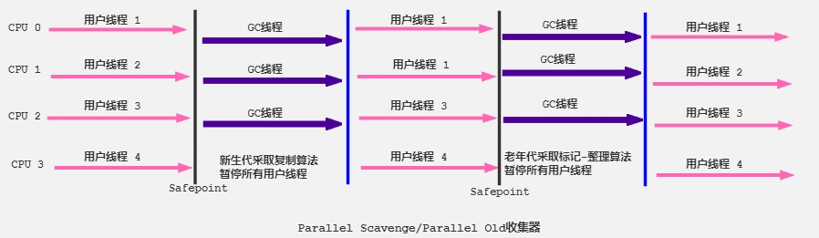

在程序吞吐量优先的应用场景中， Parallel 收集器和Parallel Old收集器的组合，在Server模式下的内存回收性能很不错。

在Java8中，默认是此垃圾收集器。

#### 参数

参数配置：

- -XX:+UseParallelGC  手动指定年轻代使用Parallel并行收集器执行内存回收任务。
- -XX:+UseParallelOldGC  手动指定老年代都是使用并行回收收集器。
  - 分别适用于新生代和老年代。默认jdk8是开启的。
  - 上面两个参数，默认开启一个，另一个也会被开启。（互相激活）
- -XX:ParallelGCThreads 设置年轻代并行收集器的线程数。一般地，最好与CPU数量相等，以避免过多的线程数影响垃圾收集性能。
  - 在默认情况下，当CPU 数量小于8个， ParallelGCThreads 的值等于CPU 数量。
  - 当CPU数量大于8个，ParallelGCThreads 的值等于3+[5*CPU_Count]/8] 。
- -XX:MaxGCPauseMillis 设置垃圾收集器最大停顿时间(即STW的时间)。单位是毫秒。
  - 为了尽可能地把停顿时间控制在MaxGCPauseMills以内，收集器在工作时会调整Java堆大小或者其他一些参数。
  - 对于用户来讲，停顿时间越短体验越好。但是在服务器端，我们注重高并发，整体的吞吐量。所以服务器端适合Parallel，进行控制。
  - 该参数使用需谨慎。
- -XX:GCTimeRatio 垃圾收集时间占总时间的比例（= 1 / (N + 1))。用于衡量吞吐量的大小。
  - 取值范围（0,100）。默认值99，也就是垃圾回收时间不超过1%。
  - 与前一个-XX:MaxGCPauseMillis参数有一定矛盾性。暂停时间越长，Radio参数就容易超过设定的比例。
-  -XX:+UseAdaptiveSizePolicy  设置Parallel Scavenge收集器具有自适应调节策略
  - 在这种模式下，年轻代的大小、Eden和Survivor的比例、晋升老年代的对象年龄等参数会被自动调整，已达到在堆大小、吞吐量和停顿时间之间的平衡点。
  - 在手动调优比较困难的场合，可以直接使用这种自适应的方式，仅指定虚拟机的最大堆、目标的吞吐量（GCTimeRatio）和停顿时间（MaxGCPauseMills），让虚拟机自己完成调优工作。

### CMS：低延迟

#### 面试题

- CMS特点，垃圾回收算法有哪些？各自的优缺点，他们共同的缺点是什么？ (天猫)
- 讲一下CMS垃圾收集器垃圾回收的流程，以及CMS的缺点  (抖音)
- 说几个垃圾回收器，cms回收器有哪几个过程，停顿几次，会不会产生内存碎片。老年代产生内存碎片会有什么问题。 (小米)
- g1和cms区别,吞吐量优先和响应优先的垃圾收集器选择 (携程)

#### 概述

- 在 JDK 1.5 时期，HotSpot 推出了一款在强交互应用中几乎可认为有划时代意义的垃圾收集器：CMS (Concurrent-Mark-Sweep)收集器，这款收集器是HotSpot虚拟机中第一款真正意义上的并发收集器，它第一次实现了让垃圾收集线程与用户线程同时工作。

- CMS收集器的关注点是尽可能缩短垃圾收集时用户线程的停顿时间。停顿时间越短（低延迟）就越适合与用户交互的程序，良好的响应速度能提升用户体验。
  目前很大一部分的Java应用集中在互联网站或者B/S系统的服务端上，这类应用尤其重视服务的响应速度，希望系统停顿时间最短，以给用户带来较好的体验。CMS收集器就非常符合这类应用的需求。

- CMS的垃圾收集算法采用标记-清除算法，并且也会”Stop-the-world”

不幸的是，CMS 作为老年代的收集器，却无法与 JDK 1.4.0 中已经存在的新生代收集器Parallel Scavenge 配合工作，所以在JDK 1.5中使用CMS来收集老年代的时候，新生代只能选择ParNew或者Serial收集器中的一个。

在G1出现之前，CMS使用还是非常广泛的。一直到今天，仍然有很多系统使用CMS GC。

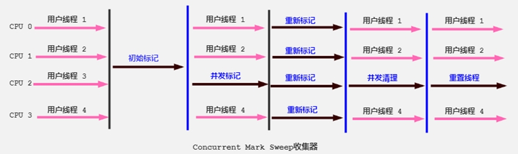

初始标记（STW）：暂时时间非常短，标记与GC Roots直接关联的对象。

并发标记（最耗时）：从GC Roots开始遍历整个对象图的过程。不会停顿用户线程

重新标记：（STW）：修复并发标记环节，因为用户线程的执行，导致数据的不一致性问题

并发清理（最耗时）

 #### 补充说明

尽管CMS收集器采用的是并发回收（非独占式），但是在其初始化标记和再次标记这两个阶段中仍然需要执行“Stop-the-World”机制暂停程序中的工作线程，不过暂停时间并不会太长，因此可以说明目前所有的垃圾收集器都做不到完全不需要“Stop-the-World”，只是尽可能地缩短暂停时间。

由于最耗费时间的并发标记与并发清除阶段都不需要暂停工作，所以整体的回收是低停顿的。

另外，由于在垃圾收集阶段用户线程没有中断，所以在CMS回收过程中，还应该确保应用程序用户线程有足够的内存可用。因此，CMS收集器不能像其他收集器那样等到老年代几乎完全被填满了再进行收集，而是当堆内存使用率达到某一阈值时，便开始进行回收，以确保应用程序在CMS工作过程中依然有足够的空间支持应用程序运行。要是CMS运行期间预留的内存无法满足程序需要，就会出现一次“Concurrent Mode Failure”失败，这时虚拟机将启动后备预案：临时启用 Serial Old 收集器来重新进行老年代的垃圾收集，这样停顿时间就很长了。

CMS收集器的垃圾收集算法采用的是标记—清除算法，这意味着每次执行完内存回收后，由于被执行内存回收的无用对象所占用的内存空间极有可能是不连续的一些内存块，不可避免地将会产生一些内存碎片。那么CMS在为新对象分配内存空间时，将无法使用指针碰撞（Bump the Pointer）技术，而只能够选择空闲列表（Free List）执行内存分配。

 #### 为什么不使用Mark-Compact？

答案其实很简答，因为当并发清除的时候，用Compact整理内存的话，原来的用户线程使用的内存还怎么用呢？要保证用户线程能继续执行，前提的它运行的资源不受影响嘛。Mark-Compact更适合“Stop the World”这种场景下使用

#### 优缺点

- CMS的优点：
  - 并发收集
  - 低延迟
- CMS的弊端：

1）会产生内存碎片，导致并发清除后，用户线程可用的空间不足。在无法分配大对象的情况下，不得不提前触发Full GC。

2）CMS收集器对CPU资源非常敏感。在并发阶段，它虽然不会导致用户停顿，但是会因为占用了一部分线程而导致应用程序变慢，总吞吐量会降低。 

3）CMS收集器无法处理浮动垃圾。可能出现“Concurrent Mode Failure”失败而导致另一次 Full GC 的产生。在并发标记阶段由于程序的工作线程和垃圾收集线程是同时运行或者交叉运行的，那么在并发标记阶段如果产生新的垃圾对象，CMS将无法对这些垃圾对象进行标记，最终会导致这些新产生的垃圾对象没有被及时回收，从而只能在下一次执行GC时释放这些之前未被回收的内存空间。

#### 参数

- -XX:+UseConcMarkSweepGC 手动指定使用CMS 收集器执行内存回收任务。
  - 开启该参数后会自动将-XX:+UseParNewGC打开。即：ParNew(Young区用)+CMS(Old区用)+Serial Old的组合。

- -XX:CMSlnitiatingOccupanyFraction 设置堆内存使用率的阈值，一旦达到该阈值，便开始进行回收。
  - JDK5及以前版本的默认值为68,即当老年代的空间使用率达到68%时，会执行一次CMS 回收。JDK6及以上版本默认值为92%
  - 如果内存增长缓慢，则可以设置一个稍大的值，大的阈值可以有效降低CMS的触发频率，减少老年代回收的次数可以较为明显地改善应用程序性能。反之，如果应用程序内存使用率增长很快，则应该降低这个阈值，以避免频繁触发老年代串行收集器。因此通过该选项便可以有效降低Full GC 的执行次数。

- -XX:+UseCMSCompactAtFullCollection 用于指定在执行完Full GC后对内存空间进行压缩整理，以此避免内存碎片的产生。不过由于内存压缩整理过程无法并发执行，所带来的问题就是停顿时间变得更长了。

- -XX:CMSFullGCsBeforeCompaction 设置在执行多少次Full GC后对内存空间进行压缩整理。

- -XX:ParallelCMSThreads 设置CMS的线程数量。
  - CMS 默认启动的线程数是（ParallelGCThreads+3)/4，ParallelGCThreads 是年轻代并行收集器的线程数。当CPU 资源比较紧张时，受到CMS收集器线程的影响，应用程序的性能在垃圾回收阶段可能会非常糟糕。

 #### 小结

HotSpot有这么多的垃圾回收器，那么如果有人问，Serial GC、Parallel GC、Concurrent Mark Sweep GC这三个GC有什么不同呢？

请记住以下口令：
如果你想要最小化地使用内存和并行开销，请选Serial GC；
如果你想要最大化应用程序的吞吐量，请选Parallel GC；
如果你想要最小化GC的中断或停顿时间，请选CMS GC。

### G1 GC：区域化分代式

#### 概述

G1（Garbage-First）是一款面向服务端应用的垃圾收集器，主要针对配备多核CPU及大容量内存的机器，以极高概率满足GC停顿时间的同时，还兼具高吞吐量的性能特征。

在JDK1.7版本正式启用，移除了Experimental的标识，是JDK 9以后的默认垃圾回收器，取代了CMS 回收器以及Parallel + Parallel Old组合。被Oracle官方称为“全功能的垃圾收集器”。

与此同时，CMS已经在JDK 9中被标记为废弃（deprecated）。在jdk8中还不是默认的垃圾回收器，需要使用-XX:+UseG1GC来启用。

G1（Garbage-First）是一款面向服务端应用的垃圾收集器，兼顾吞吐量和停顿时间的GC实现。

在JDK1.7版本正式启用，是JDK 9以后的默认GC选项，取代了CMS 回收器。

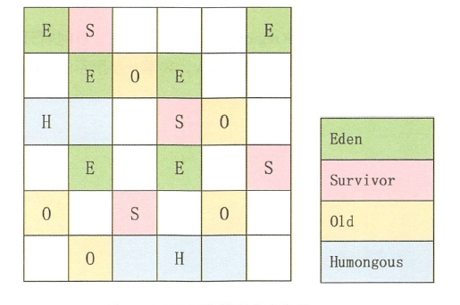

#### 参数

- -XX：+UseG1GC   手动指定使用G1收集器执行内存回收任务。
- -XX:G1HeapRegionSize  设置每个Region的大小。值是2的幂，范围是1MB到32MB之间，目标是根据最小的Java堆大小划分出约2048个区域。默认是堆内存的1/2000。
- -XX:MaxGCPauseMillis   设置期望达到的最大GC停顿时间指标(JVM会尽力实现，但不保证达到)。默认值是200ms
- -XX:ParallelGCThread   设置STW时GC线程数的值。最多设置为8
- -XX:ConcGCThreads   设置并发标记的线程数。将n设置为并行垃圾回收线程数(ParallelGCThreads)的1/4左右。
- -XX:InitiatingHeapOccupancyPercent  设置触发并发GC周期的Java堆占用率阈值。超过此值，就触发GC。默认值是45。

 #### 分区Region

分区Region：化整为零

使用 G1 收集器时，它将整个Java堆划分成约2048个大小相同的独立Region块，每个Region块大小根据堆空间的实际大小而定，整体被控制在1MB到32MB之间，且为2的N次幂，即1MB,2MB,4MB,8MB,16MB,32MB。可以通过-XX:G1HeapRegionSize设定。所有的Region大小相同，且在JVM生命周期内不会被改变。

虽然还保留有新生代和老年代的概念，但新生代和老年代不再是物理隔离的了，它们都是一部分Region（不需要连续）的集合。通过Region的动态分配方式实现逻辑上的连续。

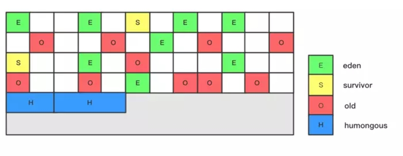

一个 region 有可能属于 Eden，Survivor 或者 Old/Tenured 内存区域。但是一个region只可能属于一个角色。图中的 E 表示该region属于Eden内存区域，S表示属于Survivor内存区域，O表示属于Old内存区域。图中空白的表示未使用的内存空间。
G1 垃圾收集器还增加了一种新的内存区域，叫做 Humongous 内存区域，如图中的 H 块。主要用于存储大对象，如果超过1.5个region，就放到H。

设置H的原因：
对于堆中的大对象，默认直接会被分配到老年代，但是如果它是一个短期存在的大对象，就会对垃圾收集器造成负面影响。为了解决这个问题，G1划分了一个Humongous区，它用来专门存放大对象。如果一个H区装不下一个大对象，那么G1会寻找连续的H区来存储。为了能找到连续的H区，有时候不得不启动Full GC。G1的大多数行为都把H区作为老年代的一部分来看待。

### 各GC使用场景

截止JDK 1.8，一共有7款不同的垃圾收集器。每一款不同的垃圾收集器都有不同的特点，在具体使用的时候，需要根据具体的情况选用不同的垃圾收集器。

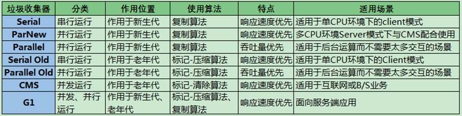

