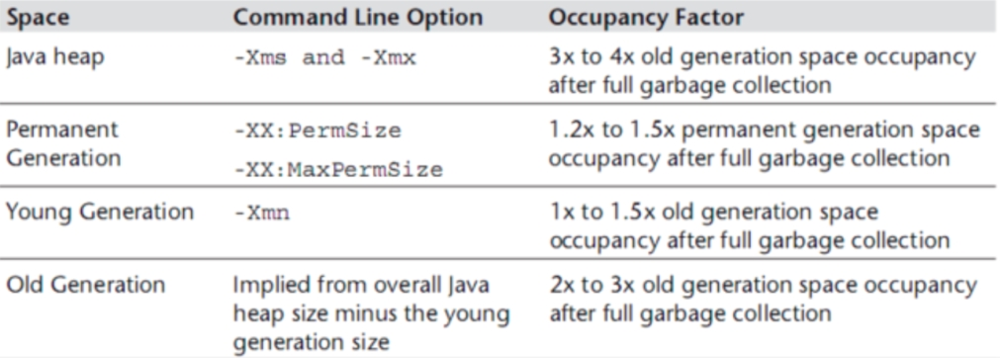

## 合理配置堆内存

### 推荐配置

在案例1中我们讲到了增加内存可以提高系统的性能而且效果显著，那么随之带来的一个问题就是，我们增加多少内存比较合适？如果内存过大，那么如果产生FullGC的时候，GC时间会相对比较长，如果内存较小，那么就会频繁的触发GC，在这种情况下，我们该如何合理的适配堆内存大小呢？

分析：
依据的原则是根据Java Performance里面的推荐公式来进行设置。



<font color = 'red'>Java整个堆大小设置，Xmx 和 Xms设置为老年代存活对象的3-4倍，即FullGC之后的老年代内存占用的3-4倍。</font>

方法区（永久代 PermSize和MaxPermSize 或 元空间 MetaspaceSize 和MaxMetaspaceSize）设置为老年代存活对象的1.2-1.5倍。

年轻代Xmn的设置为老年代存活对象的**1-1.5倍**。

老年代的内存大小设置为老年代存活对象的**2-3倍**。

但是，上面的说法也不是绝对的，也就是说这给的是一个参考值，根据多种调优之后得出的一个结论，大家可以根据这个值来设置一下我们的初始化内存，在保证程序正常运行的情况下，我们还要去查看GC的回收率，GC停顿耗时，内存里的实际数据来判断，Full GC是基本上不能有的，如果有就要做内存Dump分析，然后再去做一个合理的内存分配。

<font color = 'red'>我们还要注意到一点就是，上面说的老年代存活对象怎么去判定。</font>

### 如何计算老年代存活对象

#### 方式1：查看日志

<font color = 'red'> 推荐/比较稳妥！</font>


JVM参数中添加GC日志，GC日志中会记录每次FullGC之后各代的内存大小，观察老年代GC之后的空间大小。可观察一段时间内（比如2天）的FullGC之后的内存情况，根据多次的FullGC之后的老年代的空间大小数据来预估FullGC之后老年代的存活对象大小<font color = 'red'>（可根据多次FullGC之后的内存大小取平均值）</font>。

#### 方式2：强制触发FullGC

会影响线上服务，慎用！

方式1的方式比较可行，但需要更改JVM参数，并分析日志。同时，在使用CMS回收器的时候，有可能不能触发FullGC，所以日志中并没有记录FullGC的日志。在分析的时候就比较难处理。 <font color = 'red'>所以，有时候需要强制触发一次FullGC，来观察FullGC之后的老年代存活对象大小。</font>

注：强制触发FullGC，会造成线上服务停顿（STW），要谨慎！建议的操作方式为，在强制FullGC前先把服务节点摘除，FullGC之后再将服务挂回可用节点，对外提供服务，在不同时间段触发FullGC，<font color = 'red'>根据多次FullGC之后的老年代内存情况来预估FullGC之后的老年代存活对象大小</font>

如何强制触发Full GC?

1、jmap -dump:live,format=b,file=heap.bin <pid> 将当前的存活对象dump到文件，此时会触发FullGC

2、jmap -histo:live <pid> 打印每个class的实例数目,内存占用,类全名信息.live子参数加上后,只统计活的对象数量. 此时会触发FullGC

3、在性能测试环境，可以通过Java监控工具来触发FullGC，比如使用VisualVM和JConsole，VisualVM集成了JConsole，VisualVM或者JConsole上面有一个触发GC的按钮。

### 案例演示

#### JVM配置参数

现在我们通过idea启动springboot工程，我们将内存初始化为1024M。我们这里就从1024M的内存开始分析我们的GC日志，根据我们上面的一些知识来进行一个合理的内存设置。

JVM设置如下：
-XX:+PrintGCDetails -XX:MetaspaceSize=64m -Xss512K -XX:+HeapDumpOnOutOfMemoryError -XX:HeapDumpPath=heap/heapdump3.hprof  -XX:SurvivorRatio=8  -XX:+PrintGCDateStamps  -Xms1024M  -Xmx1024M -Xloggc:log/gc-oom3.log

 ### 结论

在内存相对紧张的情况下，可以按照上述的方式来进行内存的调优， 找到一个在GC频率和GC耗时上都可接受的一个内存设置，<font color = 'red'>可以用较小的内存满足当前的服务需要。</font>

<font color = 'red'>但当内存相对宽裕的时候，可以相对给服务多增加一点内存，可以减少GC的频率</font>，GC的耗时相应会增加一些。 一般要求低延时的可以考虑多设置一点内存， 对延时要求不高的，可以按照上述方式设置较小内存。 

如果在垃圾回收日志中观察到OutOfMemoryError,尝试把Java堆的大小扩大到物理内存的80%~90%。尤其需要注意的是堆空间导致的OutOfMemoryError以及一定要增加空间。

- 比如说，增加-Xms和-Xmx的值来解决old代的OutOfMemoryError
- 增加-XX:PermSize和-XX:MaxPermSize来解决permanent代引起的OutOfMemoryError（jdk7之前）；增加-XX:MetaspaceSize和-XX:MaxMetaspaceSize来解决Metaspace引起的OutOfMemoryError（jdk8之后）

记住一点Java堆能够使用的容量受限于硬件以及是否使用64位的JVM。在扩大了Java堆的大小之后，再检查垃圾回收日志，直到没有OutOfMemoryError为止。如果应用运行在稳定状态下没有OutOfMemoryError就可以进入下一步了，计算活动对象的大小。

## 特殊问题：新生代与老年代的比例

### 参数设置

JVM 参数设置为：

```shell
# 打印日志详情          打印日志打印日期     初始化内存300M  最大内存300M   日志路径
-XX:+PrintGCDetails   -XX:+PrintGCDateStamps  -Xms300M  -Xmx300M -Xloggc:log/gc.log
```

新生代 ( Young ) 与老年代 ( Old ) 的比例为 1:2，所以，内存分配应该是新生代100M，老年代 200M

我们可以先用命令查看一下堆内存分配是怎么样的：

```shell
# 查看进程ID
jps -l
# 查看对应的进程ID的堆内存分配
jmap -heap 应的进程ID
```

结果大家可以看到：我们的SurvivorRatio= 8 但是内存分配却不是8:1:1，这是为什么呢？

### 参数AdaptiveSizePolicy

这是因为JDK 1.8 默认使用 UseParallelGC 垃圾回收器，该垃圾回收器默认启动了 AdaptiveSizePolicy，会根据GC的情况自动计算计算 Eden、From 和 To 区的大小；所以这是由于JDK1.8的自适应大小策略导致的，除此之外，我们下面观察GC日志发现有很多类似这样的FULLGC（Ergonomics），也是一样的原因。

```shell
  # 开启：
  -XX:+UseAdaptiveSizePolicy
  # 关闭
  -XX:-UseAdaptiveSizePolicy
```

注意事项：
1、在 JDK 1.8 中，如果使用 CMS，无论 UseAdaptiveSizePolicy 如何设置，都会将 UseAdaptiveSizePolicy 设置为 false；不过不同版本的JDK存在差异；

<font color = 'red'>2、UseAdaptiveSizePolicy不要和SurvivorRatio参数显示设置搭配使用，一起使用会导致参数失效；</font>

3、由于UseAdaptiveSizePolicy会动态调整 Eden、Survivor 的大小，有些情况存在Survivor 被自动调为很小，比如十几MB甚至几MB的可能，这个时候YGC回收掉 Eden区后，还存活的对象进入Survivor 装不下，就会直接晋升到老年代，导致老年代占用空间逐渐增加，从而触发FULL GC，如果一次FULL GC的耗时很长（比如到达几百毫秒），那么在要求高响应的系统就是不可取的。

<font color = 'red'>附：对于面向外部的大流量、低延迟系统，不建议启用此参数，建议关闭该参数。</font>

如果不想动态调整内存大小，以下是解决方案：

1、保持使用 UseParallelGC，显式设置 -XX:SurvivorRatio=8。

2、使用 CMS 垃圾回收器。CMS 默认关闭 AdaptiveSizePolicy。配置参数 -XX:+UseConcMarkSweepGC

#### 补充

关于堆内存的自适应调节有如下三个参数：调整堆是按照每次20%增长，按照每次5%收缩

young区增长量（默认20%）：-XX:YoungGenerationSizeIncrement=<Y>
old区增长量（默认20%）：-XX:TenuredGenerationSizeIncrement=<T>
收缩量（默认5%）：-XX:AdaptiveSizeDecrementScaleFactor=<D>


