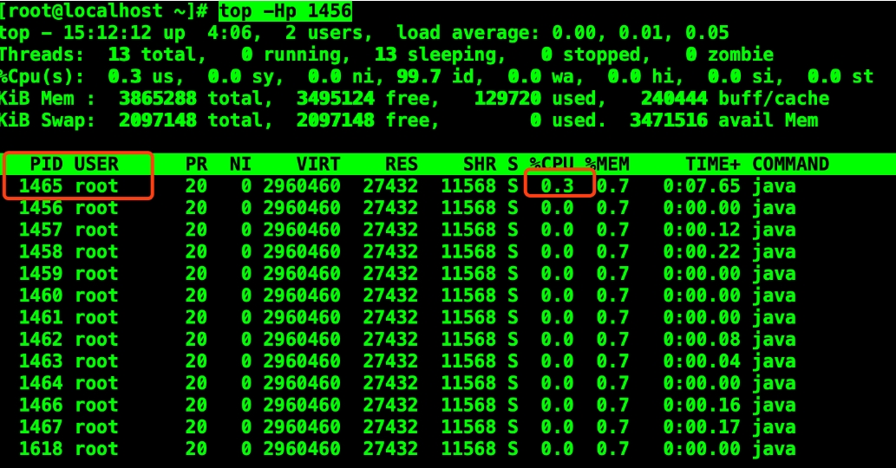
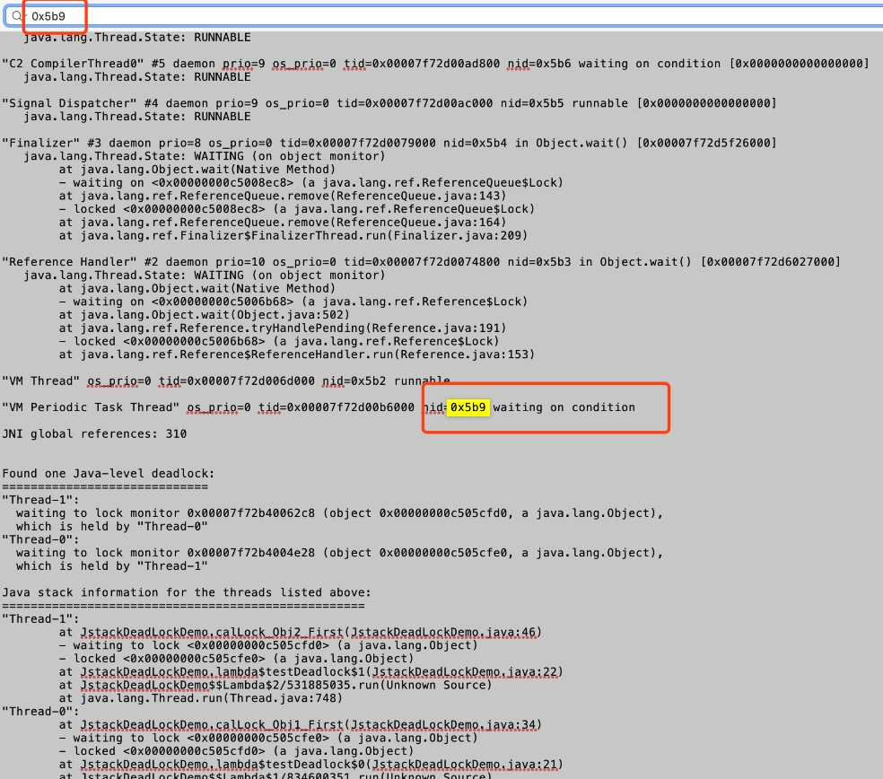
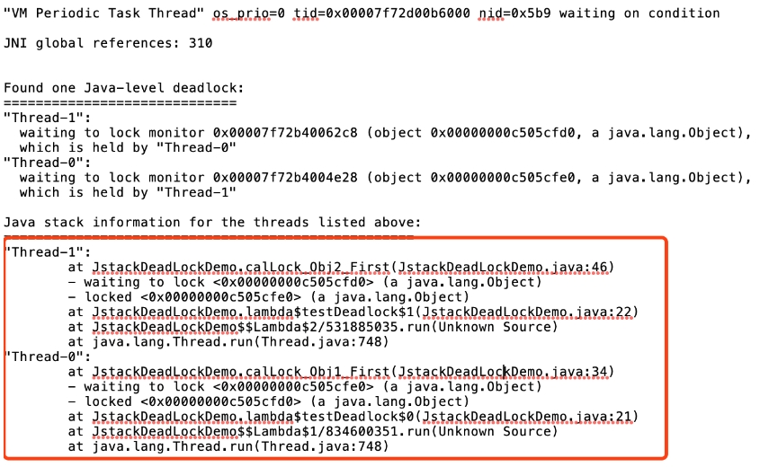

### 案例

```java
/**
 * <pre>
 *    desc    : jstack 死锁案例
 *    version : v1.0
 * </pre>
 */
public class JstackDeadLockDemo {
    /**
     * 必须有两个可以被加锁的对象才能产生死锁，只有一个不会产生死锁问题
     */
    private final Object obj1 = new Object();
    private final Object obj2 = new Object();

    public static void main(String[] args) {
        new JstackDeadLockDemo().testDeadlock();
    }

    private void testDeadlock() {
        Thread t1 = new Thread(() -> calLock_Obj1_First());
        Thread t2 = new Thread(() -> calLock_Obj2_First());
        t1.start();
        t2.start();
    }

    /**
     * 先synchronized  obj1，再synchronized  obj2
     */
    private void calLock_Obj1_First() {
        synchronized (obj1) {
            sleep();
            System.out.println("已经拿到obj1的对象锁，接下来等待obj2的对象锁");
            synchronized (obj2) {
                sleep();
            }
        }
    }

    /**
     * 先synchronized  obj2，再synchronized  obj1
     */
    private void calLock_Obj2_First() {
        synchronized (obj2) {
            sleep();
            System.out.println("已经拿到obj2的对象锁，接下来等待obj1的对象锁");
            synchronized (obj1) {
                sleep();
            }
        }
    }

    /**
     * 为了便于让两个线程分别锁住其中一个对象，
     * 一个线程锁住obj1，然后一直等待obj2，
     * 另一个线程锁住obj2，然后一直等待obj1，
     * 然后就是一直等待，死锁产生
     */
    private void sleep() {
        try {
            Thread.sleep(100);
        } catch (InterruptedException e) {
            e.printStackTrace();
        }
    }
}
```

### 问题分析

如果是生产环境的话，是怎么样才能发现目前程序有问题呢？我们可以推导一下，如果线程死锁，那么线程一直在占用CPU，这样就会导致CPU一直处于一个比较高的占用率。所以我们解决问题的思路应该是：

1、首先查看java进程ID

2、根据进程 ID 检查当前使用异常线程的pid

3、把线程pid变为16进制如 31695 -> 7bcf  然后得到0x7bcf

4、jstack 进程的pid | grep -A20  0x7bcf  得到相关进程的代码 (鉴于我们当前代码量比较小，线程也比较少，所以我们就把所有的信息全部导出来)

接下来是我们的实现上面逻辑的步骤，如下所示：
```shell
# 查看所有java进程 ID
jps -l
```

结果如下：


```shell
# 根据进程 ID 检查当前使用异常线程的pid
top -Hp 1456
```

结果如下：




从上图可以看出来，当前占用cpu比较高的线程 ID 是1465

接下来把 线程 PID 转换为16进制为
```shell
# 10 进制线程PId 转换为 16 进制
1465   ------->    5b9
# 5b9 在计算机中显示为   
0x5b9
```

最后我们把线程信息打印出来：

```shell
jstack  1456 > jstack.log
```


所有的准备工作已经完成，我们接下来分析日志中的信息，来定位问题出在哪里。

打开jstack.log文件  查找一下刚刚我们转换完的16进制ID是否存在



jstack命令生成的thread dump信息包含了JVM中所有存活的线程，里面确实是存在我们定位到的线程 ID ，在thread dump中每个线程都有一个nid，在nid=0x5b9的线程调用栈中，我们发现两个线程在互相等待对方释放资源



到此就可以检查对应的代码是否有问题，也就定位到我们的死锁问题。

### 解决方案

（1）调整锁的顺序，保持一致

（2）或者采用定时锁，一段时间后，如果还不能获取到锁就释放自身持有的所有锁。


