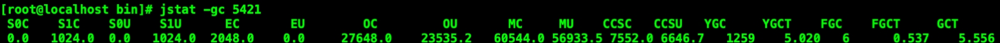
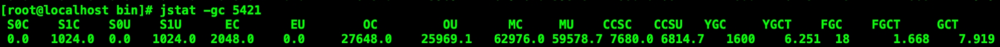
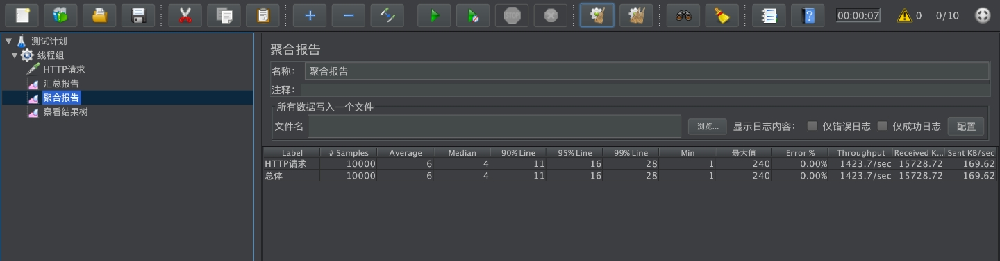
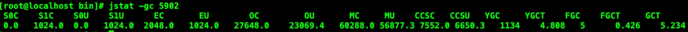
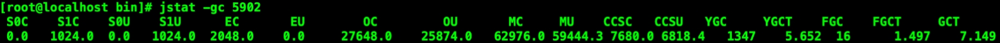
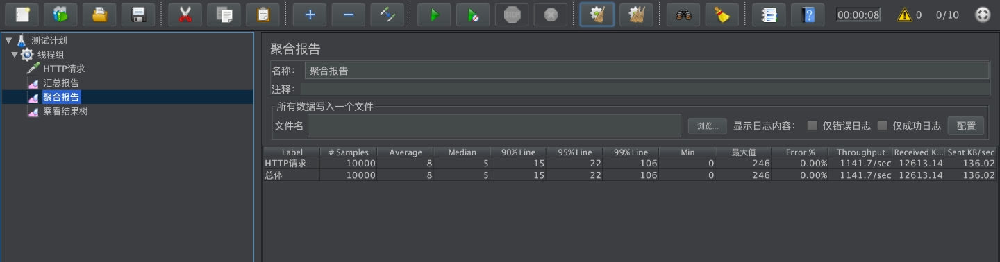

### 初始的状态

启动tomcat

查看进程默认的并发线程数：

```shell
jinfo -flag ConcGCThreads pid
-XX:ConcGCThreads=1
```

没有配置的情况下：并发线程数是1

查看线程状态：

```shell
jstat -gc pid
```



得出信息：
YGC：youngGC次数是1259次

FGC：Full GC次数是6次

GCT：GC总时间是5.556s

Jmeter压测之后的GC状态：



得出信息：

YGC：youngGC次数是1600次

FGC：Full GC次数是18次
GCT：GC总时间是7.919s

由此我们可以计算出来压测过程中，发生的GC次数和GC时间差

压测过程GC状态：

YGC：youngGC次数是 1600 - 1259 = 341次
FGC：Full GC次数是 18 - 6 = 12次
GCT：GC总时间是 7.919 - 5.556 = 2.363s

Jmeter压测结果如下：

压测结果如下：
主要关注响应时间：
95%的请求响应时间为：16ms
99%的请求响应时间为：28ms



### 优化之后

增加线程配置:

```shell
export CATALINA_OPTS="$CATALINA_OPTS -XX:ConcGCThreads=8"
```

观察GC状态

jstat -gc pid

tomcat启动之后的初始化GC状态：



总结：
YGC：youngGC次数是 1134 次
FGC：Full GC次数是 5 次
GCT：GC总时间是 5.234s

Jmeter压测之后的GC状态：



总结：
YGC：youngGC次数是 1347 次
FGC：Full GC次数是 16 次
GCT：GC总时间是 7.149s

由此我们可以计算出来压测过程中，发生的GC次数和GC时间差

压测过程GC状态：
YGC：youngGC次数是 1347 - 1134 = 213次
FGC：Full GC次数是 16 - 5 = 13次
GCT：GC总时间是 7.149 - 5.234 = 1.915s   提供了线程数，使得用户响应时间降低了。

压测结果如下：
主要关注响应时间：
95%的请求响应时间为：15ms

99%的请求响应时间为：22ms



### 总结

配置完线程数之后，我们的请求的平均响应时间和GC时间都有一个明显的减少了，仅从效果上来看，我们这次的优化是有一定效果的。大家在工作中对于线上项目进行优化的时候，可以考虑到这方面的优化。

