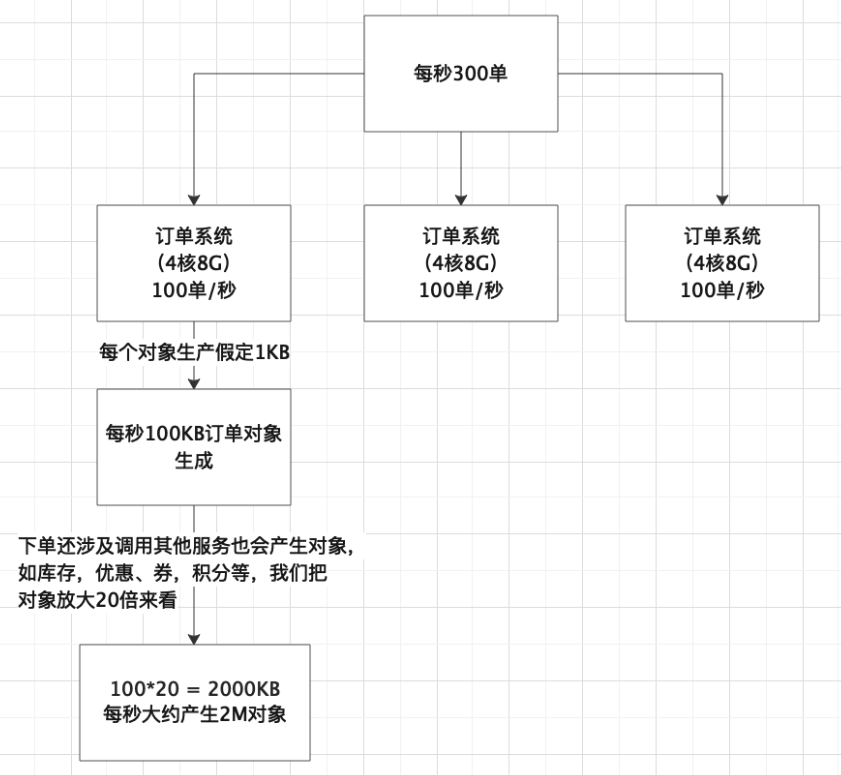
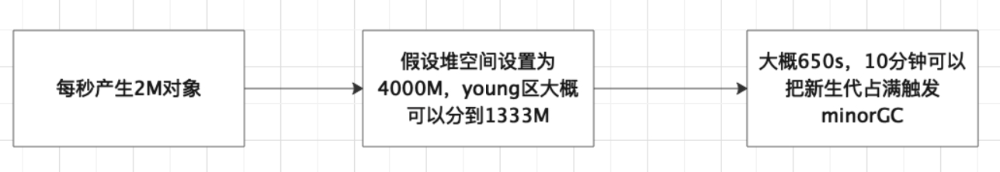

一天百万级订单这个绝对是现在顶尖电商公司交易量级，百万订单一般在4个小时左右产生，我们计算一下每秒产生多少订单，3000000/3600/4 = 208.3单/s，我们大概按照每秒300单来计算。

这种系统我们一般至少要三四台机器去支撑，假设我们部署了三台机器，也就是每台每秒钟大概处理完成100单左右，也就是每秒大概有100个订单对象在堆空间的新生代内生成，一个订单对象的大小跟里面的字段多少及类型有关，比如int类型的订单id和用户id等字段，double类型的订单金额等，int类型占用4字节，double类型占用8字节，初略估计下一个订单对象大概1KB左右，也就是说每秒会有100KB的订单对象分配在新生代内。

真实的订单交易系统肯定还有大量的其他业务对象，比如购物车、优惠券、积分、用户信息、物流信息等等，实际每秒分配在新生代内的对象大小应该要再扩大几十倍，我们假设20倍，也就是每秒订单系统会往新生代内分配近2M的对象数据，这些数据一般在订单提交完的操作做完之后基本都会成为垃圾对象。

假设我们选择4核8G的服务器，就可以给JVM进程分配四五个G的内存空间，那么堆内存可以分到三四个G左右，于是可以给新生代至少分配1G，这样算下差不多需要10分钟左右才能把新生代放满触发minor gc，这样的GC频率我们是可以接受的。我们还可以继续调整young区大小。不一定是1:2，这样就可以降低GC频率。这样进入老年代的对象也会降低，减少Full GC频率。

如果系统业务量继续增长那么可以水平扩容增加更多的机器，比如五台甚至十台机器，这样每台机器的JVM处理请求可以保证在合适范围，不至于压力过大导致大量的gc。

假设业务量暴增几十倍，在不增加机器的前提下，整个系统每秒要生成几千个订单，之前每秒往新生代里分配的1M对象数据可能增长到几十M，而且因为系统压力骤增，一个订单的生成不一定能在1秒内完成，可能要几秒甚至几十秒，那么就有很多对象会在新生代里存活几十秒之后才会变为垃圾对象，如果新生代只分配了几百M，意味着一二十秒就会触发一次minor gc，那么很有可能部分对象就会被挪到老年代，这些对象到了老年代后因为对应的业务操作执行完毕，马上又变为了垃圾对象，随着系统不断运行，被挪到老年代的对象会越来越多，最终可能又会导致full gc，full gc对系统的性能影响还是比较大的。

 
