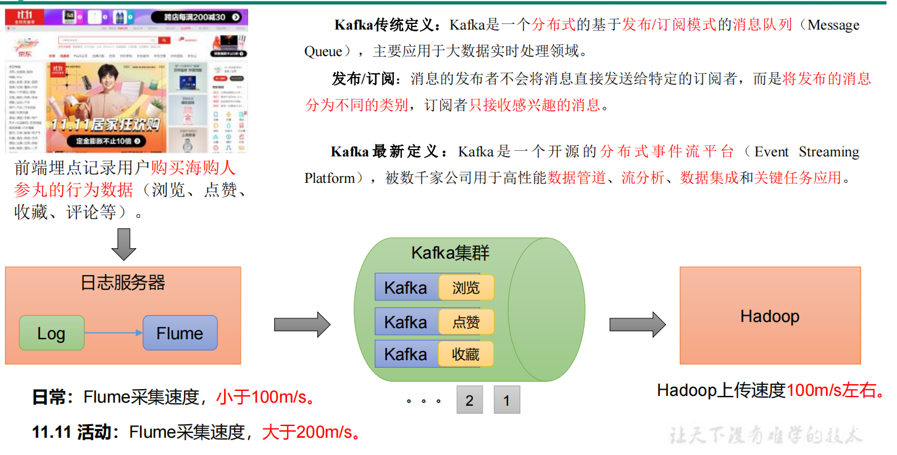
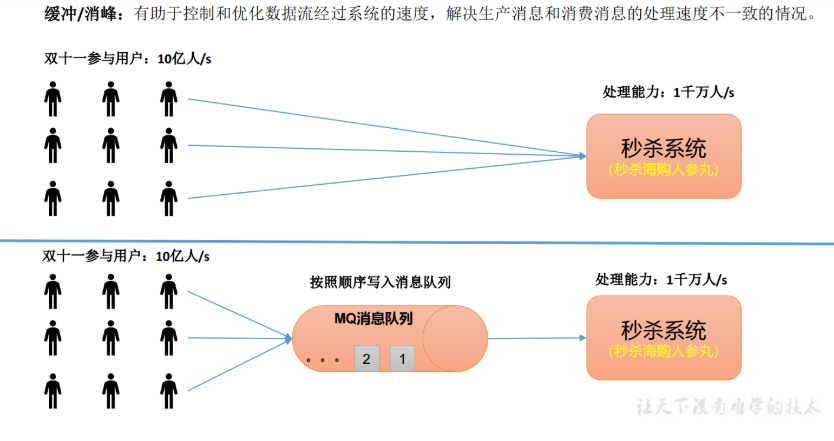
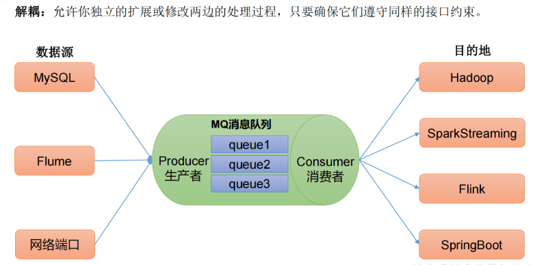
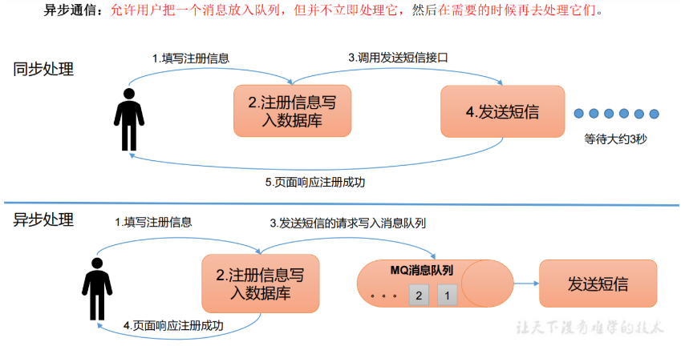
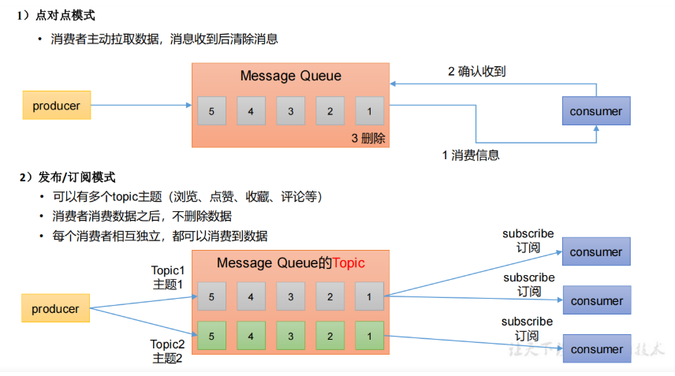
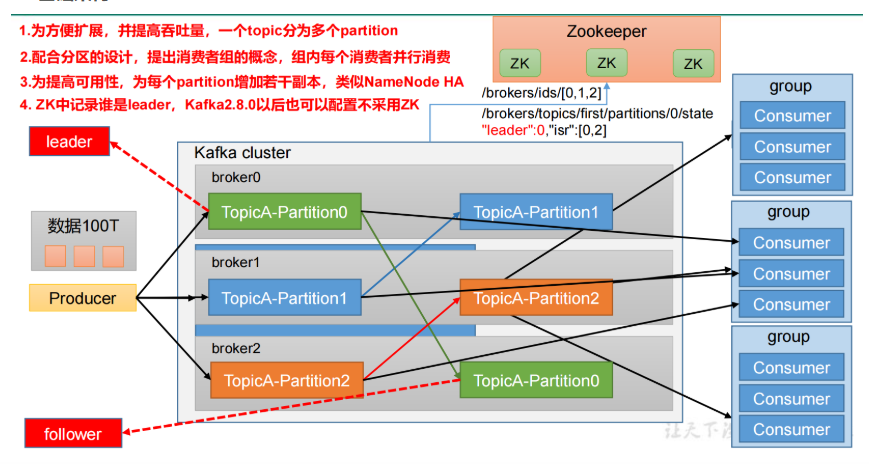

## 定义

Kafka传统定义：Kafka是一个分布式的基于发布/订阅模式的消息队列（MessageQueue），主要应用于大数据实时处理领域。

 发布/订阅：消息的发布者不会将消息直接发送给特定的订阅者，而是将发布的消息分为不同的类别，订阅者只接收感兴趣的消息。

Kafka最新定义：Kafka是一个开源的分布式事件流平台（Event StreamingPlatform），被数千家公司用于高性能数据管道、流分析、数据集成和关键任务应用。

## 消息队列

目前企业中比较常见的消息队列产品主要有 Kafka、ActiveMQ 、RabbitMQ 、RocketMQ 等。

在大数据场景主要采用 Kafka 作为消息队列。在 JavaEE 开发中主要采用 ActiveMQ、RabbitMQ、RocketMQ。

### 传统消息队列的应用场景

传统的消息队列的主要应用场景包括：**缓存消峰**、**解耦**和**异步通信。**

解耦：

异步通信：

### 消息队列的两种模式

消息队列的两种模式

区别: 点对点消费 -> 消息只能发布到一个主题， 消费完成就删除消息，且只有一个消费者

 发布订阅模式 -> 消息可以发布到多个主题， 消息一般保留七天，且有多个消费者

## 基础架构

在Kafka2.8版本前，Zookeeper的Consumer文件中存放消息被消费的记录（offset）

在Kafka2.8版本走，消息被消费的记录（offset）存放在Kafka中。

（1）Producer：消息生产者，就是向 Kafka broker 发消息的客户端。

（2）Consumer：消息消费者，向 Kafka broker 取消息的客户端。

（3）Consumer Group（CG）：消费者组，由多个 consumer 组成。消费者组内每个消费者负责消费不同分区的数据，一个分区只能由一个组内消费者消费；消费者组之间互不影响。所有的消费者都属于某个消费者组，即消费者组是逻辑上的一个订阅者。

（4）Broker：一台 Kafka 服务器就是一个 broker。一个集群由多个 broker 组成。一个broker 可以容纳多个 topic。

（5）Topic：可以理解为一个队列，生产者和消费者面向的都是一个 topic。

（6）Partition：为了实现扩展性，一个非常大的 topic 可以分布到多个 broker（即服务器）上，一个 topic 可以分为多个 partition，每个 partition 是一个有序的队列。

（7）Replica：副本。一个 topic 的每个分区都有若干个副本，一个 Leader 和若干个Follower。

（8）Leader：每个分区多个副本的“主”，生产者发送数据的对象，以及消费者消费数据的对象都是 Leader。

（9）Follower：每个分区多个副本中的“从”，实时从 Leader 中同步数据，保持和Leader 数据的同步。Leader 发生故障时，某个 Follower 会成为新的 Leader。

