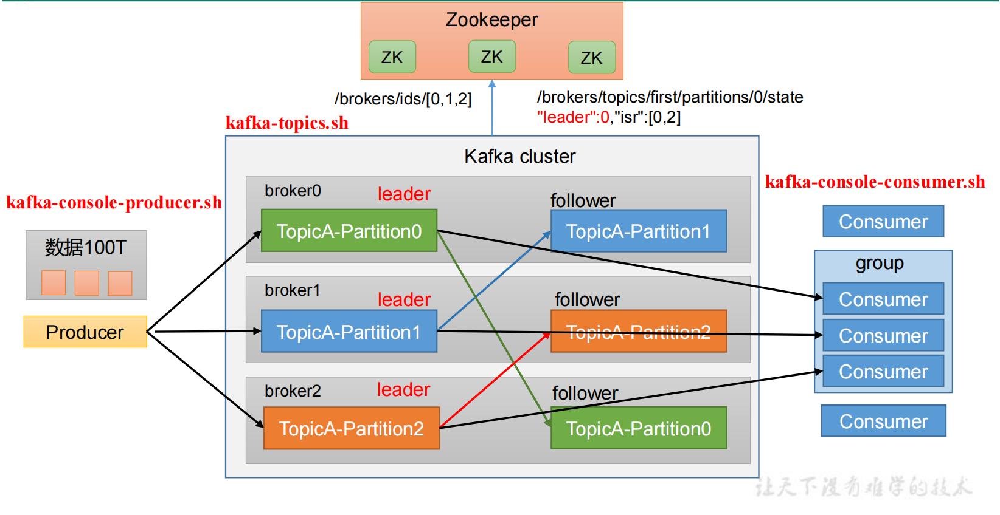
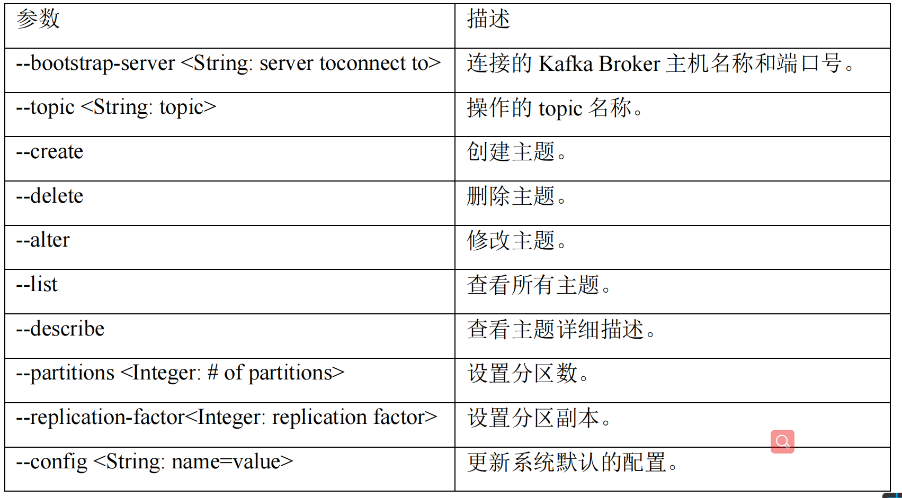

## Kafka命令行操作

**基础结构**



#### **主题命令行操作**

1）查看操作主题命令参数

```shell
 bin/kafka-topics.sh
```



2）查看当前服务器中的所有 topic

```shell
kafka-topics.sh --bootstrap-server ip:9092 --list
```

3）创建 first topic

```shell
kafka-topics.sh --bootstrap-server ip:9092 --create --partitions 1 --replication-factor 3 --topic first
```

选项说明：
`--topic` 定义 topic 名
`--replication-factor` 定义副本数
`--partitions` 定义分区数

4）查看 first 主题的详情

```shell
kafka-topics.sh --bootstrap-server ip:9092 --alter --topic first --partitions  3
```

5）修改分区数（**注意：分区数只能增加，不能减少**）

```shell
kafka-topics.sh --bootstrap-server ip:9092 --alter --topic first --partitions 3
# 将分区数增加到3个，减少分区数是会报错的
```

6）再次查看 first 主题的详情

```shell
kafka-topics.sh --bootstrap-server ip:9092 --describe --topic first
```

7）删除 topic(需要配置信息)

```shell
kafka-topics.sh --bootstrap-server 47.106.86.64:9092 --delete --topic first
```


