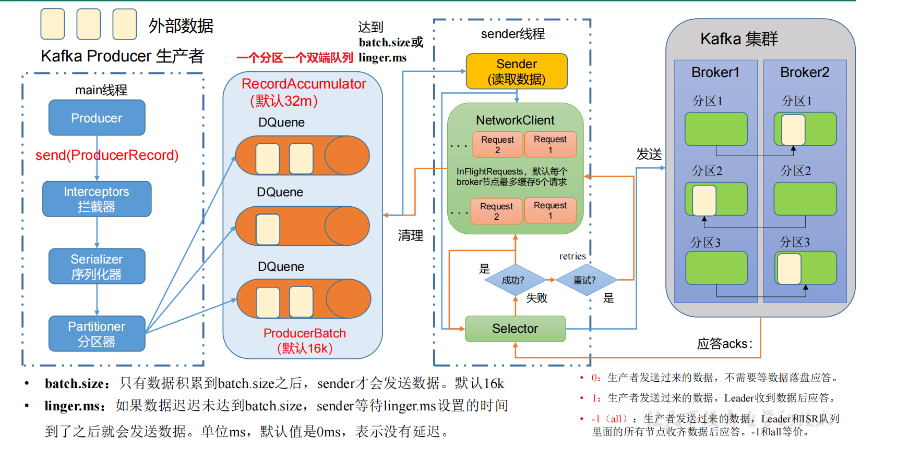
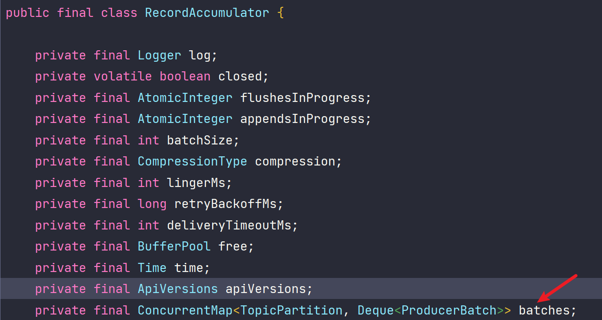
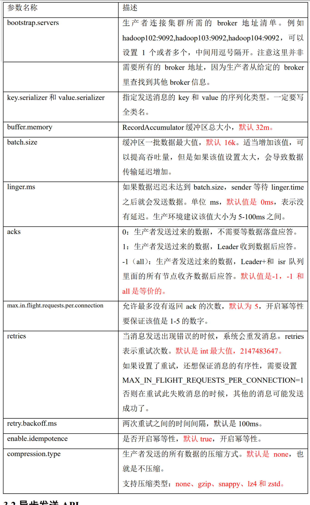

## 发送原理

在消息发送的过程中，涉及到两个线程，**main线程**和**sender线程**，其中main线程是消息的生产线程，而sender线程是jvm单例的线程，专门用于消息的发送。

 在jvm的内存中开辟了一块缓存空间叫**RecordAccumulator（消息累加器，管程队列默认32M）**，**用于将多条消息合并成一个批次**（每个生产队列大小为16K），然后由sender线程发送给kafka集群。

 我们的一条消息在生产过程会调用**send方法**然后经过**拦截器**（这个是生产上的可选项，一般可以不配置）经过**序列化器**（这个是Kafka自己的序列化器，JAVA的序列化对象太大了不合适），再经过**分区器**确定消息发送在具体topic下的哪个分区，然后发送到对应的**消息累加器**中，消息**累加器**是多个双端队列。并且每个队列和主题分区都具有一一映射关系。消息在累加器中，进行合并，达到了对应的size（batch.size）或者等待超过对应的等待时间(linger.ms)，都会触发**sender线程**的发送。sender线程有一个请求池，默认缓存五个请求（ max.in.flight.requests.per.connection ），发送消息后，会等待服务端的ack，如果没收到ack就会重试默认重试，重试次数为int最大值（ retries ）。如果ack成功就会删除累加器中的消息批次，并相应到生产端。

当双端队列中的DQueue满足 batch.size 或者 linger.ms 条件时触发sender线程。

### **生产者重要参数列表**

