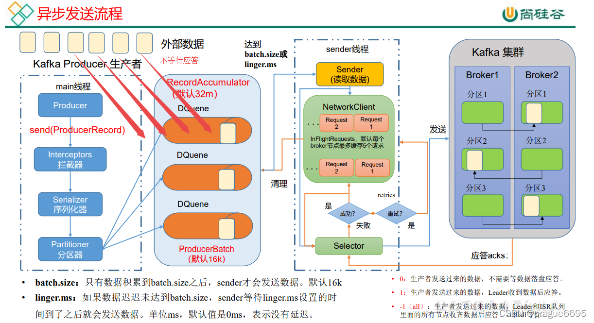
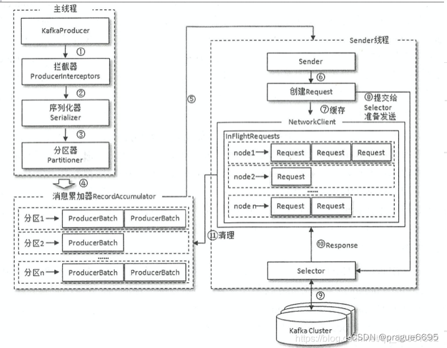
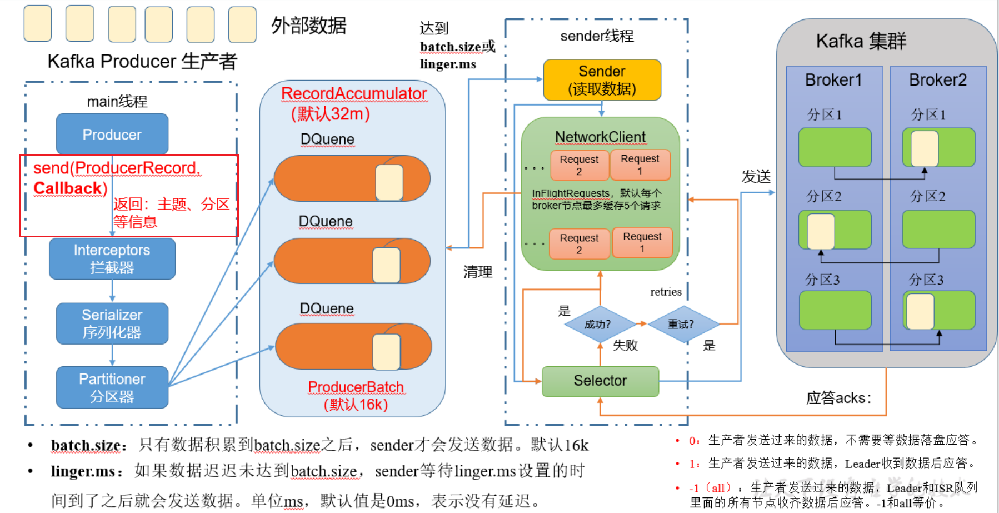
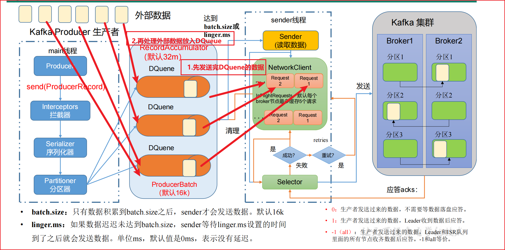

## 发送

### 普通异步发送

1）需求：创建 Kafka 生产者，采用异步的方式发送到 Kafka Broker





2）代码编写
（1）创建工程 kafka
（2）导入依赖

```xml
<dependencies>
     <dependency>
         <groupId>org.apache.kafka</groupId>
         <artifactId>kafka-clients</artifactId>
         <version>3.0.0</version>
     </dependency>
</dependencies>

```

（3）编写不带回调函数的 API 代码

```java
public class CustomProduct {

    public static void main(String[] args) {

        // 配置属性类
        Properties properties = new Properties();
        // 连接到我们的Kafka
        // 如果是集群，这里就配置多个Kafka节点
        // properties.put(ProducerConfig.BOOTSTRAP_SERVERS_CONFIG, "127.0.0.1:9092, 127.0.0.2:9092");
        properties.put(ProducerConfig.BOOTSTRAP_SERVERS_CONFIG, "127.0.0.1:9092");
        // 指定对应 key 和 value 序列化类型
        properties.put(ProducerConfig.KEY_SERIALIZER_CLASS_CONFIG, StringSerializer.class.getName());
        properties.put(ProducerConfig.VALUE_SERIALIZER_CLASS_CONFIG, StringSerializer.class.getName());

        // 1. 创建 Kafka 生产者对象
        KafkaProducer<String, String> producer = new KafkaProducer<>(properties);
        // 2.发送 Kafka 消息
        for (int i = 0; i < 5; i++) {
            producer.send(new ProducerRecord<>("first", "kafka first msg : " + i));
        }

         // 3.关闭资源
        producer.close();

    }
}
```

启动程序后，我们的Kafka中会记录对应的消息并打印对应消息

###  带回调函数的异步发送

回调函数会在 producer 收到 ack 时调用，为异步调用，该方法有两个参数，分别是元数据信息（Record Metadata）和异常信息（Exception），如果 Exception 为 null，说明消息发送成功，如果 Exception 不为 null，说明消息发送失败。



<font color = 'red'>注意：消息发送失败会自动重试，不需要我们在回调函数中手动重试。</font>

带回调发送的API如下：

```java
// 发送回调消息
for (int i = 0; i < 5; i++) {
    producer.send(new ProducerRecord<>("first", "kafka first callback msg : " + i), new Callback() {
        @Override
        public void onCompletion(RecordMetadata metadata, Exception exception) {
            if (exception == null) {
                System.out.println("主题：" + metadata.topic() + "分区：" + metadata.partition());
            }
        }
    });
}
```

### 同步发送API

1. 先处理已经堆积在DQueue中的数据。
2. RecordAccumulator再处理外部数据。



只需在异步发送的基础上，再调用一下 get()方法即可。

```java
/**
 * 同步发送消息
 */
public class CustomProductSync {

    public static void main(String[] args) throws ExecutionException, InterruptedException {

        // 配置属性类
        Properties properties = new Properties();
        // 连接到我们的Kafka
        // 如果是集群，这里就配置多个Kafka节点
        // properties.put(ProducerConfig.BOOTSTRAP_SERVERS_CONFIG, "127.0.0.1:9092, 127.0.0.2:9092");
        properties.put(ProducerConfig.BOOTSTRAP_SERVERS_CONFIG, "127.0.0.1:9092");
        // 指定对应 key 和 value 序列化类型
        properties.put(ProducerConfig.KEY_SERIALIZER_CLASS_CONFIG, StringSerializer.class.getName());
        properties.put(ProducerConfig.VALUE_SERIALIZER_CLASS_CONFIG, StringSerializer.class.getName());

        // 1. 创建 Kafka 生产者对象
        KafkaProducer<String, String> producer = new KafkaProducer<>(properties);
        // 2.发送 Kafka 消息
        for (int i = 0; i < 5; i++) {
            // 和同步的区别仅仅只在这里，用get方法去阻塞发送，等一条消息发送完毕之后才能发送下一条消息
            producer.send(new ProducerRecord<>("first", "kafka first msg : " + i)).get();
        }
        // 发送回调消息
        for (int i = 0; i < 5; i++) {
            producer.send(new ProducerRecord<>("first", "kafka first callback msg : " + i), new Callback() {
                @Override
                public void onCompletion(RecordMetadata metadata, Exception exception) {
                    if (exception == null) {
                        System.out.println("主题：" + metadata.topic() + "分区：" + metadata.partition());
                    }
                }
            });
        }

         // 3.关闭资源
        producer.close();
    }
}
```


