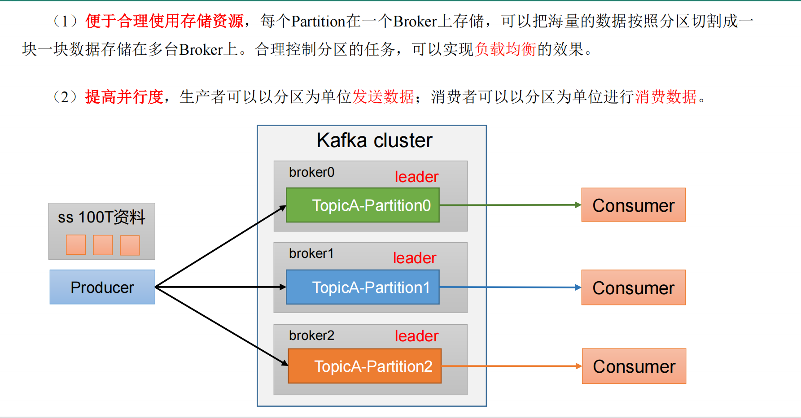
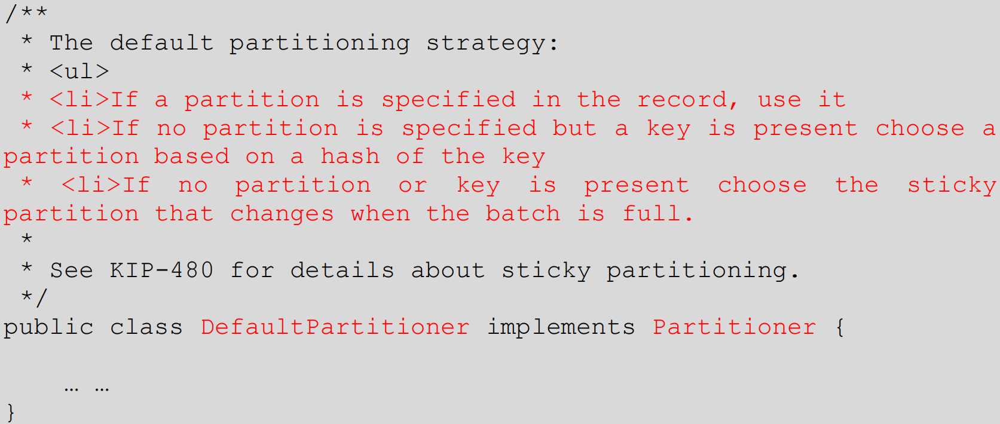
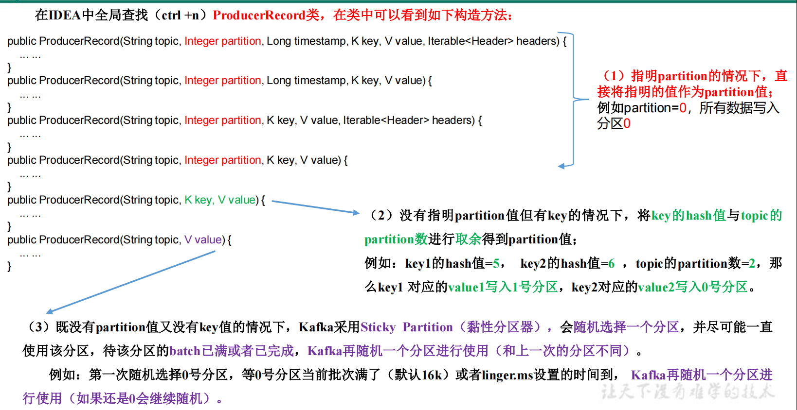

### 分区的好处

从存储的角度 -> 合理使用存储资源，实现负载均衡

从计算的角度 -> 提高并行计算的可行性



### 生产者发送消息分区策略

1）默认的分区器 DefaultPartitioner，在 IDEA 中 ctrl +n，全局查找 DefaultPartitioner。



Kafka支持三种分区策略 

1) 指定分区； 

2）指定key，计算hash得分区； 

3）指定随机粘性分区；



### 自定义分区器
如果研发人员可以根据企业需求，自己重新实现分区器。

1）需求
例如我们实现一个分区器实现，发送过来的数据中如果包含 Hi，就发往 0 号分区，不包含 Hi，就发往 1 号分区。
2）实现步骤
（1）定义类实现 Partitioner 接口。
（2）重写 partition()方法。

```java
package com.luojia.kafka.partitioner;

import org.apache.kafka.clients.producer.Partitioner;
import org.apache.kafka.common.Cluster;

import java.util.Map;

public class MyPartitioner implements Partitioner {
    @Override
    public int partition(String topic, Object key, byte[] keyBytes, Object value, byte[] valueBytes, Cluster cluster) {
        String msgValues = value.toString();

        // 你要发送到某个分区时，一定要保证这个分区是存在的，不然会报错
        int partition = 0;
        // 如果消息里面有相关的关键字，则发送到指定分区
        // 如果业务需要相同的表发送到相同的分区，那么我们可以将表名当消息的key，
        // 不手动指定分区，这样就能保证同样的表数据发送到同一个分区了
        if (msgValues.contains("luojia")) {
            partition = 1;
        }

        return partition;
    }

    @Override
    public void close() {

    }

    @Override
    public void configure(Map<String, ?> configs) {

    }
}

```

（3）使用分区器的方法，在生产者的配置中添加分区器参数。

```java
//自定义分区规则 
properties.put(ProducerConfig.PARTITIONER_CLASS_CONFIG,MyPartitioner.class.getName());
```


