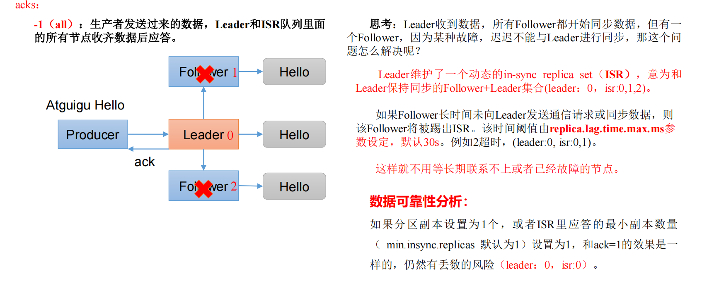

### 消息确认机制-ACK

producer提供了三种消息确认的模式，通过配置 `acks` 来实现

`acks为0时`， 表示生产者将数据发送出去就不管了，不等待任何返回。这种情况下数据传输效率最高，但是数据可靠性最低，当 server挂掉的时候就会丢数据；

`acks为1时（默认）`，表示数据发送到Kafka后，经过leader成功接收消息的的确认，才算发送成功，如果leader宕机了，就会丢失数据。

`acks为-1/all时`，表示生产者需要等待ISR中的所有follower都确认接收到数据后才算发送完成，这样数据不会丢失，因此可靠性最高，性能最低。

- 数据完全可靠条件 = ACK级别设置为-1 + 分区副本大于等于2 + ISR里应答的最小副本数量大于等于2



<font color = 'red'> AR = ISR + ORS </font>

正常情况下，如果所有的follower副本都应该与leader副本保持一定程度的同步，则AR = ISR，OSR = null。

ISR 表示在指定时间内和leader保存数据同步的集合；

ORS表示不能在指定的时间内和leader保持数据同步集合，称为OSR(Out-Sync Relipca set)。

```java
// Ack 设置
properties.put(ProducerConfig.ACKS_CONFIG,"1");

// 重试次数, 默认的重试次数是 Max.Integer
properties.put(ProducerConfig.RETRIES_CONFIG,3);
```

### 数据去重-幂等性

#### 1）幂等性原理

在一般的MQ模型中，常有以下的消息通信概念

**至少一次（At Least Once）**： <font color = 'red'> ACK级别设置为-1 + 分区副本大于等于2 + ISR里应答的最小副本数量>=2。</font>可以保证数据不丢失，但是不能保证数据不重复。

**最多一次（At Most Once）**：ACK级别设置为0 。可以保证数据不重复，但是不能保证数据不丢失。

**精确一次（Exactly Once）**： <font color = 'red'>至少一次 + 幂等性 </font>。 Kafka 0.11版本引入一项重大特性：**幂等性和事务。**

幂等性，简单地说就是对接口的多次调用所产生的结果和调用一次是一致的。生产者在进行重试的时候有可能会重复写入消息，而使用Kafka 的幂等性功能之后就可以避免这种情况。（不产生重复数据）

**重复数据的判断标准：**具有 <font color = 'red'><PID, Partition, SeqNumber></font>相同主键的消息提交时，Broker只会持久化一条。其中ProducerId（pid）是Kafka每次重启都会分配一个新的；Partition 表示分区号；Sequence Number 序列化号，是单调自增的。

broker中会在内存维护一个pid+分区对应的序列号。如果收到的序列号正好比内存序列号大一，才存储消息，如果小于内存序列号，意味着消息重复，那么会丢弃消息，并应答。**如果远大于内存序列号，意味着消息丢失，会抛出异常。**

所以幂等解决的是sender到broker间，由于网络波动可能造成的重发问题。用幂等来标识唯一消息。

<font color = 'red'>并且幂等性只能保证的是在单分区单会话内不重复。</font>

#### 2）如何使用幂等性

开启幂等性功能的方式很简单，只需要显式地将生产者客户端参数 `enable.idempotence` 设置为true即可(这个参数的默认值为true)，并且还需要确保生产者客户端的retries、acks、max.in.filght.request.per.connection参数不被配置错，默认值就是对的。


