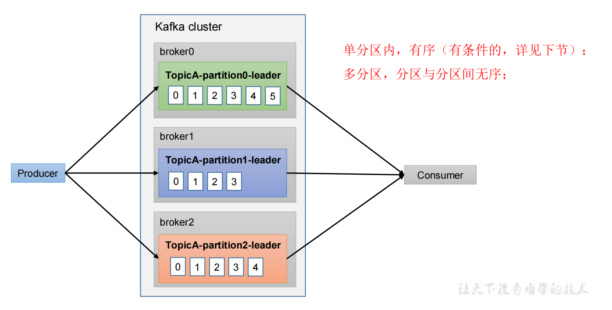
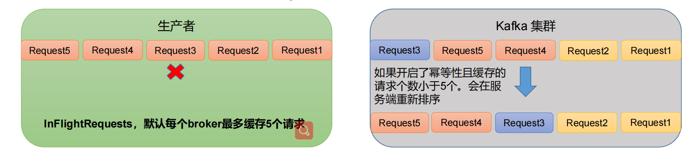
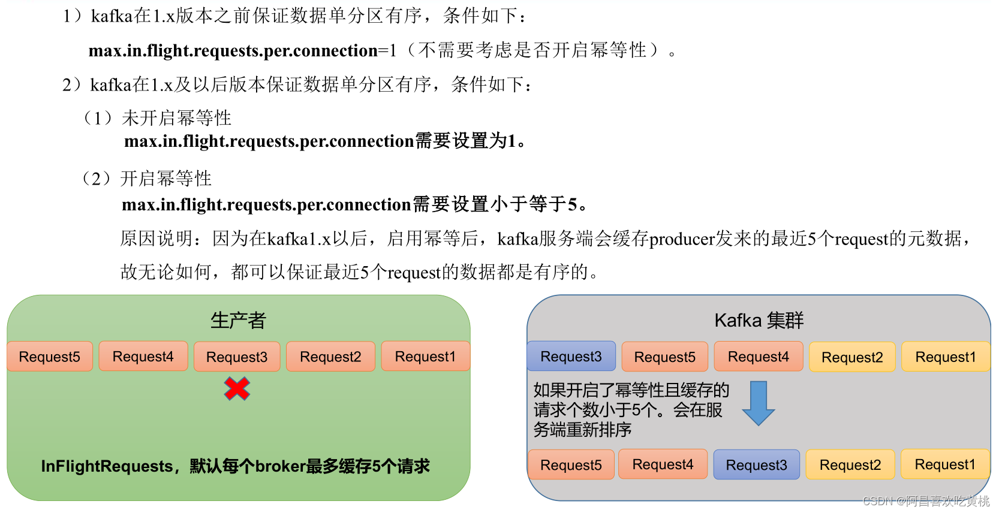

消息在单分区内有序，多分区内无序（如果对多分区进行排序，造成分区无法工作需要等待排序，浪费性能）

kafka只能保证单分区下的消息顺序性，为了保证消息的顺序性，需要做到如下几点。

如果未开启幂等性，需要 max.in.flight.requests.per.connection 设置为1。（缓冲队列最多放置1个请求）

如果开启幂等性，需要 max.in.flight.requests.per.connection 设置为小于5。

这是因为broker端会缓存producer主题分区下的五个request，保证最近5个request是有序的。

例子：

现在有5个请求，Request1、Request2、Request3、Request4、Request5，在向Kafka集群中发送的时候，Request1、Request2成功，未收到Request3的数据，而是收到了Request4，这时会将Request4缓存起来，等下一条消息，如果是Request5，那么同样缓存起来，这时，Request3来了，将Request3发送到集群，同时缓存里面的数据也连接起来了，可以发送。（因为是幂等的，所以每条消息都有自己的单调递增的序列号）但是它最多缓存5条数据。

