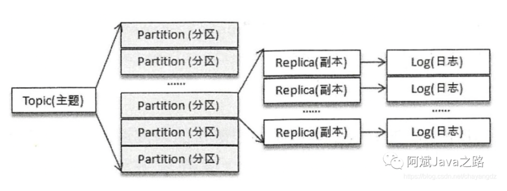
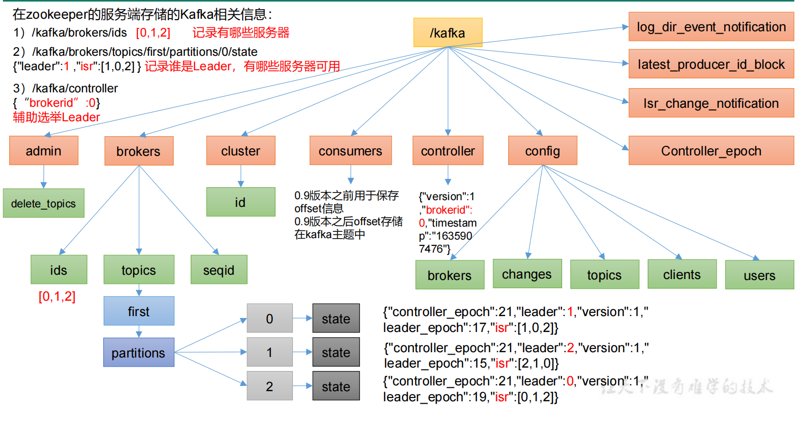
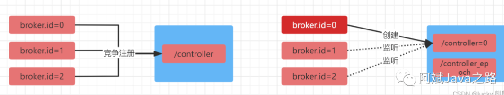
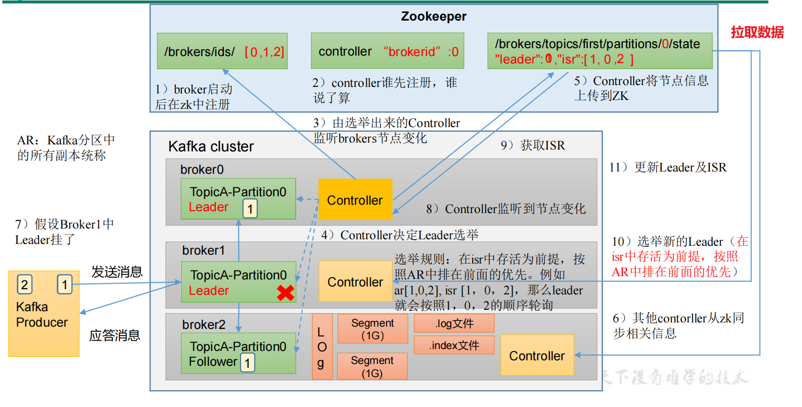
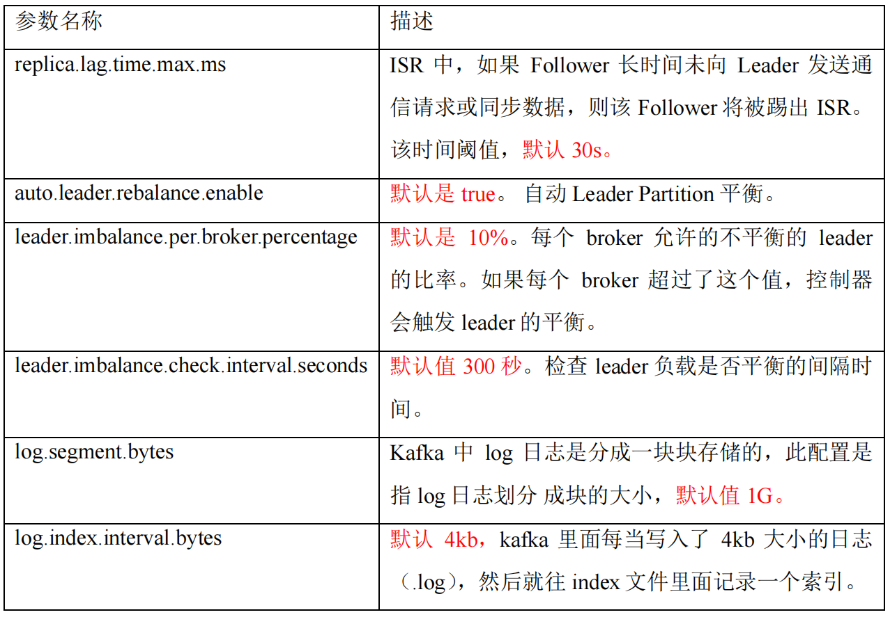
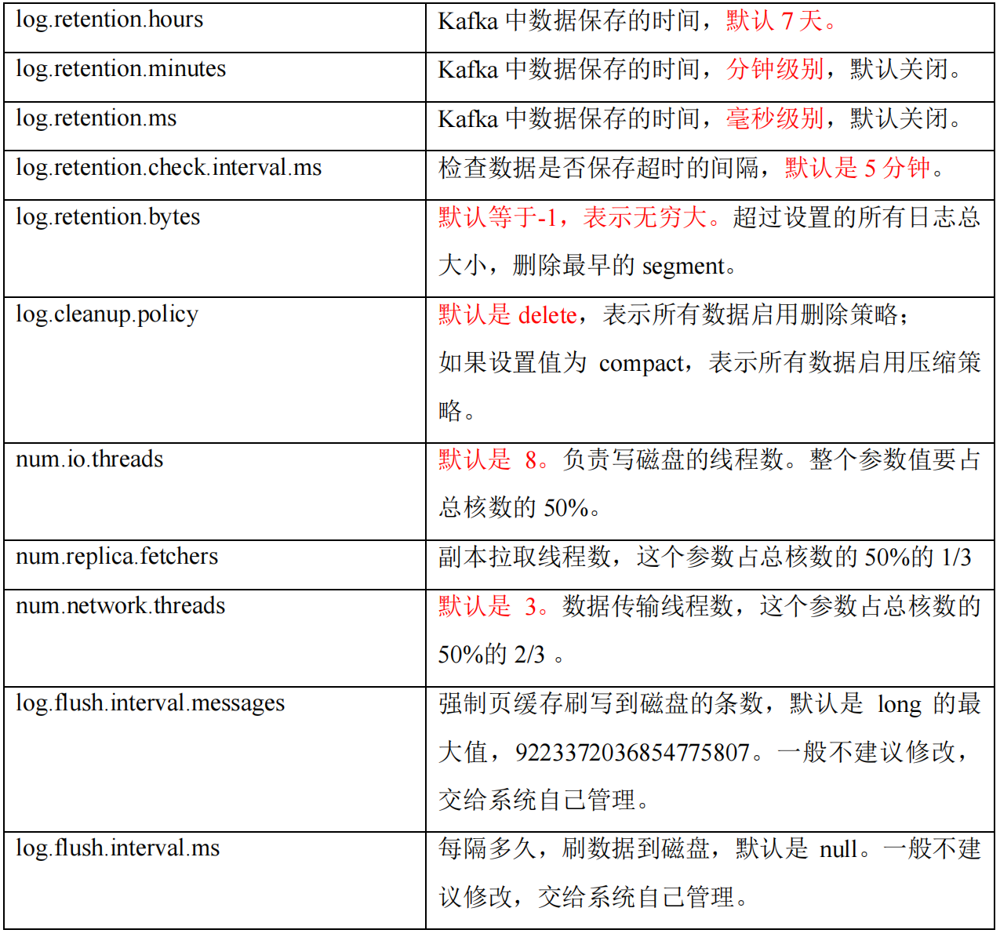

### Broker设计

我们都知道kafka能堆积非常大的数据，一台服务器，肯定是放不下的。由此出现的集群的概念，集群不仅可以让消息负载均衡，还能提高消息存取的吞吐量。kafka集群中，会有多台broker，每台broker分别在不同的机器上。

 为了提高吞吐量，每个topic也会有多个分区，同时为了保持可靠性，每个分区还会有多个副本。这些分区副本被均匀的散落在每个broker上，其中每个分区副本中有一个副本为leader，其他的为follower。



### Zookeeper

#### Zookeeper作用

Zookeeper在Kafka中扮演了重要的角色，kafka使用zookeeper进行元数据管理，保存broker注册信息，包括主题（Topic）、分区（Partition）信息等，选择分区leader。



#### Broker选举Leader

这里需要先明确一个概念leader选举，因为kafka中涉及多处选举机制，容易搞混，Kafka由三个方面会涉及到选举：

- broker（控制器）选leader
- 分区多副本选leader
- 消费者选Leader

<font color = 'red'>在kafka集群中由很多的broker（也叫做控制器），但是他们之间需要选举出一个leader，其他的都是follower。</font>broker的leader有很重要的作用，诸如：创建、删除主题、增加分区并分配leader分区；集群broker管理，包括新增、关闭和故障处理；分区重分配（auto.leader.rebalance.enable=true，后面会介绍），分区leader选举。

每个broker都有唯一的brokerId，他们在启动后会去竞争注册zookeeper上的Controller结点，谁先抢到，谁就是broker leader。而其他broker会监听该结点事件，以便后续leader下线后触发重新选举。

简图：

- broker（控制器）选leader



详细图：

- broker（控制器）选leader
- 分区多副本选leader



**模拟 Kafka 上下线，Zookeeper 中数据变化**

（1）查看/kafka/brokers/ids 路径上的节点。

```shell
[zk: localhost:2181(CONNECTED) 2] ls /kafka/brokers/ids
[0, 1, 2]
```

（2）查看/kafka/controller 路径上的数据。

```shell
[zk: localhost:2181(CONNECTED) 15] get /kafka/controller
{"version":1,"brokerid":0,"timestamp":"1637292471777"}
```

（3）查看/kafka/brokers/topics/first/partitions/0/state 路径上的数据。

```shell
[zk: localhost:2181(CONNECTED) 16] get  /kafka/brokers/topics/first/partitions/0/state
{"controller_epoch":24,"leader":0,"version":1,"leader_epoch":18," isr":[0,1,2]}
```

（4）停止 hadoop104 上的 kafka。

```shell
kafka-server-stop.sh
```

（5）再次查看/kafka/brokers/ids 路径上的节点。

```shell
[zk: localhost:2181(CONNECTED) 3] ls /kafka/brokers/ids
[0, 1]
```

（6）再次查看/kafka/controller 路径上的数据。

```shell
[zk: localhost:2181(CONNECTED) 15] get /kafka/controller
{"version":1,"brokerid":0,"timestamp":"1637292471777"}
```

（7）再次查看/kafka/brokers/topics/first/partitions/0/state 路径上的数据。

```shell
[zk: localhost:2181(CONNECTED) 16] get  /kafka/brokers/topics/first/partitions/0/state
{"controller_epoch":24,"leader":0,"version":1,"leader_epoch":18," isr":[0,1]}
```

（8）启动 hadoop104 上的 kafka。

```shell
kafka-server-start.sh -daemon ./config/server.properties
```

（9）再次观察（1）、（2）、（3）步骤中的内容。


#### Broker重要参数





