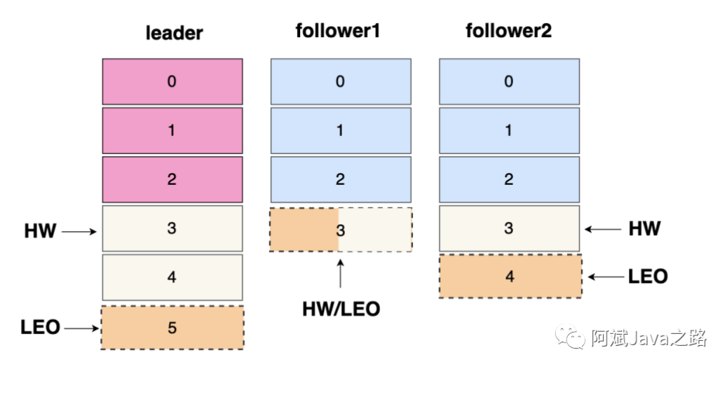
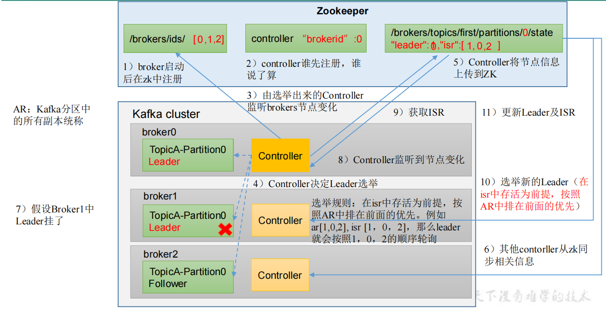
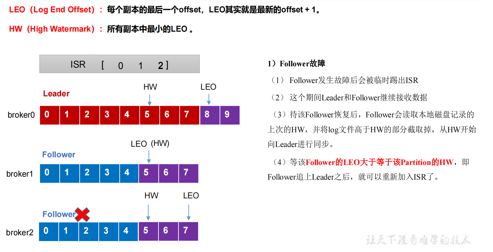
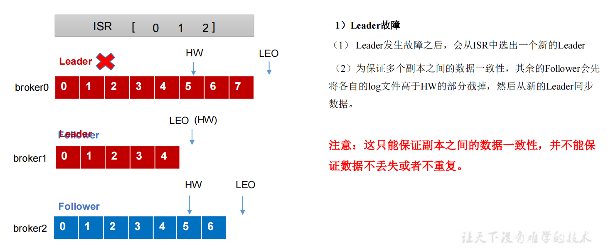
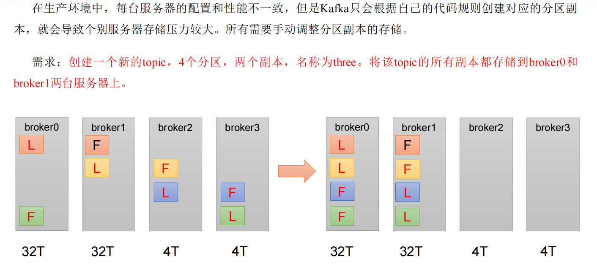
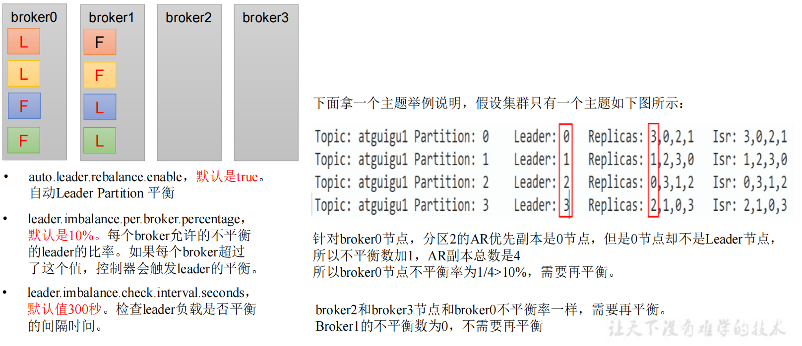

### 副本基本信息

- **Replica** ：副本，同一分区的不同副本保存的是相同的消息，为保证集群中的某个节点发生故障时，该节点上的 partition <font color = 'red'>数据不丢失 ，提高副本可靠性</font>，且 kafka 仍然能够继续工作，kafka 提供了副本机制，一个 topic 的每个分区都有若干个副本，一个 leader 和若干个 follower。

- **Leader** ：每个分区的多个副本中的"主副本"，**生产者以及消费者只与 Leader 交互。**(和MySQL的主从不一样，Kafka的Leader负责写和读，从只负责备份)

- **Follower** ：每个分区的多个副本中的"从副本"，负责实时从 Leader 中同步数据，保持和 Leader 数据的同步。Leader 发生故障时，从 Follower 副本中重新选举新的 Leader 副本对外提供服务。



- AR:分区中的所有 Replica 统称为 AR = ISR +OSR
- ISR:所有与 Leader 副本保持一定程度同步的Replica(包括 Leader 副本在内)组成 ISR
- OSR:与 Leader 副本同步滞后过多的 Replica 组成了 OSR
- LEO:每个副本都有内部的LEO，代表当前队列消息的最后一条偏移量offset + 1。
- HW:高水位，代表所有ISR中的LEO最低的那个offset，也是消费者可见的最大消息offset。

### 副本选举Leader

Kafka 集群中有一个 broker 的 Controller 会被选举为 <font color = 'red'>Controller Leader (4.2.2) </font>，负责管理集群Broker 的上下线，所有 topic 的<font color = 'red'>分区副本分配</font>和 <font color = 'red'>Leader 选举等</font>工作。

Broker中Controller 的信息同步工作是依赖于 Zookeeper 的 ./broker/topic 目录下的信息。



<font color = 'red'>结论先行： 如果leader副本下线， 会在ISR队列中存活为前提，按照**Replicas队列中前面优先**的原则。</font>

（1）创建一个新的 topic，4 个分区，4 个副本

```shell
kafka-topics.sh --bootstrap-server ip:9092 --create --topic luojia1 --partitions 4 --replication-factor 4
```

（2）查看 Leader 分布情况

```xml
kafka-topics.sh --bootstrap-server ip:9092 --describe --topic luojia1

Topic: luojia1 TopicId: awpgX_7WR-OX3Vl6HE8sVg PartitionCount: 4 ReplicationFactor: 4
Configs: segment.bytes=1073741824
Topic: luojia1 Partition: 0 Leader: 3 Replicas: 3,0,2,1 Isr: 3,0,2,1
Topic: luojia1 Partition: 1 Leader: 1 Replicas: 1,2,3,0 Isr: 1,2,3,0
Topic: luojia1 Partition: 2 Leader: 0 Replicas: 0,3,1,2 Isr: 0,3,1,2
Topic: luojia1 Partition: 3 Leader: 2 Replicas: 2,1,0,3 Isr: 2,1,0,3
```

（3）停止掉 hadoop105(brokerId 为3) 的 kafka 进程，并查看 Leader 分区情况

> 预计结果：Partition: 0的主机将会重选新Leader，根据 Isr 的在线情况，选择Replicas 中，排在最前面的主机节点，即会选择0（3,0,2,1 3下线，0还在线）

```shell
kafka-server-stop.sh
```

```shell
kafka-topics.sh --bootstrap-server ip:9092 --describe --topic luojia1

Topic: luojia1 TopicId: awpgX_7WR-OX3Vl6HE8sVg PartitionCount: 4 ReplicationFactor: 4
Configs: segment.bytes=1073741824
Topic: luojia1 Partition: 0 Leader: 0 Replicas: 3,0,2,1 Isr: 0,2,1
Topic: luojia1 Partition: 1 Leader: 1 Replicas: 1,2,3,0 Isr: 1,2,0
Topic: luojia1 Partition: 2 Leader: 0 Replicas: 0,3,1,2 Isr: 0,1,2
Topic: luojia1 Partition: 3 Leader: 2 Replicas: 2,1,0,3 Isr: 2,1,0

```

（4）停止掉 hadoop104(brokerId 为2) 的 kafka 进程，并查看 Leader 分区情况

```shell
kafka-server-stop.sh
kafka-topics.sh --bootstrap-server ip:9092 --describe  --topic luojia1

Topic: luojia1 TopicId: awpgX_7WR-OX3Vl6HE8sVg PartitionCount: 4 ReplicationFactor: 4
Configs: segment.bytes=1073741824
Topic: luojia1 Partition: 0 Leader: 0 Replicas: 3,0,2,1 Isr: 0,1
Topic: luojia1 Partition: 1 Leader: 1 Replicas: 1,2,3,0 Isr: 1,0
Topic: luojia1 Partition: 2 Leader: 0 Replicas: 0,3,1,2 Isr: 0,1
Topic: luojia1 Partition: 3 Leader: 1 Replicas: 2,1,0,3 Isr: 1,0

```

（5）如果此时 hadoop105(brokerId 为3) 恢复，再次查看Leader分区情况

```shell
kafka-server-stop.sh
kafka-topics.sh --bootstrap-server ip:9092 --describe  --topic luojia1

Topic: luojia1 TopicId: awpgX_7WR-OX3Vl6HE8sVg PartitionCount: 4 ReplicationFactor: 4
Configs: segment.bytes=1073741824
Topic: luojia1 Partition: 0 Leader: 0 Replicas: 3,0,2,1 Isr: 0,1,3
Topic: luojia1 Partition: 1 Leader: 1 Replicas: 1,2,3,0 Isr: 1,0,3
Topic: luojia1 Partition: 2 Leader: 0 Replicas: 0,3,1,2 Isr: 0,1,3
Topic: luojia1 Partition: 3 Leader: 1 Replicas: 2,1,0,3 Isr: 1,0,3
```

（6）停止掉 hadoop102(brokerId 为0) 的 kafka 进程，并查看 Leader 分区情况

```shell
kafka-server-stop.sh
kafka-topics.sh --bootstrap-server ip:9092 --describe  --topic luojia1

Topic: luojia1 TopicId: awpgX_7WR-OX3Vl6HE8sVg PartitionCount: 4 ReplicationFactor: 4
Configs: segment.bytes=1073741824
Topic: luojia1 Partition: 0 Leader: 3 Replicas: 3,0,2,1 Isr: 0,1,3
Topic: luojia1 Partition: 1 Leader: 1 Replicas: 1,2,3,0 Isr: 1,0,3
Topic: luojia1 Partition: 2 Leader: 3 Replicas: 0,3,1,2 Isr: 0,1,3
Topic: luojia1 Partition: 3 Leader: 1 Replicas: 2,1,0,3 Isr: 1,0,3
```

###  副本故障处理

#### 1.follower故障流程

如果follower落后leader过多，体现在**落后时间** repca.lag.time.max.ms ，或者**落后偏移量**repca.lag.max.messages(由于kafka生成速度不好界定，后面取消了该参数)，follower就会被移除ISR队列，等待该队列LEO追上HW，才会重新加入ISR中。



#### 2.leader故障流程

旧Leader先被从ISR队列中踢出，然后从ISR中选出一个新的Leader来(**例如选取出了broker1**)；此时为了保证多个副本之间的数据一致性，其他的follower会先将各自的log文件中高于HW的部分截取掉(**此时broker会将HW以及后面的数据全部截取掉，不要了**)，然后从新的leader同步数据（由此可知这只能保证副本之间数据一致性，并不能保证数据不丢失或者不重复）。体现了设置ACK-all的重要性。



### 分区副本分配

如果 kafka 服务器只有 4 个节点，那么设置 kafka 的分区数大于服务器台数，在 kafka底层如何分配存储副本呢？
1）创建 16 分区，3 个副本
（1）创建一个新的 topic，名称为 second。

```shell
kafka-topics.sh --bootstrap-server ip:9092 --create --partitions 16 --replication-factor 3 --topic second
```

（2）查看分区和副本情况。

```shell
kafka-topics.sh --bootstrap-server ip:9092  --describe --topic second
Topic: second4 Partition: 0 Leader: 0 Replicas: 0,1,2 Isr: 0,1,2
Topic: second4 Partition: 1 Leader: 1 Replicas: 1,2,3 Isr: 1,2,3
Topic: second4 Partition: 2 Leader: 2 Replicas: 2,3,0 Isr: 2,3,0
Topic: second4 Partition: 3 Leader: 3 Replicas: 3,0,1 Isr: 3,0,1
Topic: second4 Partition: 4 Leader: 0 Replicas: 0,2,3 Isr: 0,2,3
Topic: second4 Partition: 5 Leader: 1 Replicas: 1,3,0 Isr: 1,3,0
Topic: second4 Partition: 6 Leader: 2 Replicas: 2,0,1 Isr: 2,0,1
Topic: second4 Partition: 7 Leader: 3 Replicas: 3,1,2 Isr: 3,1,2
Topic: second4 Partition: 8 Leader: 0 Replicas: 0,3,1 Isr: 0,3,1
Topic: second4 Partition: 9 Leader: 1 Replicas: 1,0,2 Isr: 1,0,2
Topic: second4 Partition: 10 Leader: 2 Replicas: 2,1,3 Isr: 2,1,3
Topic: second4 Partition: 11 Leader: 3 Replicas: 3,2,0 Isr: 3,2,0
Topic: second4 Partition: 12 Leader: 0 Replicas: 0,1,2 Isr: 0,1,2
Topic: second4 Partition: 13 Leader: 1 Replicas: 1,2,3 Isr: 1,2,3
Topic: second4 Partition: 14 Leader: 2 Replicas: 2,3,0 Isr: 2,3,0
Topic: second4 Partition: 15 Leader: 3 Replicas: 3,0,1 Isr: 3,0,1
```

由此可见，Kafka内部也会自动的平衡分区的数据。

### 手动调整分区副本



手动调整分区副本存储的步骤如下：
（1）创建一个新的 topic，名称为 three。

```shell
kafka-topics.sh --bootstrap-server  ip:9092  --create --partitions 4 --replication-factor 2 --topic three
```

（2）创建副本存储计划（所有副本都指定存储在 broker0、broker1 中）。

```shell
$ vim increase-replication-factor.json
输入如下内容：
{
"version":1,
"partitions":[
{"topic":"three","partition":0,"replicas":[0,1]},
{"topic":"three","partition":1,"replicas":[0,1]},
{"topic":"three","partition":2,"replicas":[1,0]},
{"topic":"three","partition":3,"replicas":[1,0]}]
}
```

（3）执行副本存储计划。

```shell
kafka-reassign-partitions.sh --bootstrap-server  ip:9092  --reassignment-json-file increase-replication-factor.json --execute
```

（4）验证副本存储计划。

```shell
kafka-reassign-partitions.sh --bootstrap-server  ip:9092  --reassignment-json-file increase-replication-factor.json --verify
```

### 分区自动调整

一般情况下，我们的分区都是平衡散落在broker的，随着一些broker故障，会慢慢出现leader集中在某台broker上的情况，造成集群负载不均衡，这时候就需要分区平衡。



为了解决上述问题kafka出现了自动平衡的机制。kafka提供了下面几个参数进行控制：

- `auto.leader.rebalance.enable`：自动leader parition平衡，默认是true;
- `leader.imbalance.per.broker.percentage`：每个broker允许的不平衡的leader的比率，默认是10%，如果超过这个值，控制器将会触发leader的平衡
- `leader.imbalance.check.interval.seconds`：检查leader负载是否平衡的时间间隔，默认是300秒
- 但是在生产环境中是不开启这个自动平衡，因为触发leader partition的自动平衡会损耗性能，或者可以将触发自动平和的参数`leader.imbalance.per.broker.percentage` 的值调大点。

我们也可以通过修改配置，然后手动触发分区的再平衡。

### 增加副本因子

在生产环境当中，由于某个主题的重要等级需要提升，我们考虑增加副本。副本数的增加需要先制定计划，然后根据计划执行。不能通过命令行的方法添加副本。

1）创建 topic

```shell
bin/kafka-topics.sh --bootstrap-server ip:9092 --create --partitions 3 --replication-factor 1 --topic four
```

2）手动增加副本存储
（1）创建副本存储计划（所有副本都指定存储在 broker0、broker1、broker2 中）。

```json
vim increase-replication-factor.json

{"version":1,"partitions":[
{"topic":"four","partition":0,"replicas":[0,1,2]},
{"topic":"four","partition":1,"replicas":[0,1,2]},
{"topic":"four","partition":2,"replicas":[0,1,2]}]}

```

（2）执行副本存储计划。

```shell
kafka-reassign-partitions.sh --bootstrap-server ip:9092 --reassignment-json-file increase-replication-factor.json --execute
```


