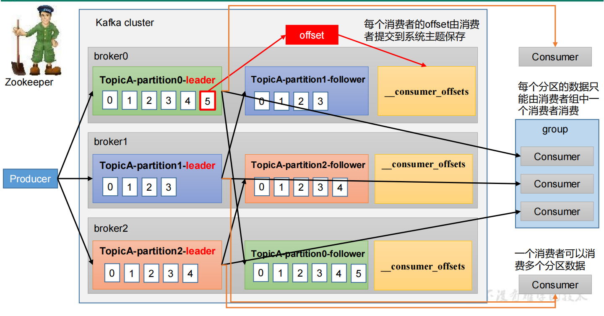
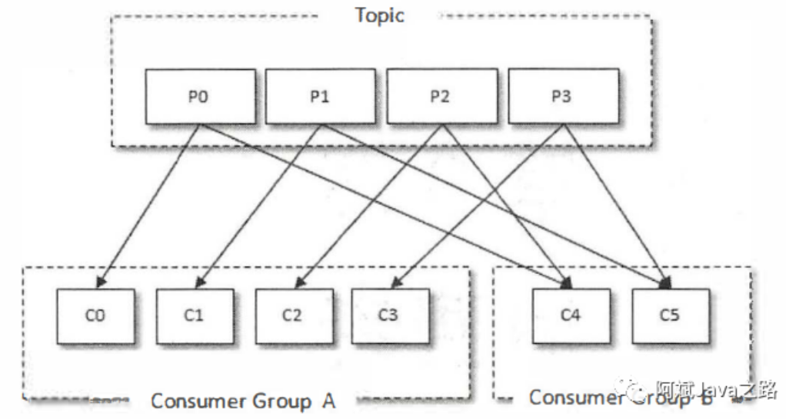
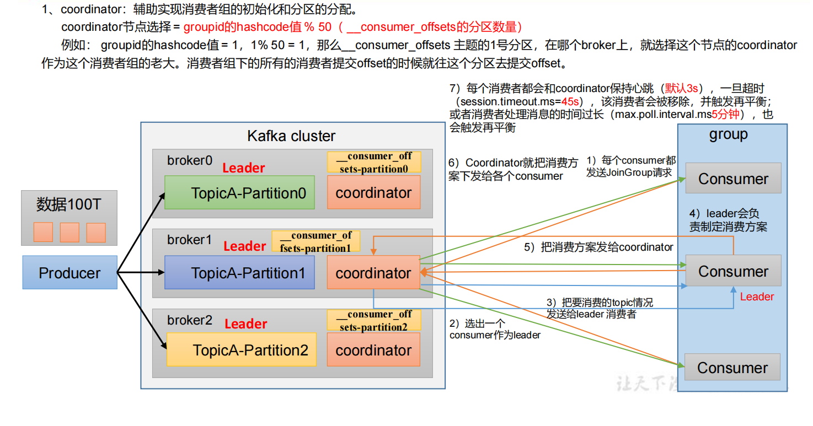
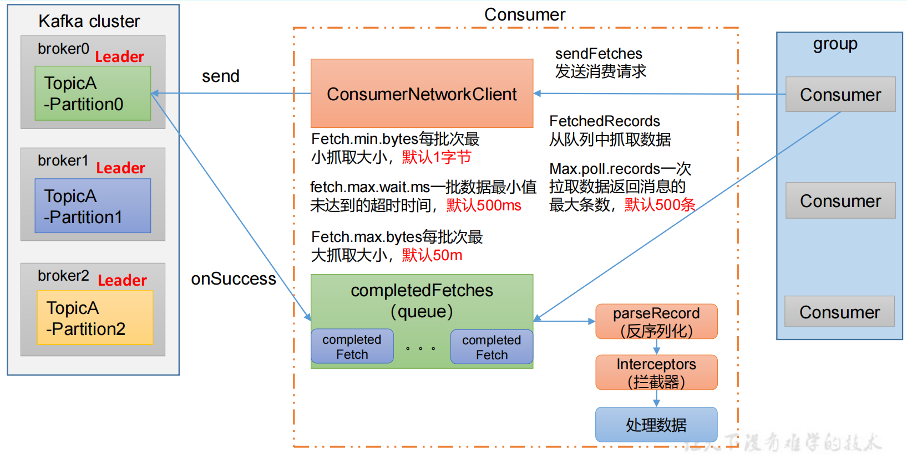
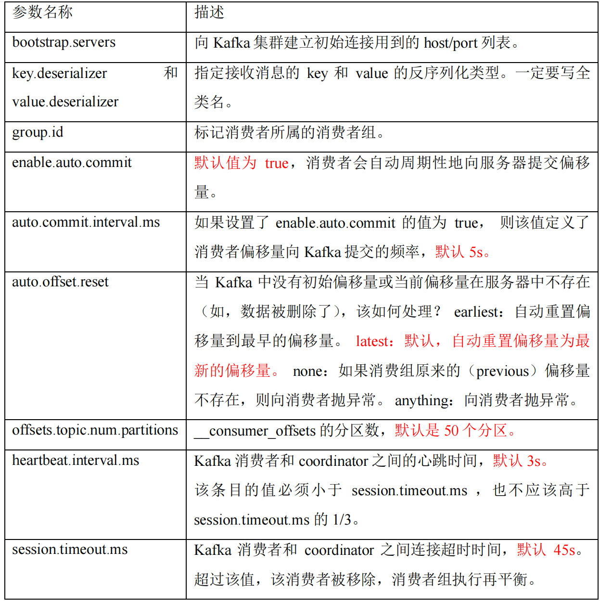
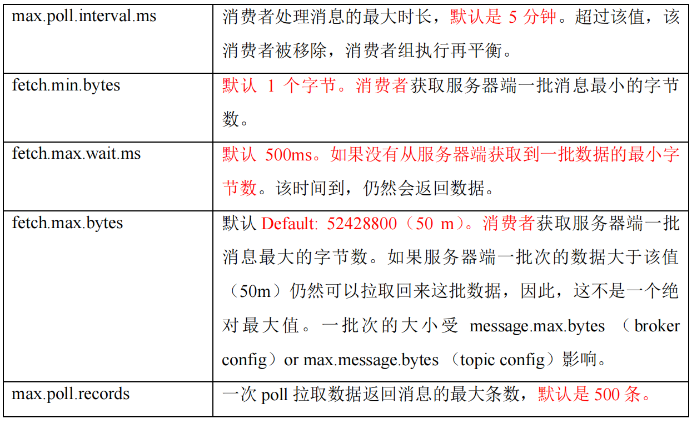

### 消费模式

常见的消费模式有两种：

`poll(拉)`：消费者主动向服务端拉取消息。

`push(推)`：服务端主动推送消息给消费者。

由于推模式很难考虑到每个客户端不同的消费速率,导致消费者无法消费消息而宕机，因此kafka采用的是poll的模式，该模式有个缺点，如果服务端没有消息，消费端就会一直空轮询。为了避免过多不必要的空轮询，kafka做了改进，如果没消息服务端就会暂时保持该请求，在一段时间内有消息再回应给客户端。

### 消费工作流程

#### 消费者总体工作流程

消费者对消息进行消费，并且将已经消费的消息加入 _consumer_offsets 中。

#### 消费者组原理

Consumer Group（CG）：消费者组，由多个consumer组成。形成一个消费者组的条件，是所有消费者的groupid相同。

- 消费者组内每个消费者负责消费不同分区的数据，一个分区只能由一个组内消费者消费。
- 消费者组之间互不影响。所有的消费者都属于某个消费者组，即消费者组是逻辑上的一个订阅者。

对于消息中间件而言，一般有两种消息投递模式：**点对点**(P2P, Point-to-Point)模式和**发布／订阅**(Pub/Sub)模式。点对点模式是基于队列的，消息生产者发送消息到队列，消息消费者从队列中接收消息。发布订阅模式定义了如何向一个内容节点发布和订阅消息，这个内容节点称为主题(Topic) , 主题可以认为是消息传递的中介，消息发布者将消息发布到某个主题， 而消息订阅者从主题中订阅消息。主题使得消息的订阅者和发布者互相保持独立，不需要进行接触即可保证消息的传递，发布／订阅模式在消息的一对多广播时采用。Kafka同时支待两种消息投递模式，而这正是得益于消费者与消费组模型的契合：

- 如果所有的消费者都隶属于同一个消费组，那么所有的消息都会被均衡地投递给每一个消费者，即每条消息只会被一个消费者处理，这就相当于点对点模式的应用。
- 如果所有的消费者都隶属于不同的消费组，那么所有的消息都会被广播给所有的消费者，即每条消息会被所有的消费者处理，这就相当于发布／订阅模式的应用。

#### 消费者组选举Leader

具体的消费者组初始化流程：

通过对GroupId进行Hash得到那台服务器的coordinator ，coordinator负责选出消费组中的Leader ，并且协调信息。真正存储消费记录的是 _consumer_offsets_partition 。

