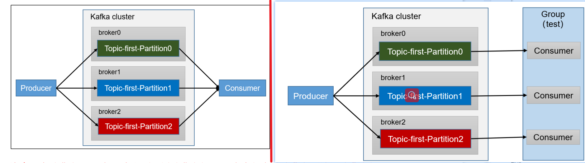
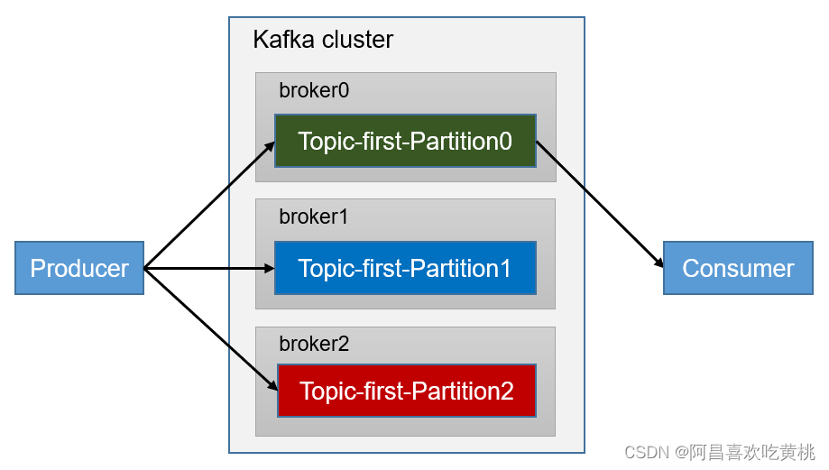
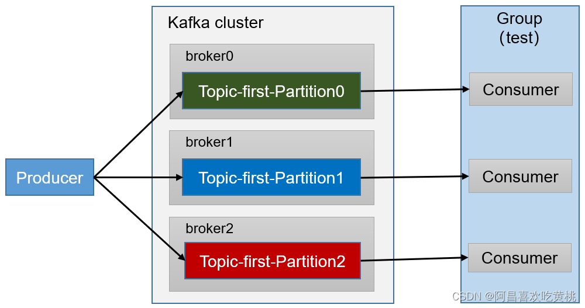

### 消费者API

消费组单消费者以及消费者组多消费者



<font color = 'red'>注意：在消费者 API 代码中必须配置消费者组 id，如果没有会报错。</font>命令行启动消费者不填写消费者组id 会被自动填写随机的消费者组 id。

#### 独立消费者案例 （订阅主题）

```java
public class CustomConsumer {

    public static void main(String[] args) {
        // 配置属性类
        Properties properties = new Properties();
        properties.put(ConsumerConfig.BOOTSTRAP_SERVERS_CONFIG, "127.0.0.1:9092");
        // 反序列化
        properties.put(ConsumerConfig.KEY_DESERIALIZER_CLASS_CONFIG, StringDeserializer.class.getName());
        properties.put(ConsumerConfig.VALUE_DESERIALIZER_CLASS_CONFIG, StringDeserializer.class.getName());
        // 消费者必须指定一个组ID
        properties.put(ConsumerConfig.GROUP_ID_CONFIG, "test");

        // 1 创建一个消费者
        KafkaConsumer<String, String> kafkaConsumer = new KafkaConsumer<>(properties);

        // 2 订阅 topic
        List<String> topics = new ArrayList<>();
        topics.add("first");
        kafkaConsumer.subscribe(topics);

        // 3 消费数据
        while (true) {
            ConsumerRecords<String, String> consumerRecords = kafkaConsumer.poll(Duration.ofSeconds(1));
            for (ConsumerRecord<String, String> records: consumerRecords) {
                System.out.println(records.topic() + ":" + records.key() + ":" + records.value());
            }
        }
    }
}
```

#### 独立消费者案例 （订阅分区）



```java
/**
 * 消费者消费指定分区数据
 */
public class CustomConsumerPartition {

    public static void main(String[] args) {
        // 配置属性类
        Properties properties = new Properties();
        properties.put(ConsumerConfig.BOOTSTRAP_SERVERS_CONFIG, "127.0.0.1:9092");
        // 反序列化
        properties.put(ConsumerConfig.KEY_DESERIALIZER_CLASS_CONFIG, StringDeserializer.class.getName());
        properties.put(ConsumerConfig.VALUE_DESERIALIZER_CLASS_CONFIG, StringDeserializer.class.getName());
        // 消费者必须指定一个组ID
        properties.put(ConsumerConfig.GROUP_ID_CONFIG, "test");

        // 1 创建一个消费者
        KafkaConsumer<String, String> kafkaConsumer = new KafkaConsumer<>(properties);

        // 2 订阅主题对应的分区，只有这里和订阅主题方式不一样
        List<TopicPartition> topicPartitions = new ArrayList<>();
        // 消费 first主题 0号分区数据
        topicPartitions.add(new TopicPartition("first", 0));
        kafkaConsumer.assign(topicPartitions);

        // 3 消费数据
        while (true) {
            ConsumerRecords<String, String> consumerRecords = kafkaConsumer.poll(Duration.ofSeconds(1));
            for (ConsumerRecord<String, String> records: consumerRecords) {
                System.out.println(records);
            }
        }
    }
}
```

#### 消费者组案例



这个很好理解，就是将上面 **独立消费者案例 （订阅分区）**的代码复制多份，保证里面配置的 properties.put(ConsumerConfig.GROUP_ID_CONFIG, "test"); 组ID是一样的就行，然后启动服务，在Kafka里面就已经将这几个服务组合成一个消费组了，能对应消费主题里面的分区。


