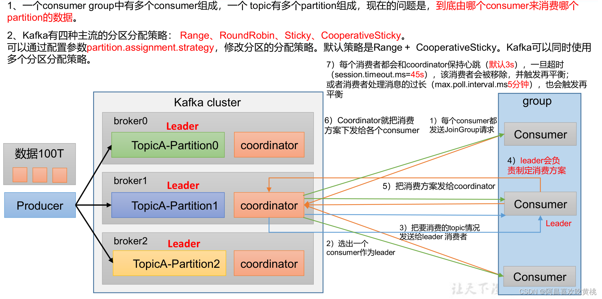
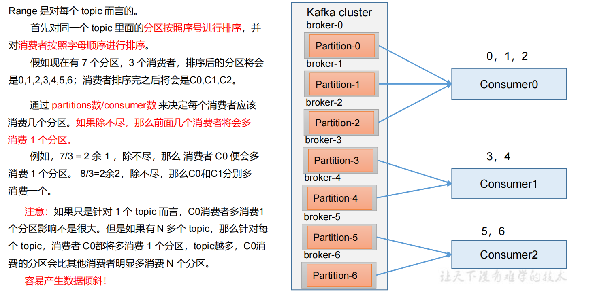

### 生产经验 —— 分区的分配



参数名称描述

`heartbeat.interval.ms Kafka` 消费者和 coordinator 之间的心跳时间，**默认 3s**。该条目的值必须小于 session.timeout.ms，也不应该高于session.timeout.ms 的 1/3。

`session.timeout.ms` Kafka 消费者和 coordinator 之间连接超时时间，**默认 45s**。超过该值，该消费者被移除，消费者组执行再平衡。

`max.poll.interval.ms` 消费者处理消息的最大时长，**默认是 5 分钟**。超过该值，该消费者被移除，消费者组执行再平衡。

`partition.assignment.strategy` 消费者分区分配策略， 默认策略是 Range + CooperativeSticky。Kafka 可以同时使用多个分区分配策略。可 以 选 择 的 策 略 包 括 ： Range 、 RoundRobin 、 Sticky 、<font color = 'red'>CooperativeSticky (协作者粘性)</font>

#### 分区分配策略

我们知道一个 Consumer Group 中有多个 Consumer，一个 Topic 也有多个 Partition，所以必然会涉及到 Partition 的分配问题: 确定哪个 Partition 由哪个 Consumer 来消费的问题。

Kafka 客户端提供了3 种分区分配策略：**RangeAssignor**、**RoundRobinAssignor** 和 **StickyAssignor**，前两种 分配方案相对简单一些StickyAssignor分配方案相对复杂一些。

#### ①Range以及再平衡(是针对单个topic而言)



##### Range 分区分配策略案例

- 修改主题 first为 7个分区。

```shell
bin/kafka-topics.sh --bootstrap-server hadoop102:9092 --alter --topic first --partitions 7
```

**注意：分区数可以增加，但是不能减少。**

复制 CustomConsumer 类，创建 CustomConsumer2。这样可以由三个消费者
CustomConsumer、CustomConsumer1、CustomConsumer2 组成消费者组，组名都为“test”，同时启动 3 个消费者。

启动 CustomProducer生产者，发送 500条消息，随机发送到不同的分区。

<font color = 'red'>Range 分区分配再平衡案例</font>
（1）停止掉 0 号消费者，快速重新发送消息观看结果（<font color = 'red'>45s 以内</font>，越快越好）。

1 号消费者：消费到 3、4 号分区数据。

2 号消费者：消费到 5、6 号分区数据。

0 号消费者的任务**会整体被分配**到 1 号消费者或者 2 号消费者。<font color = 'red'> (被整体分配)</font>

<font color = 'red'>说明：0 号消费者挂掉后，消费者组需要按照超时时间 45s 来判断它是否退出，所以需要等待，时间到了 45s 后，判断它真的退出就会把任务分配给其他 broker 执行。</font>

（2）再次重新发送消息观看结果（<font color = 'red'>45s 以后</font>）。
1 号消费者：消费到 0、1、2、3 号分区数据。

2 号消费者：消费到 4、5、6 号分区数据。

说明：消费者 0 已经被踢出消费者组，**所以重新按照 range 方式分配**。

#### ②RoundRobin 以及再平衡(是针对所有topic而言)


```java
// 修改分区分配策略
properties.put(ConsumerConfig.PARTITION_ASSIGNMENT_STRATEGY_CONFIG, "org.apache.kafka.clients.consumer.RoundRobinAssignor");
```

（1）停止掉 0 号消费者，快速重新发送消息观看结果（<font color = 'red'>45s 以内</font>，越快越好）。

1 号消费者：消费到 2、5 号分区数据

2 号消费者：消费到 4、1 号分区数据

0 号消费者的任务会按照 RoundRobin 的方式，把数据轮询分成 0 、6 和 3 号分区数据，分别由 1 号消费者或者 2 号消费者消费。<font color = 'red'>（采用轮训）</font>

<font color = 'red'>说明：0 号消费者挂掉后，消费者组需要按照超时时间 45s 来判断它是否退出，所以需要等待，时间到了 45s 后，判断它真的退出就会把任务分配给其他 broker 执行。</font>

（2）再次重新发送消息观看结果（<font color = 'red'>45s 以后</font>）。

1 号消费者：消费到 0、2、4、6 号分区数据

2 号消费者：消费到 1、3、5 号分区数据

说明：消费者 0 已经被踢出消费者组，所以**重新按照 RoundRobin 方式分配**。

#### ③Sticky 以及再平衡

**粘性分区定义**：可以理解为分配的结果带有“粘性的”。即在执行一次新的分配之前，考虑上一次分配的结果，尽量少的调整分配的变动，可以节省大量的开销。

粘性分区是Kaka从 0.11.x版本开始引入这种分配策略，<font color = 'red'>首先会尽量均衡的放置分区到消费者上面</font>，在出现同一消费者组内消费者出现问题的时候，<font color = 'red'>会尽量保持原有分配的分区不变化。</font>

1)、**Topic Partition** 的分配要尽量均衡。

2)、当 **Rebalance**(重分配，后面会详细分析) 发生时，尽量与上一次分配结果保持一致。

该算法的精髓在于，重分配后，还能尽量与上一次结果保持一致，进而达到消费者故障下线，故障恢复后的均衡问题，在此就不举例了。

```shell
// 修改分区分配策略
properties.put(ConsumerConfig.PARTITION_ASSIGNMENT_STRATEGY_CONFIG, "org.apache.kafka.clients.consumer.StickyAssignor");
```

(1)停止掉0号消费者，快速重新发送消息观看结果(45s以内，越快越好)。

1号消费者：消费到2、3、5号分区数据。

2号消费者：消费到4、6号分区数据。

0号消费者的任务会<font color = 'red'>按照粘性规则，尽可能均衡的随机分成0和1号分区数据</font>，分别由1号消费者或者2号消费者消费。

<font color = 'red'>说明：0号消费者挂掉后，消费者组需要按照超时时间 45s来判断它是否退出，所以需要等待，时间到了 45s后，判断它真的退出就会把任务分配给其他 broker 执行</font>

(2)再次重新发送消息观看结果(45s以后)。

1号消费者：消费到2、3、5号分区数据

2号消费者：消费到0、1、4、6号分区数据

说明：消费者0已经被踢出消费者组，所以**重新按照粘性方式分配**


