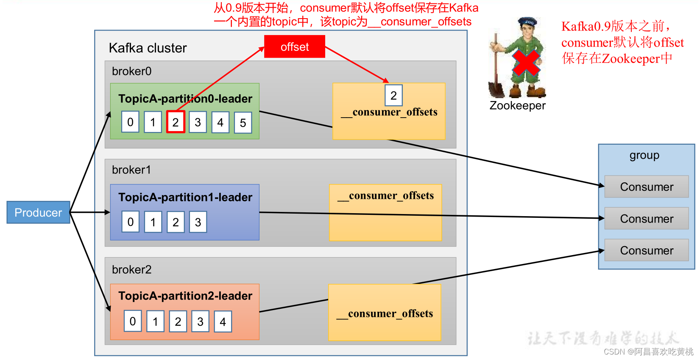
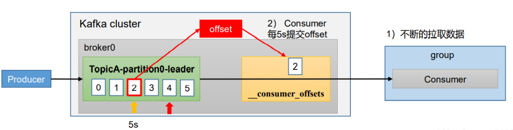
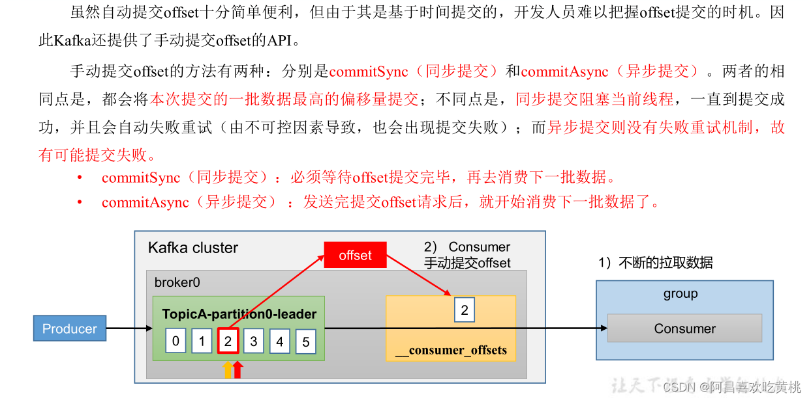
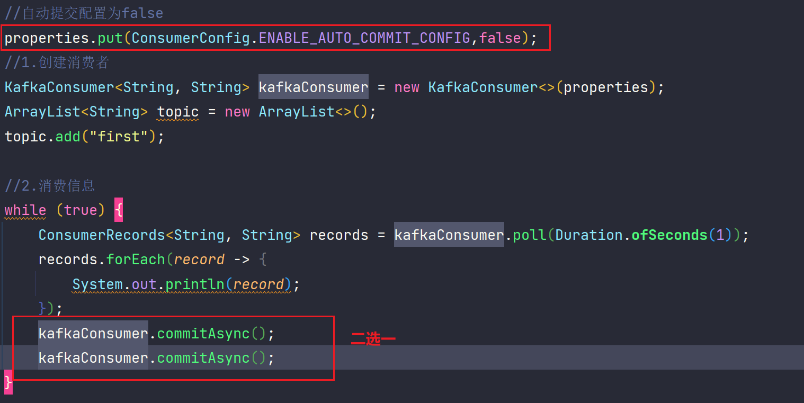
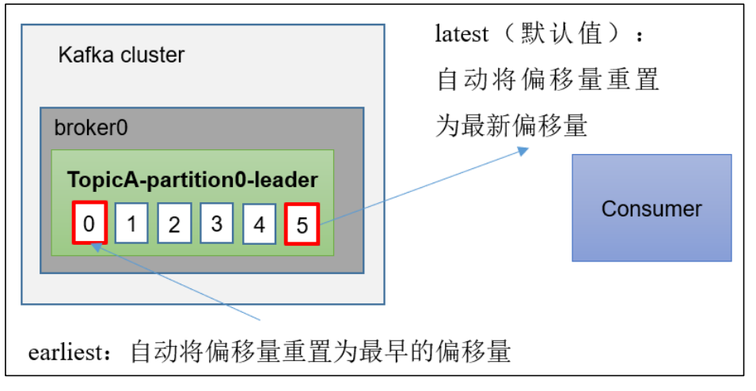
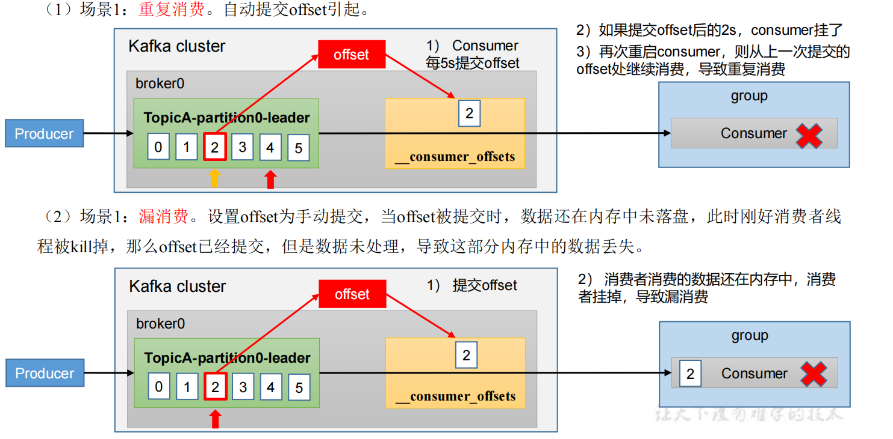

### offset位移提交

#### 1、offset 的默认维护



__consumer_offsets 主题里面采用 key 和 value 的方式存储数据。key 是group.id+topic+分区号，value 就是当前 offset 的值。每隔一段时间，kafka 内部会对这个 topic 进行压缩compact，也就是每个group.id+topic+分区号就保留最新数据。

<font color = 'red'>Kafka 0.9 版本之前consumer默认将offset保存在Zookeeper中，从0.9版本之后consumer默认保存在Kafka一个内置的topic中，该topic为_consumer_offsets。 </font>

消费者提交的offset值维护在 **__consumer_offsets **这个Topic中，具体维护在哪个分区中，是由消费者所在的消费者组groupid决定，计算方式是：groupid的hashCode值对50取余。当kafka环境正常而消费者不能消费时，有可能是对应的__consumer_offsets分区leader为none或-1，或者分区中的日志文件损坏导致。

 __consumer_offsets 主题里面采用 key 和 value 的方式存储数据。key 是 group.id+topic+ 分区号，value 就是当前 offset 的值。每隔一段时间，kafka 内部会对这个 topic 进行 compact，也就是每个 group.id+topic+分区号就保留最新数据。

 一般情况下， 当集群中第一次有消费者消费消息时会自动创建主题  __consumer_offsets , 不过它的副本因子还受offsets.topic .replication.factor参数的约束，这个参数的默认值为3 (下载安装的包中此值可能为1)，分区数可以通过offsets.topic.num.partitions参数设置，默认为50，所以上面一直说的对50取余，就是这里默认值为50，如果这里值改变了，那么取余的值也会变化。

在配置文件 config/consumer.properties 中添加配置 exclude.internal.topics=false，默认是 true，表示不能消费系统主题。为了查看该系统主题数据，所以该参数修改为 false。

```shell
kafka-console-consumer.sh --topic __consumer_offsets --bootstrap-server ip:9092 --consumer.config config/consumer.properties --formatter "kafka.coordinator.group.GroupMetadataManager\$OffsetsMessageFormatter" --from-beginning
```

消费者提交offset的方式有两种，**自动提交**和**手动提交**

#### 自动提交offset

为了使我们能够专注于自己的业务逻辑，Kafka提供了自动提交offset的功能。



- `enable.auto.commit`：是否开启自动提交offset功能，<font color = 'red'>默认是true</font>
- `auto.commit.interval.ms`：自动提交offset的时间间隔，<font color = 'red'>默认是5s</font>

消费者消费配置核心代码

```java
// 自动提交 offset
properties.put(ConsumerConfig.ENABLE_AUTO_COMMIT_CONFIG, true);
// 自动提交 offset 事件间隔，默认 5000ms
properties.put(ConsumerConfig.AUTO_COMMIT_INTERVAL_MS_CONFIG, 1000);
```

自动提交有可能出现消息消费失败，但是却提交了offset的情况，导致**消息丢失**。为了能够实现消息消费offset的精确控制，更推荐手动提交。

#### 手动提交offset

虽然自动提交offset十分简单便利，但由于其是基于时间提交的，开发人员难以把握offset提交的时机。因此Kafka还提供了手动提交offset的API。

手动提交offset的方法有两种：分别是<font color = 'red'>commitSync（同步提交）</font>和<font color = 'red'>commitAsync（异步提交）</font>。两者的相同点是，都会将本次提交的一批数据最高的偏移量提交；不同点是，<font color = 'red'>同步提交阻塞当前线程</font>，一直到提交成功，并且会自动失败重试（由不可控因素导致，也会出现提交失败）；<font color = 'red'>而异步提交则没有失败重试机制，故有可能提交失败。</font>

- `commitSync（同步提交）`：必须等待offset提交完毕，再去消费下一批数据。 阻塞线程，一直到提交到成功，会进行失败重试
- `commitAsync（异步提交）` ：发送完提交offset请求后，就开始消费下一批数据了。没有失败重试机制，会提交失败





#### 指定消费位置

在kafka中当消费者查找不到所记录的消费位移时，会根据auto.offset.reset的配置，决定从何处消费。

`auto.offset.reset = earliest | latest | none` 默认是 latest。

- `earliest`：自动将偏移量重置为最早的偏移量，–from-beginning。
- `latest`（默认值）：自动将偏移量重置为最新偏移量
- `none`：如果未找到消费者组的先前偏移量，则向消费者抛出异常。



Kafka中的消费位移是存储在一个内部主题中的， 而我们可以使用**seek()**方法可以突破这一限制：消费位移可以保存在任意的存储介质中， 例如数据库、 文件系统等。以数据库为例， 我们将消费位移保存在其中的一个表中， 在下次消费的时候可以读取存储在数据表中的消费位移并通过seek()方法指向这个具体的位置 。

```java
//配置信息
Properties properties = new Properties();
properties.put(ConsumerConfig.AUTO_OFFSET_RESET_CONFIG, "latest");
```

##### 指定位移消费

```java
/**
 * 指定 offset位置开始消费
 */
public class CustomConsumerSeek {

    public static void main(String[] args) {
        // 配置属性类
        Properties properties = new Properties();
        properties.put(ConsumerConfig.BOOTSTRAP_SERVERS_CONFIG, "127.0.0.1:9092");
        // 反序列化
        properties.put(ConsumerConfig.KEY_DESERIALIZER_CLASS_CONFIG, StringDeserializer.class.getName());
 properties.put(ConsumerConfig.VALUE_DESERIALIZER_CLASS_CONFIG, StringDeserializer.class.getName());
        
        properties.put(ConsumerConfig.AUTO_OFFSET_RESET_CONFIG, "latest");

        // 消费者必须指定一个组ID
        properties.put(ConsumerConfig.GROUP_ID_CONFIG, "test1");

        // 1 创建一个消费者
        KafkaConsumer<String, String> kafkaConsumer = new KafkaConsumer<>(properties);

        // 2 订阅 topic
        List<String> topics = new ArrayList<>();
        topics.add("first");
        kafkaConsumer.subscribe(topics);

        // 指定位置进行消费
        Set<TopicPartition> assignment = kafkaConsumer.assignment();
        // 需要保证分区分配方案已经指定完毕
        while (assignment.size() == 0) {
            // 不断拉取消息，保证能及时拉取到最新的分区信息
            kafkaConsumer.poll(Duration.ofSeconds(1));
            assignment = kafkaConsumer.assignment();
        }

        for (TopicPartition topicPartition : assignment) {
            kafkaConsumer.seek(topicPartition, 50);
        }

        // 3 消费数据
        while (true) {
            ConsumerRecords<String, String> consumerRecords = kafkaConsumer.poll(Duration.ofSeconds(1));
            for (ConsumerRecord<String, String> records: consumerRecords) {
                System.out.println(records);
            }
        }
    }
}
```

##### 指定时间消费

原理就是查到时间对应的offset再去指定位移消费，为了确保同步到分区信息，我们还需要确保能获取到分区，再去查询分区时间

```java
/**
 * 指定 offset位置开始消费
 */
public class CustomConsumerSeekTime {

    public static void main(String[] args) {
        // 配置属性类
        Properties properties = new Properties();
        properties.put(ConsumerConfig.BOOTSTRAP_SERVERS_CONFIG, "127.0.0.1:9092");
        // 反序列化
        properties.put(ConsumerConfig.KEY_DESERIALIZER_CLASS_CONFIG, StringDeserializer.class.getName());
        properties.put(ConsumerConfig.VALUE_DESERIALIZER_CLASS_CONFIG, StringDeserializer.class.getName());
        // 消费者必须指定一个组ID
        properties.put(ConsumerConfig.GROUP_ID_CONFIG, "test1");

        // 1 创建一个消费者
        KafkaConsumer<String, String> kafkaConsumer = new KafkaConsumer<>(properties);

        // 2 订阅 topic
        List<String> topics = new ArrayList<>();
        topics.add("first");
        kafkaConsumer.subscribe(topics);

        // 指定位置进行消费
        Set<TopicPartition> assignment = kafkaConsumer.assignment();
        // 需要保证分区分配方案已经指定完毕
        while (assignment.size() == 0) {
            // 不断拉取消息，保证能及时拉取到最新的分区信息
            kafkaConsumer.poll(Duration.ofSeconds(1));
            assignment = kafkaConsumer.assignment();
        }

        // 希望把时间转换为对应的 Offset
        HashMap<TopicPartition, Long> topicPartitionLongHashMap = new HashMap<>();
        // 获取到所有的分区信息
        for (TopicPartition topicPartition : assignment) {
            // 从当前时间的前一天开始消费
            topicPartitionLongHashMap.put(topicPartition, System.currentTimeMillis() - 1 * 24 * 3600 * 1000);
        }

        Map<TopicPartition, OffsetAndTimestamp> topicPartitionOffsetAndTimestampMap = kafkaConsumer.offsetsForTimes(topicPartitionLongHashMap);

        for (TopicPartition topicPartition : assignment) {
            OffsetAndTimestamp offsetAndTimestamp = topicPartitionOffsetAndTimestampMap.get(topicPartition);
            kafkaConsumer.seek(topicPartition, offsetAndTimestamp.offset());
        }

        // 3 消费数据
        while (true) {
            ConsumerRecords<String, String> consumerRecords = kafkaConsumer.poll(Duration.ofSeconds(1));
            for (ConsumerRecord<String, String> records: consumerRecords) {
                System.out.println(records);
            }
        }
    }
}
```

##### 漏消费和重复消费

**重复消费**：已经消费了数据，但是 offset没提交。

**漏消费**：先提交 offset后消费，有可能会造成数据的漏消费。




怎么能做到即不漏消费也不重复消费呢？这时需要消费者事务。


