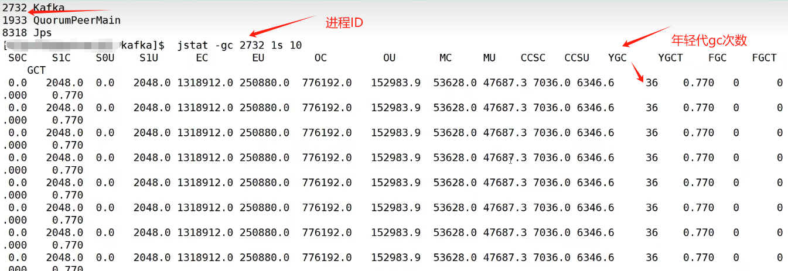

### 场景说明

100万日活，每人每天100条日志，每天总共的日志条数是100万 * 100条=1亿条。

1亿/24小时/60分/60秒=1150条/每秒钟。

每条日志大小：0.5k-2k(取1k)。

1150条/每秒钟 * 1k ≈ 1m/s。

高峰期(扩大20倍)每秒钟：1150条 * 20倍=23000条。

每秒多少数据量：20MB/S。

### 服务器台数选择

服务器台数 = 2 * (生产者峰值生产速率 * 副本数 / 100) + 1

​					= 2 * (20m/s * 2 / 100) + 1

​					= 3台

### 磁盘选择

Kafka 按照顺序读写，机械硬盘和固态硬盘顺序读写速度差不多，选择采购机械硬盘

1亿条 * 1k = 100g

100g * 2副本 * 3天(数据按保留3天计算) / 0.7 = 1t

建议三台服务器总的磁盘大小 大于1t

### 内存选择

Kafka 内存 = 堆内存(Kafka内部配置，xms， xms) + 页缓存(服务器内存)

1. 堆内存生产环境每个节点一般配置  10 - 15G
   
2. 页缓存 segment (1g)
   一个segment默认大小为1g，然后我们只需要将25%的数据放入到页缓存中
   1g * 25% * 分区数(例如10个) / 3(三台服务器) = 2.5g / 3 = 1g

即一台服务器大概的内存大小就是 10g + 1g

### CPU选择

`num.io.threads= 8` 负责写磁盘的线程数，整个参数值要占总核数的50%。

`num.replica.fetchers=1` 副本拉取线程数，这个参数占总核数的 50%的 1/3。

`num.network.threads=3`数据传输线程数，这个参数占总核数的50%的2/3。

建议 32个cpu core。

### 网络选择

网络带宽-峰值吞吐量 ≈ 20MB/S 选择千兆网卡即可。

100Mtps单位是bit; 10Ms单位是byte; 1byte=8bit，100Mbps/8 = 12.5Ms。

一般百兆的网卡(100Mbps)、千兆的网卡(1000Mbps)、万兆的网卡(10000Mbps)。

