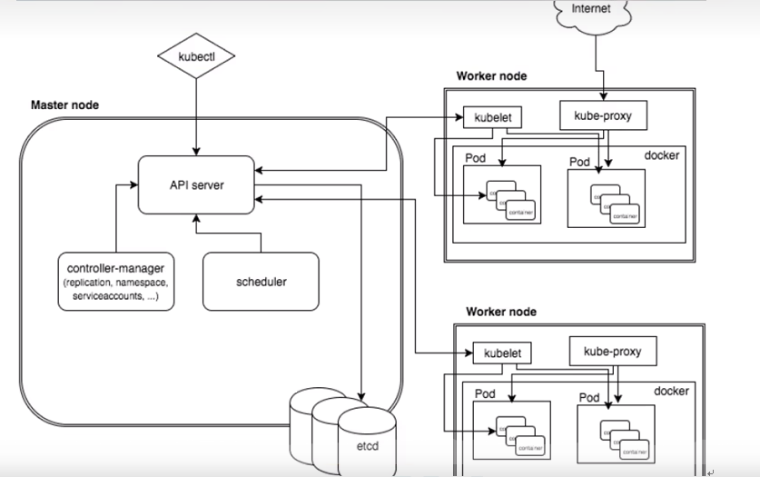

# k8s概述和特性

### K8S是谷歌在2014年开业的容器化集群管理系统

### 使用K8S进行容器化应用部署

### 使用K8S利于应用扩展

### K8S目标实施让部署容器化应用更加简洁和高效

### k8s特性

1. 自动装箱

   基于容器对应用运行环境的资源配置要求自动部署应用容器

2. 自我修复能力(自愈能力)

   当容器失败时，会对容器进行重启

   当所部署的 Node 节点有问题时，会对容器进行重新部署和重新调度

   当容器未通过监控检查时，会关闭此容器直到容器正常运行时，才会对外提供服务

3. 水平扩展

   通过简单的命令、用户 UI 界面或基于 CPU 等资源使用情况，对应用容器进行规模扩大或规模剪裁

4. 服务发现

   用户不需使用额外的服务发现机制，就能够基于 Kubernetes 自身能力实现服务发现和负载均衡

5. 滚动更新

   可以根据应用的变化，对应用容器运行的应用，进行一次性或批量式更新

6. 版本回退

   可以根据应用部署情况，对应用容器运行的应用，进行历史版本即时回退

7. 密钥和配置管理

   在不需要重新构建镜像的情况下，可以部署和更新密钥和应用配置，类似热部署。

8. 存储编排

   自动实现存储系统挂载及应用，特别对有状态应用实现数据持久化非常重要，存储系统可以来自于本地目录、网络存储(NFS、Gluster、Ceph 等)、公共云存储服务

9. 批处理

   提供一次性任务，定时任务；满足批量数据处理和分析的场景

# k8s集群架构组件

### master组件

- apiserver

  集群统一入口，以restful方式，交给etcd存储

- scheduler

  节点调度，选择node结点应用部署

- controller-manager

  处理集群中常规后台任务，一个资源对应一个控制器

- etcd

  存储系统，用于保存集群相关的数据

### node组件

- kubelet

  master派到node节点代表，管理本机容器

- kubc-proxy

  提供网络代理，实现负载均衡等操作

# k8s核心概念

- pod

  最小部署单元

  一组容器的集合

  共享网络

  生命周期是短暂的

- controller

  确保预期的pod副本数量

  无状态应用部署

  有状态应用部署

  确保所有的node运行同一个pod

  一次性任务和定时任务

- Service

  定义一组pod的访问规则

