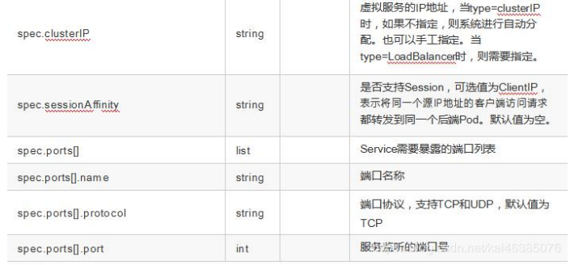
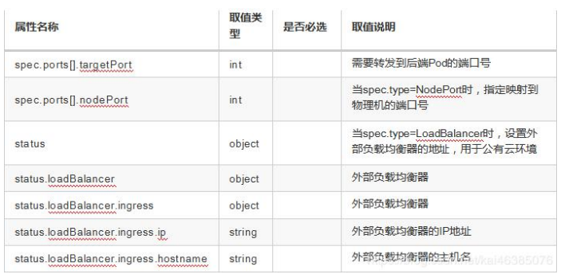

### Service 概述

Service 是 Kubernetes 最核心概念，通过创建 Service,可以为一组具有相同功能的容器应用提供一个统一的入口地址，并且将请求负载分发到后端的各个容器应用上。

### Service 的定义

yaml 格式的 Service 定义文件

```yaml
apiVersion: v1 
kind: Service 
matadata:
  name: string 
  namespace: string 
  labels:
    - name: string 
  annotations:
  - name: string 
spec:
  selector: [] 
  type: string 
  clusterIP: string
  sessionAffinity: string 
  ports:
  - name: string 
    protocol: string 
    port: int 
    targetPort: int 
    nodePort: int
status: 
  loadBalancer:
    ingress:
      ip: string 
      hostname: string
```







