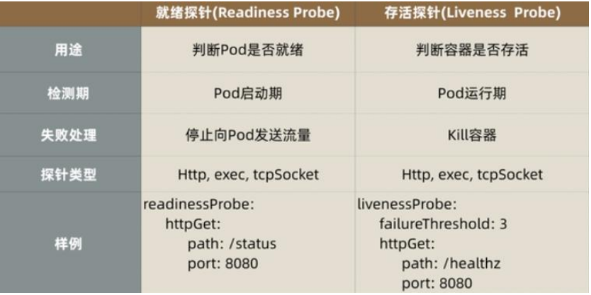

### 探针类型

K8s 中存在两种类型的探针：liveness probe 和 readiness probe。

### liveness probe（存活探针）

用于判断容器是否存活，即 Pod 是否为 running 状态，如果 LivenessProbe 探针探测到容器不健康，则 kubelet 将 kill 掉容器，并根据容器的重启策略是否重启。如果一个容器不包含 LivenessProbe 探针，则 Kubelet 认为容器的 LivenessProbe 探针的返回值永远成功。有时应用程序可能因为某些原因（后端服务故障等）导致暂时无法对外提供服务，但应用软件没有终止，导致 K8S 无法隔离有故障的 pod，调用者可能会访问到有故障的 pod，导致业务不稳定。K8S 提供 livenessProbe 来检测应用程序是否正常运行，并且对相应状况进行相应的补救措施。

### readiness probe（就绪探针）

用于判断容器是否启动完成，即容器的 Ready 是否为 True，可以接收请求，如果ReadinessProbe 探测失败，则容器的 Ready 将为 False，控制器将此 Pod 的 Endpoint 从对应的 service 的 Endpoint 列表中移除，从此不再将任何请求调度此 Pod 上，直到下次探测成功。通过使用 Readiness 探针，Kubernetes 能够等待应用程序完全启动，然后才允许服务将流量发送到新副本。

比如使用 tomcat 的应用程序来说，并不是简单地说 tomcat 启动成功就可以对外提供服务的，还需要等待 spring 容器初始化，数据库连接没连上等等。对于 spring boot 应用，默认的 actuator 带有/health 接口，可以用来进行启动成功的判断。



### 每类探针都支持三种探测方法

（1）exec：通过执行命令来检查服务是否正常，针对复杂检测或无 HTTP 接口的服务，命令返回值为 0 则表示容器健康。

（2）httpGet：通过发送 http 请求检查服务是否正常，返回 200-399 状态码则表明容器健康。

（3）tcpSocket：通过容器的 IP 和 Port 执行 TCP 检查，如果能够建立 TCP 连接，则表明容器健康。

### 探针探测的结果

（1）Success：Container 通过了检查。

（2）Failure：Container 未通过检查。

（3）Unknown：未能执行检查，因此不采取任何措施。

### Pod 重启策略

（1）Always: 总是重启

（2）OnFailure: 如果失败就重启

（3）Never: 永远不重启

### 示例

```yaml
apiVersion: v1
kind: Pod
metadata:
	name: goproxy
	labels:
		app: goproxy
spec:
	containers:
	- name: goproxy
	  image: k8s.gcr.io/goproxy:0.1
	  ports:
	  - containerPort: 8080
	  readinessProbe:
		tcpSocket:
		  port: 8080
		initialDelaySeconds: 5
		periodSeconds: 10
	  livenessProbe:
		tcpSocket:
		  port: 8080
	  initialDelaySeconds: 15
	  periodSeconds: 20
```

探针(Probe)有许多可选字段，可以用来更加精确的控制 Liveness 和 Readiness 两种探针的行为。这些参数包括：

initialDelaySeconds：容器启动后第一次执行探测时需要等待多少秒。

periodSeconds：执行探测的频率。默认是 10 秒，最小 1 秒。

timeoutSeconds：探测超时时间。默认 1 秒，最小 1 秒。

successThreshold：探测失败后，最少连续探测成功多少次才被认定为成功。默认是 1。对于 liveness 必须是 1。最小值是 1。

failureThreshold：探测成功后，最少连续探测失败多少次才被认定为失败。默认是 3。最小值是 1。


