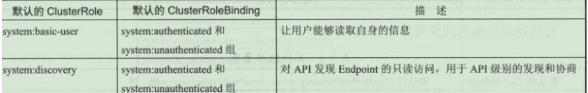
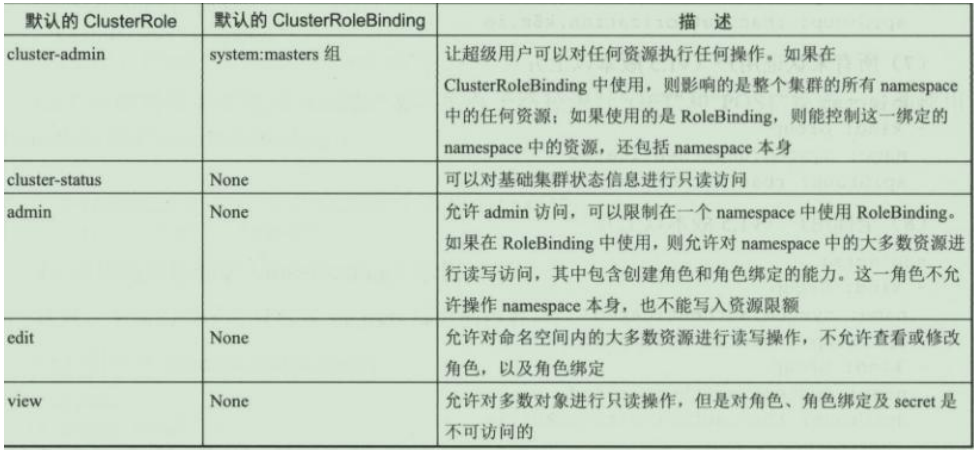
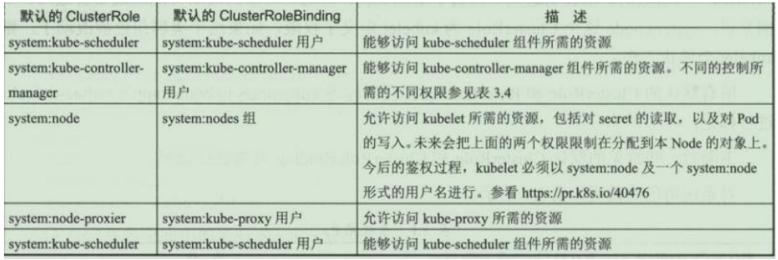

# 默认的角色和角色绑定

API Server 会创建一套默认的 ClusterRole 和 ClusterRoleBinding 对象，其中很多是以 system:为前缀的，以表明这些资源属于基础架构，对这些对象的改动可能造成集群故障。

所有默认的 ClusterRole 和RoleBinding 都会用标签kubernetes.io/bootstrapping=rbac-defaults 进行标记。

常见的系统角色如下：

有些默认角色不是以 system:为前缀的，这部分角色是针对用户的，其中包含超级用户角色 cluster-admin，有的用于集群一级的角色 cluster-status，还有针对 namespace 的角色 admin、edit、view

### 常见的用户角色如下：

### 核心 Master 组件角色

