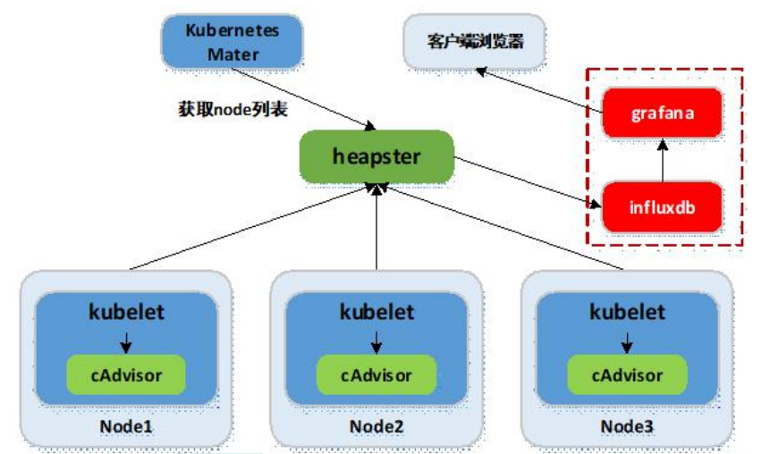

# 概述

开源软件 cAdvisor（Container Advisor）用于监控所在节点的容器运行状态，当前已经被默认集成到 kubelet 组件内，默认使用 tcp 4194 端口。在大规模容器集群，一般使用Heapster+Influxdb+Grafana 平台实现集群性能数据的采集，存储与展示。

# 环境准备

### 基础环境

Kubernetes + heapster + Influxdb + grafana

### 原理

Heapster：集群中各 node 节点的 cAdvisor 的数据采集汇聚系统，通过调用 node 上kubelet 的 api，再通过 kubelet 调用 cAdvisor 的 api 来采集所在节点上所有容器的性能数据。Heapster 对性能数据进行聚合，并将结果保存到后端存储系统，heapster 支持多种后端存储系统，如 memory，Influxdb 等。

Influxdb：分布式时序数据库（每条记录有带有时间戳属性），主要用于实时数据采集，时间跟踪记录，存储时间图表，原始数据等。Influxdb 提供 rest api 用于数据的存储与查询。

Grafana：通过 dashboard 将 Influxdb 中的时序数据展现成图表或曲线等形式，便于查看集群运行状态。

Heapster，Influxdb，Grafana 均以 Pod 的形式启动与运行。

