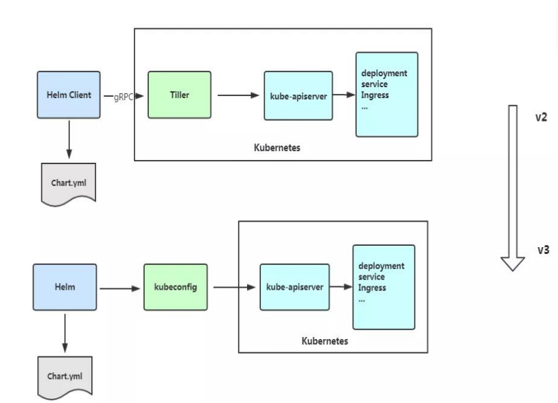

# Helm 引入

K8S 上的应用对象，都是由特定的资源描述组成，包括 deployment、service 等。都保存各自文件中或者集中写到一个配置文件。然后 kubectl apply –f 部署。如果应用只由一个或几个这样的服务组成，上面部署方式足够了。而对于一个复杂的应用，会有很多类似上面的资源描述文件，例如微服务架构应用，组成应用的服务可能多达十个，几十个。如果有更新或回滚应用的需求，可能要修改和维护所涉及的大量资源文件，而这种组织和管理应用的方式就显得力不从心了。且由于缺少对发布过的应用版本管理和控制，使Kubernetes 上的应用维护和更新等面临诸多的挑战，主要面临以下问题：（1）如何将这些服务作为一个整体管理 （2）这些资源文件如何高效复用 （3）不支持应用级别的版本管理

# Helm 介绍

Helm 是一个 Kubernetes 的包管理工具，就像 Linux 下的包管理器，如 yum/apt 等，可以很方便的将之前打包好的 yaml 文件部署到 kubernetes 上。

Helm 有 3 个重要概念：

（1）helm：一个命令行客户端工具，主要用于 Kubernetes 应用 chart 的创建、打包、发布和管理。

（2）Chart：应用描述，一系列用于描述 k8s 资源相关文件的集合。

（3）Release：基于 Chart 的部署实体，一个 chart 被 Helm 运行后将会生成对应的一个release；将在 k8s 中创建出真实运行的资源对象。

# Helm v3 变化

2019 年 11 月 13 日， Helm 团队发布 Helm v3 的第一个稳定版本。

该版本主要变化如下：

架构变化：

1、最明显的变化是 Tiller 的删除



2、Release 名称可以在不同命名空间重用

3、支持将 Chart 推送至 Docker 镜像仓库中

4、使用 JSONSchema 验证 chart values

5、其他

# Helm 客户端

### 部署 helm 客户端

Helm 客户端下载地址：https://github.com/helm/helm/releases 解压移动到/usr/bin/目录即可。

```
wget https://get.helm.sh/helm-vv3.2.1-linux-amd64.tar.gz
tar zxvf helm-v3.2.1-linux-amd64.tar.gz
mv linux-amd64/helm /usr/bin/
```


