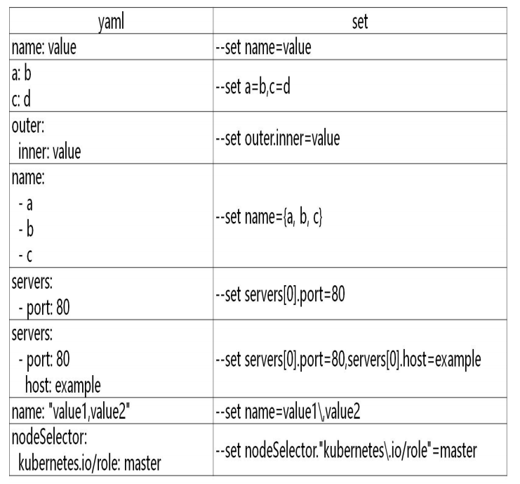

# helm 基本使用

### 主要介绍三个命令：

chart install

chart upgrade

chart rollback

### 使用 chart 部署一个应用

```
#查找 chart
# helm search repo weave
NAME 				CHART VERSION 	APP VERSION 	DESCRIPTION
aliyun/weave-cloud  0.1.2 							Weave Cloud is a add-on
to Kubernetes which pro...
aliyun/weave-scope  0.9.21.6.5 						A Helm chart for the Weave Scope
cluster visual...
stable/weave-cloud  0.3.71.4.0 						Weave Cloud is a add-on to Kubernetes
which pro...
stable/weave-scope  1.1.101.12.0                    A Helm chart for the Weave Scope
cluster visual...
#查看 chrt 信息
# helm show chart stable/mysql
#安装包
# helm install ui stable/weave-scope
#查看发布状态
# helm list
NAME NAMESPACE REVISION UPDATED
STATUS CHART APP VERSION
ui default 12020-05-2817:45:01.696109626 +0800 CST deployed
weave-scope-1.1.101.12.0
[root@k8s-master ~]# helm status ui
NAME: ui
LAST DEPLOYED: Thu May 2817:45:012020
NAMESPACE: default
STATUS: deployed
REVISION: 1
NOTES:
You should now be able to access the Scope frontend in your web browser, byusing kubectl port-forward:

kubectl -n default port-forward $(kubectl -n default get endpoints \
ui-weave-scope -o jsonpath='{.subsets[0].addresses[0].targetRef.name}')8080:4040

then browsing to http://localhost:8080/.
For more details on using Weave Scope, see the Weave Scope documentation:
https://www.weave.works/docs/scope/latest/introducing/
#修改 service Type: NodePort 即可访问 ui
```

### 安装前自定义 chart 配置选项

自定义选项是因为并不是所有的 chart 都能按照默认配置运行成功，可能会需要一些环境依赖，例如 PV。

所以我们需要自定义 chart 配置选项，安装过程中有两种方法可以传递配置数据：

--values（或-f）：指定带有覆盖的 YAML 文件。这可以多次指定，最右边的文件优先

--set：在命令行上指定替代。如果两者都用，--set 优先级高

**--values 使用，先将修改的变量写到一个文件中**

```
# helm show values stable/mysql
# catconfig.yaml
persistence:
  enabled: true
  storageClass: "managed-nfs-storage"
  accessMode: ReadWriteOnce
size: 8Gi
mysqlUser: "k8s"
mysqlPassword: "123456"
mysqlDatabase: "k8s"

# helm install db -f config.yaml stable/mysql
# kubectl get pods
NAME						 READY	 STATUS	 RESTARTS	 AGE
db-mysql-57485b68dc-4xjhv	 1/1	 Running 0 			 8m51s
# kubectl run -it db-client --rm --restart=Never --image=mysql:5.7 -- bash
If you don't see a command prompt, try pressing enter.
root@db-client:/# mysql -hdb-mysql -uk8s -p123456
mysql: [Warning] Using a password on the command line interface can be insecure.
Welcome to the MySQL monitor. Commands end with ; or \g.
Your MySQL connection id is 36
Server version: 5.7.30 MySQL Community Server (GPL)
Copyright (c) 2000, 2020, Oracle and/or its affiliates. All rights reserved.
Oracle is a registered trademark of Oracle Corporation and/or its
affiliates. Other names may be trademarks of their respective
owners.
Type 'help;' or '\h'for help. Type '\c' to clear the current input statement.
mysql> show databases;
+--------------------+
| Database			 |
+--------------------+
| information_schema |
| k8s				 |
+--------------------+
```

以上将创建具有名称的默认 MySQL 用户 k8s，并授予此用户访问新创建的 k8s 数据库的权限，但将接受该图表的所有其余默认值。

**命令行替代变量：**

```
# helm install db --set persistence.storageClass="managed-nfs-storage" stable/mysql
```

也可以把 chart 包下载下来查看详情：

```
# helm pull stable/mysql --untar
```

values yaml 与 set 使用：



**该 helm install 命令可以从多个来源安装：**

chart 存储库

本地 chart 存档（helm install foo-0.1.1.tgz）

chart 目录（helm install path/to/foo）

完整的 URL（helm install https://example.com/charts/foo-1.2.3.tgz）


