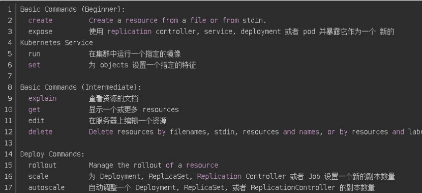
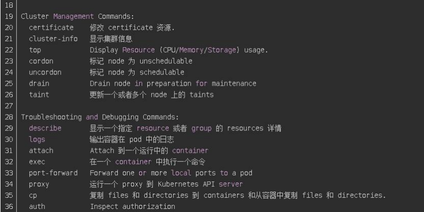
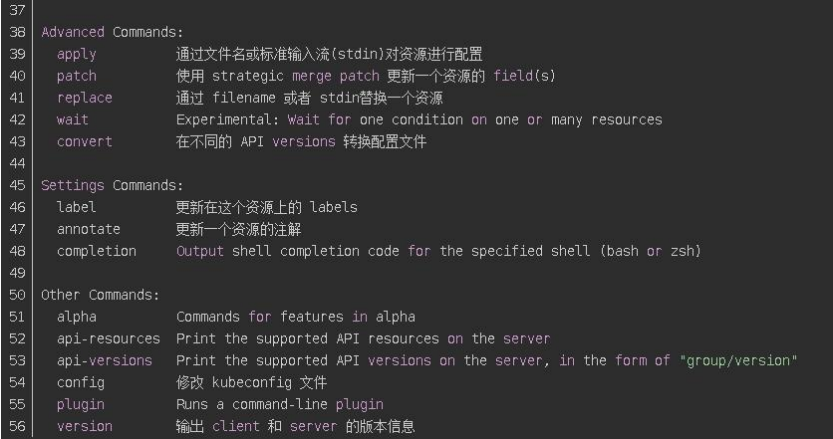
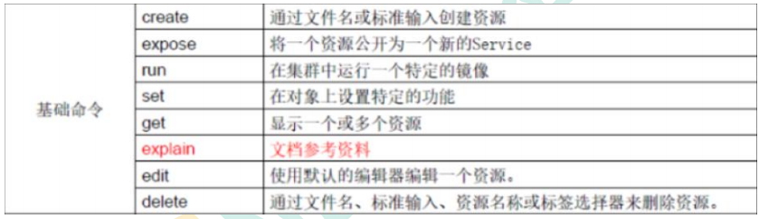
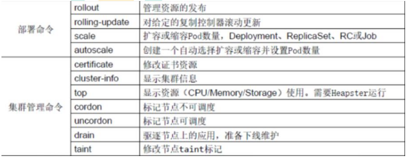
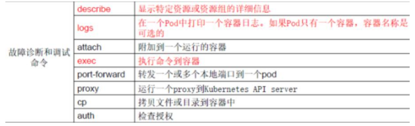
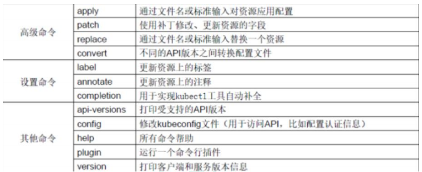

# kubectl概述

**kubectl 是 Kubernetes 集群的命令行工具**，通过 kubectl 能够对集群本身进行管理，并能够在集群上进行容器化应用的安装部署。

# kubectl命令的语法

```
kubectl [command] [TYPE] [NAME] [flags]
```

#### comand：指定要对资源执行的操作，例如 create、get、describe 和 delete

#### TYPE：指定资源类型，资源类型是大小写敏感的，开发者能够以单数、复数和缩略的形式。例如：

```
kubectl get pod pod1
kubectl get pods pod1
kubectl get po pod1
```

#### NAME：指定资源的名称，名称也大小写敏感的。如果省略名称，则会显示所有的资源，例如:

```
kubectl get pods  --会显示出所有的资源名称
```

#### flags：指定可选的参数。例如，可用-s 或者–server 参数指定 Kubernetes APIserver 的地址和端口。

# kubectl help 获取更多信息

```
kubectl --help
kubectl get --help 具体查看某个操作
```







# kubectl 子命令使用分类

### 基础命令



### 部署和集群管理命令



### 故障和调试命令



### 其他命令




