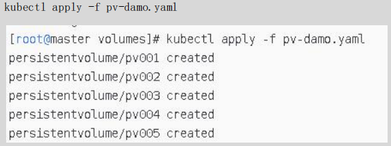
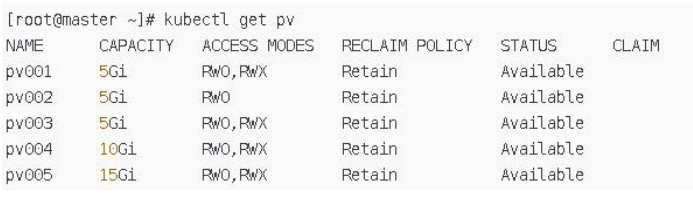

### PV 类型

```
GCEPersistentDisk
AWSElasticBlockStore
AzureFile
AzureDisk
FC (Fibre Channel)
Flexvolume
Flocker
NFS
iSCSI
RBD (Ceph Block Device)
CephFS
Cinder (OpenStack block storage)
Glusterfs
VsphereVolume
Quobyte Volumes
HostPath (Single node testing only – local storage is not supported in any
way and WILL NOT WORK in a multi-node cluster)
Portworx Volumes
ScaleIO Volumes
StorageOS
```

### PV 卷阶段状态

Available – 资源尚未被 claim 使用

Bound – 卷已经被绑定到 claim 了

Released – claim 被删除，卷处于释放状态，但未被集群回收。

Failed – 卷自动回收失败

### 演示：创建 PV

（1）第一步：编写 yaml 文件，并创建 pv

创建 5 个 pv，存储大小各不相同，是否可读也不相同

```yaml
apiVersion: v1
kind: PersistentVolume
metadata:
	name: pv001
	labels:
		name: pv001
spec:
	nfs:
		path: /data/volumes/v1
		server: nfs
	accessModes: ["ReadWriteMany","ReadWriteOnce"]
	capacity:
		storage: 2Gi
---
apiVersion: v1
kind: PersistentVolume
metadata:
	name: pv002
	labels:
		name: pv002
spec:
	nfs:
		path: /data/volumes/v2
		server: nfs
	accessModes: ["ReadWriteOnce"]
	capacity:
		storage: 5Gi
---
apiVersion: v1
kind: PersistentVolume
metadata:
	name: pv003
	labels:
		name: pv003
spec:
	nfs:
		path: /data/volumes/v3
		server: nfs
	accessModes: ["ReadWriteMany","ReadWriteOnce"]
	capacity:
		storage: 5Gi
---
apiVersion: v1
kind: PersistentVolume
metadata:
	name: pv004
	labels:
		name: pv004
spec:
	nfs:
		path: /data/volumes/v4
		server: nfs
	accessModes: ["ReadWriteMany","ReadWriteOnce"]
	capacity:
		storage: 10Gi
---
apiVersion: v1
kind: PersistentVolume
metadata:
	name: pv005
	labels:
		name: pv005
spec:
	nfs:
		path: /data/volumes/v5
		server: nfs
	accessModes: ["ReadWriteMany","ReadWriteOnce"]
	capacity:
		storage: 15Gi
```

### 第二步：执行创建命令

```
kubectl apply -f pv-damo.yaml
```



### 第三步：查询验证




