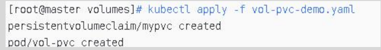
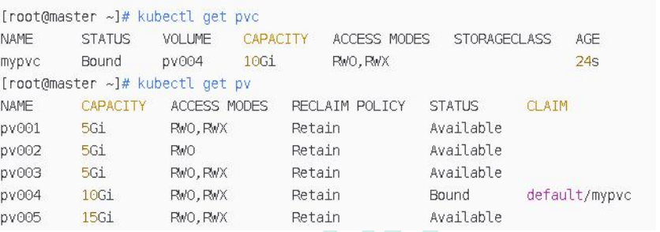
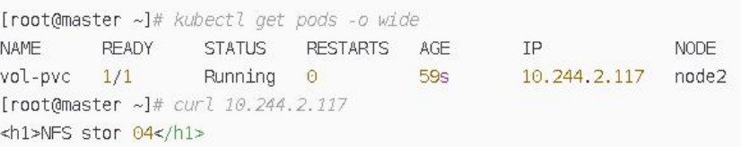

# 演示：创建 PVC，绑定 PV

###  第一步：编写 yaml 文件，并创建 pvc

创建一个 pvc，需要 6G 存储；所以不会匹配 pv001、pv002、pv003

```yaml
apiVersion: v1
kind: PersistentVolumeClaim
metadata:
	name: mypvc
	namespace: default
spec:
	accessModes: ["ReadWriteMany"]
	resources:
	requests:
		storage: 6Gi
---
apiVersion: v1
kind: Pod
metadata:
	name: vol-pvc
	namespace: default
spec:
	volumes:
	- name: html
      persistentVolumeClaim:
	    claimName: mypvc
	containers:
	- name: myapp
		image: ikubernetes/myapp:v1
		volumeMounts:
	    - name: html
		  mountPath: /usr/share/nginx/html/
```

### 第二步：执行命令创建

kubectl apply -f vol-pvc-demo.yaml



### 第三步：查询验证






