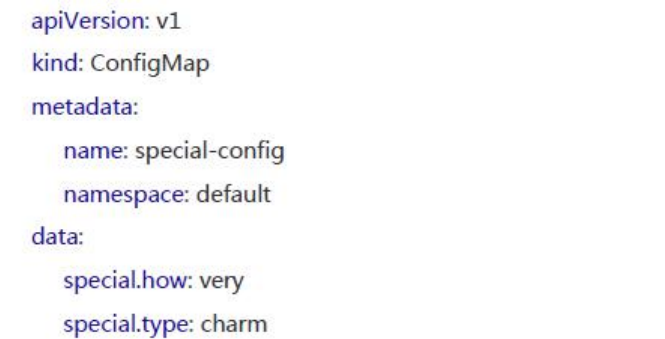
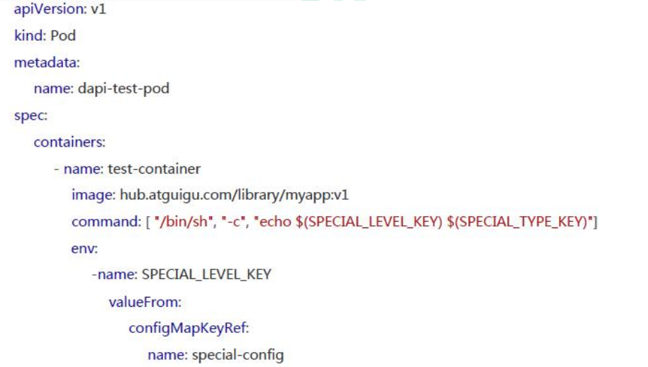
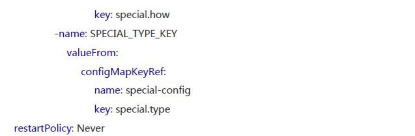
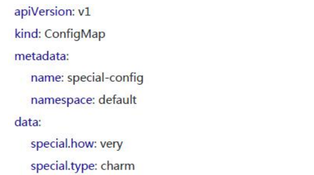
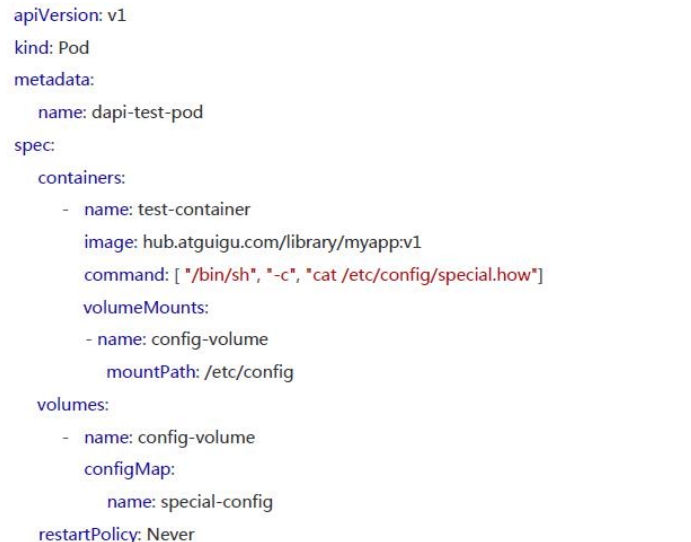

### 使用 ConfigMap 来替代环境变量

```
apiVersion: v1
kind: ConfigMap
metadata:
name: special-config
namespace: default
data:
special.how: very
special.type: charm

apiVersion: v1
kind: ConfigMap
metadata:
name: env-config
namespace: default
data:
log_level: INFO

apiVersion: v1
kind: Pod
metadata:
name: dapi-test-pod
spec:
containers:
- name: test-container
image: hub.atguigu.com/library/myapp:v1
command: [ "/bin/sh", "-c", "env"]
env:
-name: SPECIAL_LEVEL_KEY
valueFrom:
configMapKeyRef:
name: special-config

key: special.how
-name: SPECIAL_TYPE_KEY
valueFrom:
configMapKeyRef:
name: special-config
key: special.type
envFrom:
-configMapRef:
name: env-config
restartPolicy: Never
```

### 使用 ConfigMap 设置命令行参数







### 通过数据卷插件使用 ConfigMap



在数据卷里面使用这个ConfigMap,有不同的选项。最基本的就是将文件填入数据卷，在这个文件中，键就是文件名，键值就是文件内容




