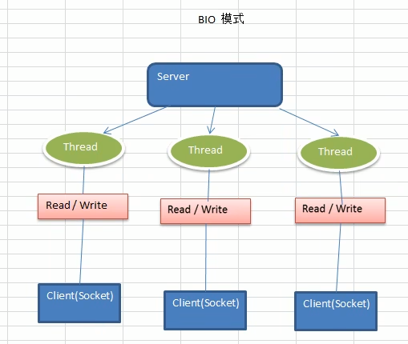
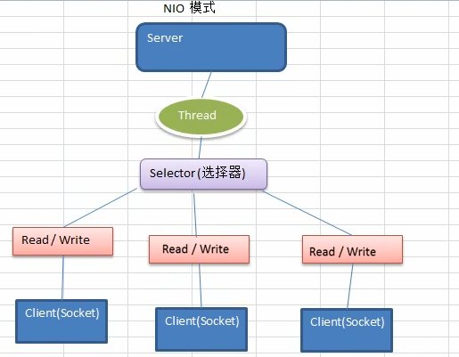

1) Netty是由JBOSS提供的一个Java开源框架，现为Github上的独立项目。
2) Netty是一个异步的、基于事件驱动的网络应用框架，用以快速开发高性能、高可
靠性的网络lO程序。
3) Netty主要针对在TCP协议下，面向Clients端的高并发应用，或者Peer-to-Peer场景下的大量数据持续传输的应用。
4) Netty本质是一个NIO框架，适用于服务器通讯相关的多种应用场景
5) 要透彻理解Netty ,需要先学习NIO，这样我们才能阅读Netty 的源码。

### Netty的应用场景

1)互联网行业：在分布式系统中，各个节点之间需要远程服名调用，高性能的RPC框架必不可少，Netty 作为**异步高性能的通信框架**，往往作为基础通信组件被这些RPC框架使用。

2)典型的应用有：阿里分布式服务框架Dubbo的 RPC框架使用Dubbo协议进行节点间通信，Dubbo协议默认使用Netty 作为基础通信组件，用于实现各进程节点之间的内部通信

#### 游戏行业

1)无论是手游服务端还是大型的网络游戏Java语言得到了越来越广泛的应用
2) Netty 作为高性能的基础通信组件，提供了TCP/UDP和HTTP协议栈，方便定制和开发私有协议栈，账号登录服务器
3)地图服务器之间可以方便的通过Netty进行高性能的通信

#### 大数据领域
1)经典的Hadoop的高性能通信和序列化组(AVRO 实现数据文件共享)件的RPC框架，默认采用Netty进行跨界点通信
2)它的Netty Service基于Netty框架二次封装实现。

### IO模型基本说明

1) I/O模型简单的理解：就是用什么样的通道进行数据的发送和接收，很大程度上决定了程序通信的性能

2) Java共支持3种网络编程模型IO模式: BIO、 NIO、 AIO

3) Java BIO:同步并阻塞(**传统阻塞型**)， 服务器实现模式为一个连接一个线程，即客户端有连接请求时服务器端就需要启动一个线程进行处理，如果这个连接不做任何事情会造成不必要的线程开销

4) Java NIO：**同步非阻塞**，服务器实现模式为一个线程处理多个请求(连接)，即客户端发送的连接请求都会注册到多路复用器上，多路复用器轮询到连接有I/O请求就进行处理

5) Java AIO(NIO.2)：**异步非阻塞**，AIO 引入异步通道的概念，采用了Proactor模式， 简化了程序编写，有效的请求才启动线程，它的特点是先由操作系统完成后才通知服务端程序启动线程去处理，一般适用于连接数较多且连接时间较长的应用

#### BIO、NIO、AIO适用场景分析

BIO、NIO、 AIO适用场景分析
1) BIO方 式适用于连接数目比较小且固定的架构，这种方式对服务器资源要求比较高，
并发局限于应用中，JDK1.4以前的唯一选择，但程序简单易理解。

2) NIO方式适用于连接数目多且连接比较短(轻操作)的架构，比如聊天服务器，弹幕系统，服务器间通讯等。编程比较复杂，JDK1.4开始支持。

3) AI0方式使用于连接数目多且连接比较长( 重操作)的架构，比如相册服务器，充分调用OS参与并发操作，编程比较复杂，JDK7开始支持。

