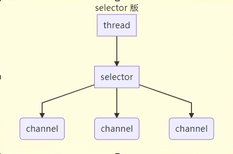
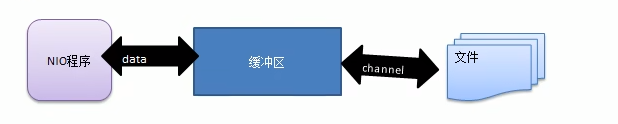

# Java NIO基本介绍

1)Java Nl0 全称 java non-blocking lO,是指 JDK 提供的新API。从 JDK1.4 开始，Java 提供了一系列改进的输入/输出的新特性，被统称为 NIO(即 NewIO)，是<font color = 'red'>同步非阻塞的</font>

2)NIO 相关类都被放在 java.nio 包及子包下，并且对原 java.io包中的很多类进行改写。

3)NIO 有三大核心部分:<font color = 'red'>Channel(通道)，Buffer(缓冲区),Selector(选择器)</font>

4)NIO是 <font color = 'red'>面向缓冲区，或者面向块</font>编程的。数据读取到一个它稍后处理的缓冲区，需要时可在缓冲区中前后移动，这就增加了处理过程中的灵活性，使用它可以提供非阻塞式的高伸缩性网络

5)Java NIO的非阻塞模式，使一个线程从某通道发送请求或者读取数据，但是它仅能得到目前可用的数据，如果目前没有数据可用时，就什么都不会获取，而**不是保持线程阻塞**，所以直至数据变的可以读取之前，该线程可以继续做其他的事情。非阻塞写也是如此，一个线程请求写入一些数据到某通道，但不需要等待它完全写入，这个线程同时可以去做别的事情。

6)通俗理解:NIO是可以做到用一个线程来处理多个操作的。假设有10000个请求过来根据实际情况，可以分配50或者100个线程来处理。不像之前的阻塞IO那样，非得分配10000

7)HTTP2.0使用了多路复用的技术，做到同一个连接并发处理多个请求，而且并发请求的数量比HTTP1.1大了好几个数量级。

### NIO和BIO的比较

1)BI0 以流的方式处理数据，而 NIO 以块的方式处理数据，块 I/0 的效率比流 I/0 高很多

2)BIO 是阻塞的，NIO 则是非阻塞的

3)BIO 基于字节流和字符流进行操作，而 NI0 基于 Channel(通道)和 Buffer(缓冲区)进行操作，数据总是从通道读取到缓冲区中，或者从缓冲区写入到通道中。Selector(选择器)用于监听多个通道的事件(比如:连接请求，数据到达等)，因此使用**单个线程就可以监听多个客户端通道**

### selector、channel、buffer关系说明

每个channel都会对应一个Buffer

一个Selector 对应一个线程，一个Selector 对应多个channel(连接)

程序切换到哪个channel 是由事件决定的,Event 就是一个重要的概念

Selector会根据不同的事件，在各个通道上切换

Buffer 就是一个内存块， 底层是有一个数组

数据的读取写入是通过Buffer,这个和BIO有区别,BIO 中要么是输入流，或者是输出流,不能双向，但是NIO的Buffer 是可以读也可以写,需要 fip 方法切换

channel 是双向的,可以返回底层操作系统的情况,比如Linux，底层的操作系统通道就是双向的.

### 选择器(selector)

selector 的作用是配合一个线程管理多个Channel，获取这些Channel 上发生的事件，这些Channel 工作在非阻塞模式下，不会让线程吊死在一个Channel上，适合链接数特别多，但是流量低的场景



调用 selector 的 select() 会阻塞直到 Channel 发生了读写就绪事件，这些事件发生select 方法就会返回这些事件交给 thread 来处理

### 缓冲区(Buffer)

1.缓冲区(Buffer):缓冲区本质上是一个可以读写数据的内存块，可以理解成是一个<font color = 'red'>容器对象(含数组)</font>，该对象提供了<font color = 'red'>一组方法</font>，可以更轻松地使用内存块，缓冲区对象内置了一些机制，能够跟踪和记录缓冲区的状态变化情况。Channel 提供从文件、网络读取数据的渠道，但是读取或写入的数据都必须经由Buffer，如图:



2.Buffer类定义了所有的缓冲区都具有的四个属性来提供关于其所包含的数据元素的信息；

```java
// Invariants: mark <= position <= limit <= capacity
private int mark = -1;
private int position = 0;
private int limit;
private int capacity;
```

capacity：容量，即可以容纳的最大数源量，在缓冲区创建时被设定并且不能改变

limit：表示缓冲区的当前终点，不能对缓冲区超过极限的位置进行读写操作。且极限是可以修改的

position：位置，下一个要被读或写的元素的索引，每次读写缓冲区数据时都会改变该值，为下次读写做准备

mark：标记

### 通道(Channel)

1)NIO的通道类似于流，但有些区别如下:

​	通道可以同时进行读写，而流只能读或者只能写

​	通道可以实现异步读写数据

​	通道可以从缓冲读数据，也可以写数据到缓冲

2)BIO中的 stream 是单向的，例如 FilelnputStream 对象只能进行读取数据的操作，而 NIO 中的通道(Channel)是双向的，可以读操作，也可以写操作。‘

3)Channel在NIO中是一个接口public interface Channel extends Closeable{}

4)常用的 Channel 类有:FileChannel、DatagramChanhel、ServerSocketChannel 和SocketChannel.

5)FileChannel 用于文件的数据读写,DatagramChannel 用于 UDP 的数据读写，ServerSocketChannel和SocketChannel用于TCP的数据读写。

#### 关于Buffer和Channel的注意事项和细节

1)ByteBuffer 支持**类型化**的put 和 get,put 放入的是什么数据类型，get就应该使用相应的数据类型来取出，否则可能有 BufferUnderflowException 异常。

2)可以将一个普通Buffer 转成只读Buffer 。

3)NIO 还提供了 MappedByteBuffer，可以让文件直接在内存(堆外的内存)中进行修改，而如何同步到文件由NIO 来完成。

4)前面我们讲的读写操作，都是通过一个Buffer 完成的，<font color = 'red'>NIO 还支持通过多个Buffer(即 Buffer 数组)完成读写操作</font>，即 Scattering 和 Gatering 。


 