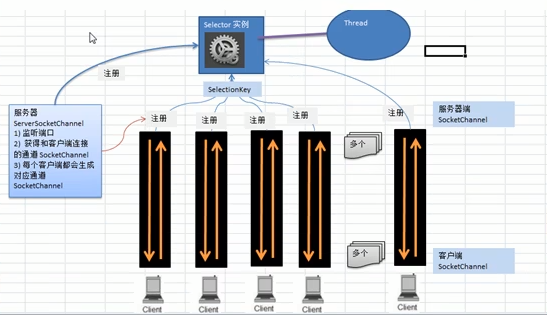

# Selector 选择器

### 基本介绍

1)Java 的 NIO，用非阻塞的IO 方式。可以用一个线程，处理多个的客户端连接，就会使用到Selector(选择器)

2)Selector 能够检测多个注册的通道上是否有事件发生(注意:多个Channel以事件的方式可以注册到同一个Selector)，如果有事件发生，便获取事件然后针对每个事件进行相应的处理。这样就可以只用一个单线程去管理多个通道，也就是管理多个连接和请求。

3)只有在 连接/通道 真正有读写事件发生时，才会进行读写，就大大地减少了系统开销，并且不必为每个连接都创建一个线程，不用去维护多个线程

4)避免了多线程之间的上下文切换导致的开销

#### 特点说明

1）Netty的IO 线程 NioEventLoop 聚合了 Selector(选择器，也叫多路复用器)，可以同时并发处理成百上千个容户端连接。

2）当线程从某客户端 Socket 通道进行读写数据时，若没有数据可用时，该线程可以进行其他任务。

3）线程通常将非阻塞IO的空闲时间用于在其他通道上执行I0操作，所以单独的线程可以管理多个输入和输出通道。

4）由于读写操作都是非阻塞的，这就可以充分提升 IO线程的运行效率，避免由于频繁 IO阻塞导致的线程挂起。

5）一个I/O线程可以并发处理N个客户端连接和读写操作，这从根本上解决了传统同步阻塞I/O一连接一线程模型，架构的性能、弹性伸缩能力和可靠性都得到了极大的提升。

### NIO非阻塞网络编程原理分析图

NIO非阻塞网络编程相关的(Selector、SelectionKey、ServerSocketChannel和SocketChannel)关系梳理

对上图的说明：

1. 当客户端连接时，会通过ServerSocketChannel得到SocketChannel
2. 将SocketChannel 注册到Selector上，调用register(Selector sel, int ops)，一个Selector上可以注册多个SocketChannel
3. 注册后返回一个SelectionKey，会和该Selector关联(集合关系)
4. Selector实例进行监听 select方法，返回有事件发生的通道个数
5. 进一步得到各个selectionKey（有事件发生的selectionKey）
6. 在通过SelectionKey 反向获取到SocketChannel ，方法：Channel()
7. 通过得到的 SocketChannel，完成业务处理

