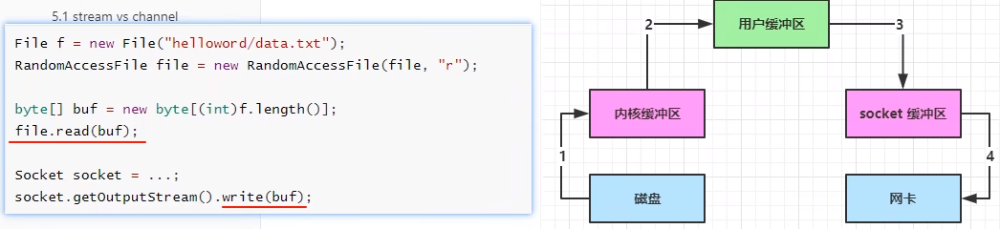
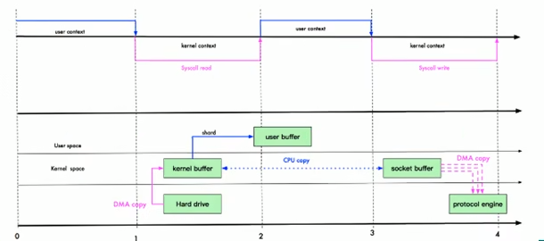
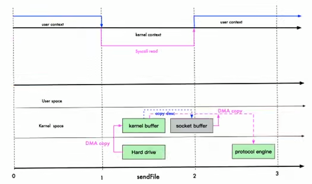

# NIO与零拷贝

### 零拷贝基本介绍

1）零拷贝是网络编程的关键，很多性能优化都离不开

2）在 Java 程序中，常用的零拷贝有 mmap(内存映射)和 sendFile。那么，他们在OS 里，到底是怎么样的一个设计?我们分析 mmap 和sendFile 这两个等拷贝

3）另外我们看下NIO 中如何使用零拷贝

### 传统IO数据读写

Java传统IO和网络编程的一段代码


**传统IO**



1. java本身并不具备IO读写能力，因此read方法调用后，要从java程序的**用户态**切换至**内核态**，去调用操作系统(Kernel)的读能力，将数据读入**内核缓冲区**。这期间用户线程阻塞，操作系统使用DMA (Direct Memory Access)来实现文件读，其间也不会使用cpu

> DMA也可以理解为硬件单元，用来解放 cpu 完成文件IO

2. 从内核态切换回用户态，将数据从内核缓冲区读入用户缓冲区(即 byte[] buf)，这期间 cpu会参与拷贝，无法利用DMA

3. 调用 write方法，这时将数据从用户缓冲区(byte[] buf)写入**socket缓冲区**，cpu会参与拷贝

4. 接下来要向网卡写数据，这项能力java 又不具备，因此又得从**用户态**切换至**内核态**，调用操作系统的写能力，使用DMA将 **socket缓冲区** 的数据写入网卡，不会使用 cpu

**mmap优化**

mmap通过内存映射，将文件映射到内核缓冲区，同时，用户空间可以共享内核空间的数据。这样，在进行网络传输时，就可以减少内核空间到用户空间的拷贝次数。如下图



**sendFile**

Linux 在 2.4 版本中，做了一些修改，避免了从内核缓冲区拷贝到 Socketbuffer 的操作，直接拷贝到协议栈，从而再一次减少了数据拷贝。具体如下图和小结:



### mmap和sendFile的区别

1)mmap 适合小数据量读写，sendFile 适合大文件传输。

2)mmap 需要4次上下文切换，3 次数据拷贝；sendFile 需要3次上下文切换，最少2次数据拷贝。

3)sendFile 可以利用 DMA方式，减少 CPU 拷贝，mmap 则不能(必须从内核拷贝到 Socket 缓冲区)

channel.transferTo(0, channel.size(), socketChannel); 该方法就使用到了零拷贝

**NIOServer**

```java
package com.luojia.netty.nettypro.nio.zerocopy;

import java.io.IOException;
import java.net.InetSocketAddress;
import java.nio.ByteBuffer;
import java.nio.channels.ServerSocketChannel;
import java.nio.channels.SocketChannel;

public class NIOServer {
    public static void main(String[] args) throws IOException {
        InetSocketAddress address = new InetSocketAddress(7001);
        ServerSocketChannel serverSocketChannel = ServerSocketChannel.open();
        serverSocketChannel.socket().bind(address);

        // 创建Buffer
        ByteBuffer buffer = ByteBuffer.allocate(4096);
        while (true) {
            SocketChannel socketChannel = serverSocketChannel.accept();
            int readCount = 0;
            while (-1 != readCount) {
                readCount = socketChannel.read(buffer);
            }
            buffer.rewind(); // 倒带，让数据可以重读
        }
    }
}
```

**NIOClient**

```java
package com.luojia.netty.nettypro.nio.zerocopy;

import java.io.FileInputStream;
import java.io.IOException;
import java.net.InetSocketAddress;
import java.nio.channels.FileChannel;
import java.nio.channels.SocketChannel;

public class NIOClient {
    public static void main(String[] args) throws IOException {
        SocketChannel socketChannel = SocketChannel.open();
        socketChannel.connect(new InetSocketAddress("127.0.0.1", 7001));
        String fileName = "F:\\nginx-1.23.4.zip";
        FileChannel channel = new FileInputStream(fileName).getChannel();
        
        // 准备发送
        long start = System.currentTimeMillis();
        // 在Linux下一个transferTo 方法就可以完成传输
        // 在Windows下一个transferTo 只能发送8M，需要分段传输文件，需要注意传输的位置
        // transferTo 底层使用到零拷贝
        long transferCount = channel.transferTo(0, channel.size(), socketChannel);

        System.out.println("发送的总的字节数 = " + transferCount + "  耗时：" + (System.currentTimeMillis() - start));
        channel.close();
    }
}
```

