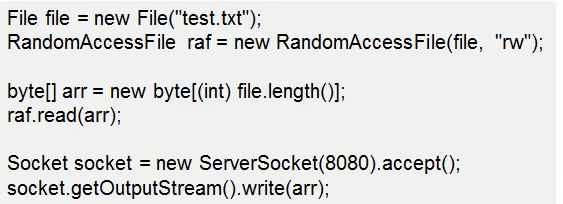
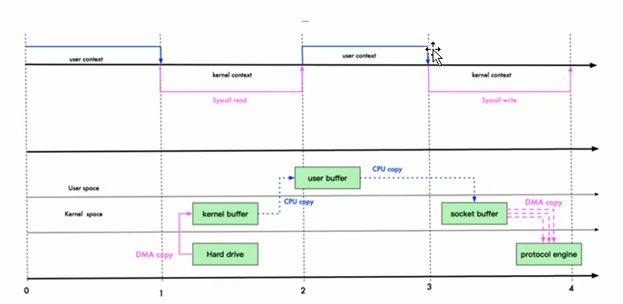

# NIO与零拷贝

### 零拷贝基本介绍

1）零拷贝是网络编程的关键，很多性能优化都离不开

2）在 Java 程序中，常用的零拷贝有 mmap(内存映射)和 sendFile。那么，他们在OS 里，到底是怎么样的一个设计?我们分析 mmap 和sendFile 这两个等拷贝

3）另外我们看下NIO 中如何使用零拷贝

### 传统IO数据读写

Java传统IO和网络编程的一段代码

传统IO

### mmap和sendFile的区别

1)mmap 适合小数据量读写，sendFile 适合大文件传输。

2)mmap 需要4次上下文切换，3 次数据拷贝；sendFile 需要3次上下文切换，最少2次数据拷贝。

3)sendFile 可以利用 DMA方式，减少 CPU 拷贝，mmap 则不能(必须从内核拷贝到 Socket 缓冲区)

