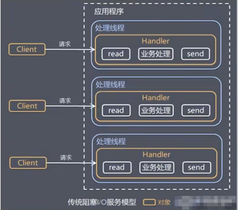

### 原生NIO存在的问题

1）NIO 的类库和 API 繁杂，使用麻烦：需要熟练掌握 Selector、ServerSocketChannel、SocketChannel、ByteBuffer等。

2）需要具备其他的额外技能：要熟悉 Java 多线程编程，因为 NIO 编程涉及到 Reactor模式，你必须对多线程和网络编程非常熟悉，才能编写出高质量的NO 程序。

3）开发工作量和难度都非常大:例如客户端面临断连重连、网络闪断、半包读写、失败缓存、网络拥塞和异常流的处理等等。

4）JDK NIO 的 Bug：例如臭名昭著的 Epoll Bug，它会导致 Selector 空轮询，最终导致 CPU 100%。直到 JDK 1.7 版本该问题仍旧存在，没有被根本解决。

### Netty官网说明

https://netty.io

### Netty的优点

Netty 对 JDK 自带的 NIO 的 APL进行了封装，解决了上述问题。

1）设计优雅：适用于各种传输类型的统一 API阻塞和非阻塞Socket；基于灵活且可扩展的事件模型，可以清晰地分离关注点；高度可定制的线程模型， 单线程，一个或多个线程池。
2）使用方便：详细记录的 Javadoc，用户指南和示例；没有其他依项，IDK5(Netty3.x)或6(Netty4.x)就足够了

3）高性能、吞吐量更高：延迟更低；减少资源消耗；最小化不必要的内存复制。

4）安全:完整的 SSL/TLS 和StartTls 支持。

5）社区活跃、不断更新：社区活跃，版本迭代周期短，发现的 Bug可以被及时修复，同时，更多的新功能会被加入

# Netty架构设计

### 线程模型基本介绍

1）不同的线程模式，对程序的性能有很大影响，为了搞清Netty 线程模式，我们来系统的讲解下各个线程模式，最后看看Netty 线程模型有什么优越性.

2）目前存在的线程模型有：

传统阻塞I/O 服务模型

Reactor 模式

**3）根据 Reactor 的数量和处理资源池线程的数量不同，有3种典型的实现**

单 Reactor 单线程；

单 Reactor 多线程；

主从 Reactor 多线程

4）Netty线程模式(Netty 主要**基于主从 Reactor 多线程模型**做了一定的改进，其中主从Reactor 多线程模型有多个 Reactor)

### 传统阻塞I/O服务模型

**工作原理图**

黄色的框表示对象，蓝色的框表示线程，白色的框表示方法(API)

**模型特点**

1）采用阻塞IO模式获取输入的数据

2）每个连接都需要独立的线程完成数据的输入，业务处理，数据返回

**问题分析**

1）当并发数很大，就会创建大量的线程，占用很大系统资源

2）连接创建后，如果当前线程暂时没有数据可读，该线程会阻塞在read操作，造成线程资源浪费

