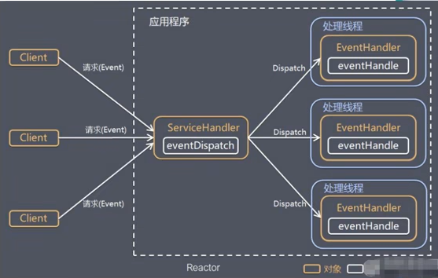
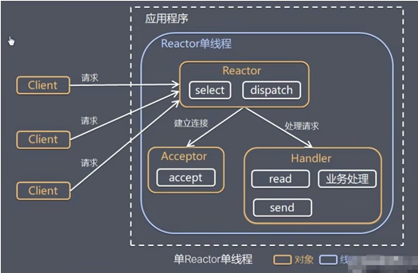
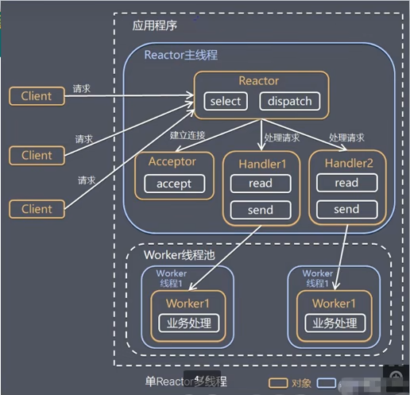

### 原生NIO存在的问题

1）NIO 的类库和 API 繁杂，使用麻烦：需要熟练掌握 Selector、ServerSocketChannel、SocketChannel、ByteBuffer等。

2）需要具备其他的额外技能：要熟悉 Java 多线程编程，因为 NIO 编程涉及到 Reactor模式，你必须对多线程和网络编程非常熟悉，才能编写出高质量的NO 程序。

3）开发工作量和难度都非常大:例如客户端面临断连重连、网络闪断、半包读写、失败缓存、网络拥塞和异常流的处理等等。

4）JDK NIO 的 Bug：例如臭名昭著的 Epoll Bug，它会导致 Selector 空轮询，最终导致 CPU 100%。直到 JDK 1.7 版本该问题仍旧存在，没有被根本解决。

### Netty官网说明

https://netty.io

### Netty的优点

Netty 对 JDK 自带的 NIO 的 APL进行了封装，解决了上述问题。

1）设计优雅：适用于各种传输类型的统一 API阻塞和非阻塞Socket；基于灵活且可扩展的事件模型，可以清晰地分离关注点；高度可定制的线程模型， 单线程，一个或多个线程池。
2）使用方便：详细记录的 Javadoc，用户指南和示例；没有其他依项，IDK5(Netty3.x)或6(Netty4.x)就足够了

3）高性能、吞吐量更高：延迟更低；减少资源消耗；最小化不必要的内存复制。

4）安全:完整的 SSL/TLS 和StartTls 支持。

5）社区活跃、不断更新：社区活跃，版本迭代周期短，发现的 Bug可以被及时修复，同时，更多的新功能会被加入

# Netty架构设计

### 线程模型基本介绍

1）不同的线程模式，对程序的性能有很大影响，为了搞清Netty 线程模式，我们来系统的讲解下各个线程模式，最后看看Netty 线程模型有什么优越性.

2）目前存在的线程模型有：

传统阻塞I/O 服务模型

Reactor 模式

**3）根据 Reactor 的数量和处理资源池线程的数量不同，有3种典型的实现**

单 Reactor 单线程；

单 Reactor 多线程；

主从 Reactor 多线程

4）Netty线程模式(Netty 主要**基于主从 Reactor 多线程模型**做了一定的改进，其中主从Reactor 多线程模型有多个 Reactor)

### 传统阻塞I/O服务模型

**工作原理图**

黄色的框表示对象，蓝色的框表示线程，白色的框表示方法(API)

**模型特点**

1）采用阻塞IO模式获取输入的数据

2）每个连接都需要独立的线程完成数据的输入，业务处理，数据返回

**问题分析**

1）当并发数很大，就会创建大量的线程，占用很大系统资源

2）连接创建后，如果当前线程暂时没有数据可读，该线程会阻塞在read操作，造成线程资源浪费

## Reactor模式

针对传统阻塞I/0服务模型的2个缺点，解决方案:

1)基于 I/O复用模型:多个连接共用一个阻塞对象，应用程序只需要在一个阻塞对象等待，无需阻塞等待所有连接。当某个连接有新的数据可以处理时，操作系统通知应用程序，线程从阻塞状态返回，开始进行业务处理

2)基于线程池复用线程资源:不必再为每个连接创建线程，将连接完成后的业务处理任务分配给线程进行处理，一个线程可以处理多个连接的业务。

 I/O 复用结合线程池，就是Reactor模式基本设计思想,如图:

说明：

1）Reactor 模式，通过一个或多个输入同时传递给服务处理器的模式(基于事件驱动)

2）服务器端程序处理传入的多个请求，并将它们同步分派到相应的处理线程，因此Reactor模式也叫Dispatcher模式（观察者模式）

3）Reactor模式使用IO 复用监听事件收到事件后，分发给某个线程(进程），这点就是网络服务器高并发处理关键

### Reactor模式中核心组成

1）Reactor:Reactor在一个单独的线程中运行，负责监听和分发事件，分发给适当的处理程序来对 IO 事件做出反应。它就像公司的电话接线员，它接听来自客户的电话并将线路转移到适当的联系人;

2）Handlers:处理程序执行 I/0事件要完成的实际事件，类似于客户想要与之交谈的公
司中的实际官员。Reactor 通过调度适当的处理程序来响应 I/O事件，处理程序执行非阻塞操作。

### 单Reactor单线程

可以对照NIO群聊代码进行理解

方案说明：

1. Select 是前面 I/O 复用模型介绍的标准网络编程 API，可以实现应用程序通过一个阻塞对象监听多路连接请求
2. Reactor 对象通过 Select 监控客户端请求事件，收到事件后通过 Dispatch 进行分发
3. 如果是建立连接请求事件，则由 Acceptor 通过 Accept处理连接请求，然后创建一个Handler对象处理连接完成后的后续业务处理
4. 如果不是建立连接事件，则 Reactor会分发调用连接对应的 Handler来响应
5. Handler 会完成 Read→业务处理→Send 的完整业务流程

结合实例：服务器端用一个线程通过多路复用搞定所有的 IO操作(包括连接，读、写等)，编码简单，清晰明了，但是如果客户端连接数量较多，将无法支撑，前面的 NIO案例就属于这种模型。

方案优缺点分析：

1. **优点**：模型简单，没有多线程、进程通信、竞争的问题，全部都在一个线程中完成
2. **缺点**：性能问题，只有一个线程，无法完全发挥多核CPU的性能。Handler 在处理某个连接上的业务时，整个进程无法处理其他连接事件，很容易导致性能瓶颈
3. **缺点**：可靠性问题，线程意外终止，或者进入死循环，会导致整个系统通信模块不可用，不能接收和处理外部消息，造成节点故障
4. **使用场景**：客户端的数量有限，业务处理非常快速，比如Redis在业务处理的时间复杂度 0(1) 的情况

### 单Reactor多线程

**工作原理示意图**：

**方案说明**

1. Reactor 对象通过select监控客户端请求事件，收到事件后，通过dispatch进行分发
2. 如果建立连接请求，则由Acceptor通过accept处理连接请求，然后创建一个Handler对象处理完成连接后的各种事件
3. 如果不是连接请求，则由reactor分发调用 连接对应的handler 来处理
4. handler只负责响应事件，不做具体的业务处理，通过read读取数据后，会分发给后面的worker线程池的某个线程处理业务
5. worker线程他会分配独立线程完成真正的业务，并将结果返回给handler
6. handler收到响应后，通过send将结果返回给client

