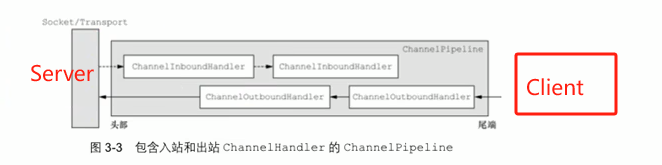
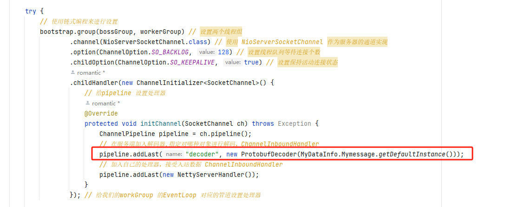
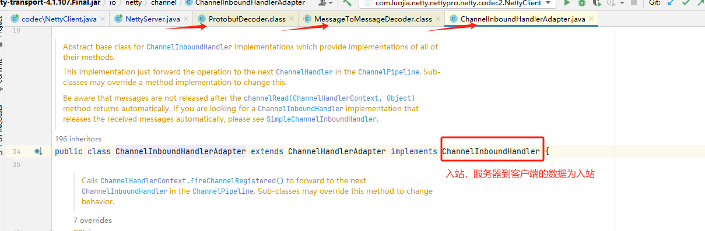
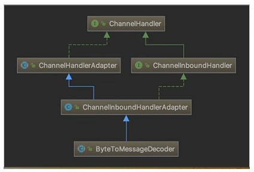
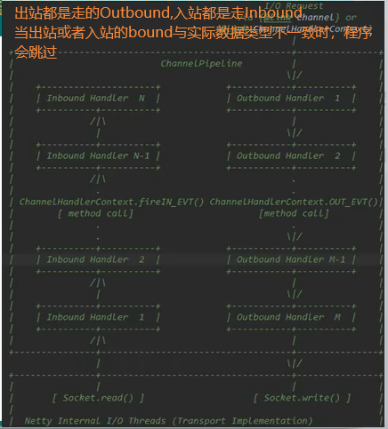
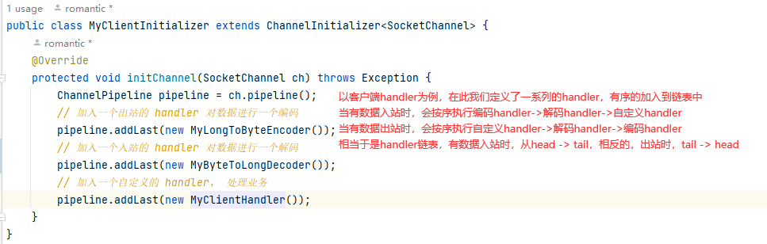
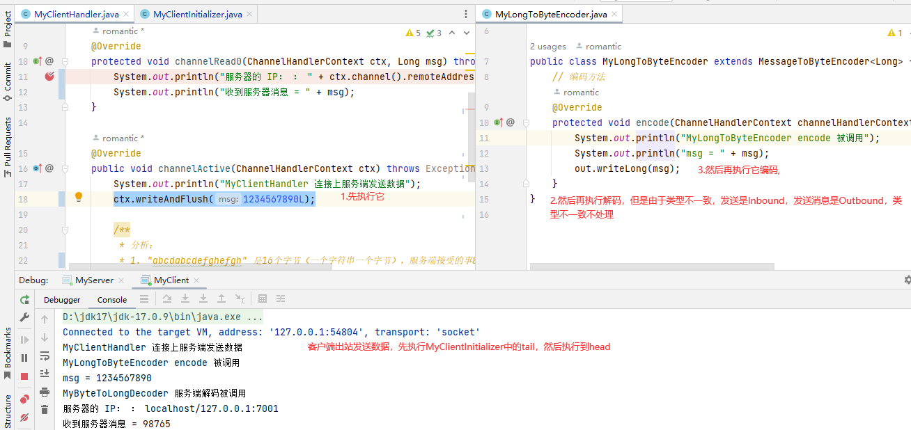
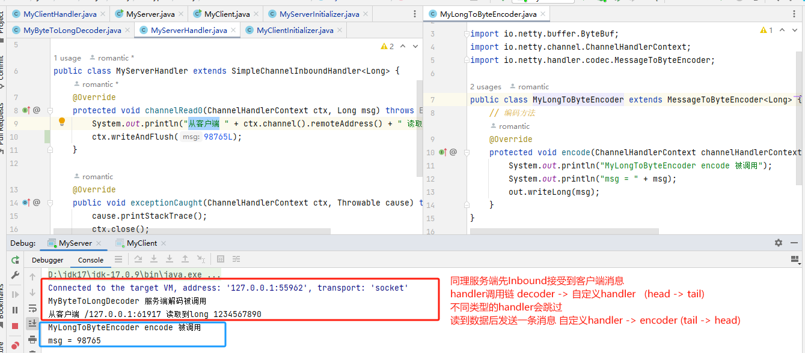
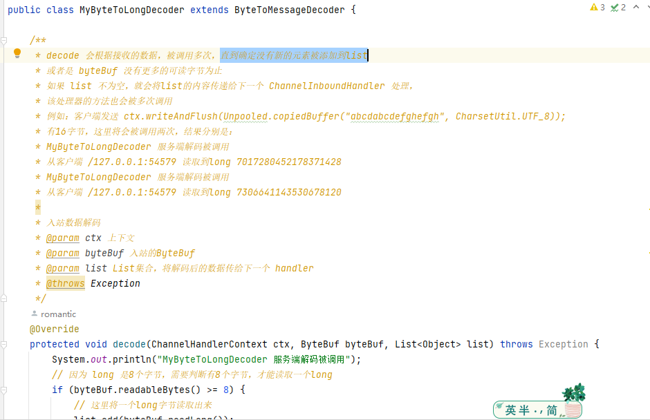
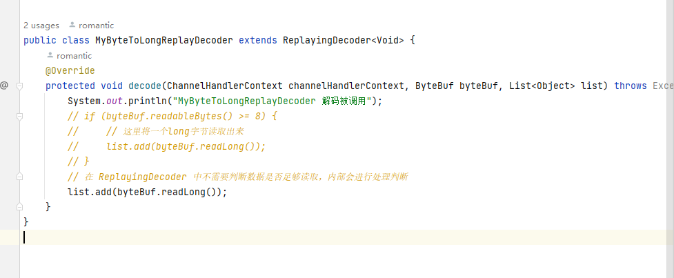

# Netty编解码器和handler的调用机制

### 基本说明

1） netty的组件设计：Netty的主要组件有Channel、EventLoop、ChannelFuture、ChannelHandler、ChannelPipe等

2）ChannelHandler充当了处理入站和出站数据的应用程序逻辑的容器。例如，实现ChannellnboundHandler接口(或ChannellnboundHandlerAdapter)，你就可以接收入站事件和数据，这些数据会被业务逻辑处理。当要给客户端发送响应时，也可以从ChannellnboundHandler冲刷数据。业务逻辑通常写在一个或者多个ChannellnboundHandler中。ChannelOutboundHandler原理一样，只不过它是用来处理出站数据的

3）ChannelPipeline提供了ChannelHandler链的容器。以客户端应用程序为例，如果事件的运动方向是从客户端到服务端的，那么我们称这些事件为出站的，即客户端发送给服务端的数据会通过pipeline中的一系列ChannelOutboundHandler，并被这些Handler处理，反之则称为入站的



### 编码解码器

1）当Netty发送或者接受一个消息的时候，就将会发生一次数据转换。入站消息会被解码：从字节转换为另一种格式(比如java对象)；如果是出站消息，它会被编码成字节。

2）Netty提供一系列实用的编解码器，他们都实现了ChannellnboundHadnler或者ChannelOutboundHandler接口。在这些类中，channelRead方法已经被重写了。以入站为例，对于每个从入站Channel读取的消息，这个方法会被调用。随后它将调用由解码器所提供的decode()方法进行解码，并将已经解码的字节转发给ChannelPipeline中的下一个ChannellnboundHandler。

我们以服务端编码器为例，查看源码



点进去查看 ProtobufDecoder类，它继承 MessageToMessageDecoder 类，而 MessageToMessageDecoder 类又继承 ChannelInboundHandlerAdapter 类，ChannelInboundHandlerAdapter 又实现了 ChannelInboundHandler类，达到入站的目的



出站、入站不是绝对的，读就是涉及到入站，所以在Server中，也会有 ChannelInboundHandler

#### 解码器-ByteToMessageDecoder

1）关系继承图



2）由于不可能知道远程节点是否会一次性发送一个完整的信息，tcp有可能出现粘包拆包的问题，这个类会对入站数据进行缓冲，直到它准备好被处理.

#### Netty 的 handler 链的调用机制

实例要求：

1)使用自定义的编码器和解码器来说明Netty的handler 调用机制

2)案例演示

出站入站解释：



**handler执行规则：**


**Client执行handler流程**



**Server执行handler流程**



**ByteToMessageDecoder 中decode解释**



**ReplayingDecoder 中 decode解释**



#### 结论

不论解码器handler还是编码器handler即接收的消息类型必须与待处理的销息类型一致，否则读handler不会被执行

在解码器进行数据解码时，需要判断缓存区(ByteBuf)的数据是否足够，否则接收到的结果可能会和期望结果不一致

MyServer

```java
package com.luojia.netty.nettypro.netty.inboundandoutboundhandler;

import io.netty.bootstrap.ServerBootstrap;
import io.netty.channel.ChannelFuture;
import io.netty.channel.EventLoopGroup;
import io.netty.channel.nio.NioEventLoopGroup;
import io.netty.channel.socket.nio.NioServerSocketChannel;

public class MyServer {
    public static void main(String[] args) throws InterruptedException {
        EventLoopGroup bossGroup = new NioEventLoopGroup(1);
        EventLoopGroup workerGroup = new NioEventLoopGroup();

        try {
            ServerBootstrap serverBootstrap = new ServerBootstrap();
            serverBootstrap.group(bossGroup, workerGroup)
                    .channel(NioServerSocketChannel.class)
                    .childHandler(new MyServerInitializer());
            ChannelFuture future = serverBootstrap.bind(7001).sync();
            future.channel().closeFuture().sync();
        } finally {
            bossGroup.shutdownGracefully();
            workerGroup.shutdownGracefully();
        }
    }
}
```

MyServerInitializer

```java
package com.luojia.netty.nettypro.netty.inboundandoutboundhandler;

import io.netty.channel.ChannelInitializer;
import io.netty.channel.ChannelPipeline;
import io.netty.channel.socket.SocketChannel;

public class MyServerInitializer extends ChannelInitializer<SocketChannel> {
    @Override
    protected void initChannel(SocketChannel ch) throws Exception {
        ChannelPipeline pipeline = ch.pipeline();
        // 入站的handler 进行解码 MyByteToLongDecoder
        pipeline.addLast("MyByteToLongDecoder", new MyByteToLongDecoder());
        // 加入一个出站的 handler 对数据进行一个编码
        pipeline.addLast(new MyLongToByteEncoder());
        // 自定义的 handler 处理业务逻辑
        pipeline.addLast("", new MyServerHandler());
    }
}
```

MyByteToLongDecoder

```java
package com.luojia.netty.nettypro.netty.inboundandoutboundhandler;

import io.netty.buffer.ByteBuf;
import io.netty.channel.ChannelHandlerContext;
import io.netty.handler.codec.ByteToMessageDecoder;

import java.util.List;

public class MyByteToLongDecoder extends ByteToMessageDecoder {

    /**
     * decode 会根据接收的数据，被调用多次，直到确定没有新的元素被添加到list
     * 或者是 byteBuf 没有更多的可读字节为止
     * 如果 list 不为空，就会将list的内容传递给下一个 ChannelInboundHandler 处理，
     * 该处理器的方法也会被多次调用
     * 例如：客户端发送 ctx.writeAndFlush(Unpooled.copiedBuffer("abcdabcdefghefgh", CharsetUtil.UTF_8));
     * 有16字节，这里将会被调用两次，结果分别是：
     * MyByteToLongDecoder 服务端解码被调用
     * 从客户端 /127.0.0.1:54579 读取到long 7017280452178371428
     * MyByteToLongDecoder 服务端解码被调用
     * 从客户端 /127.0.0.1:54579 读取到long 7306641143530678120
     *
     * 入站数据解码
     * @param ctx 上下文
     * @param byteBuf 入站的ByteBuf
     * @param list List集合，将解码后的数据传给下一个 handler
     * @throws Exception
     */
    @Override
    protected void decode(ChannelHandlerContext ctx, ByteBuf byteBuf, List<Object> list) throws Exception {
        System.out.println("MyByteToLongDecoder 服务端解码被调用");
        // 因为 long 是8个字节，需要判断有8个字节，才能读取一个long
        if (byteBuf.readableBytes() >= 8) {
            // 这里将一个long字节读取出来
            list.add(byteBuf.readLong());
        }
    }
}
```

MyLongToByteEncoder

```java
package com.luojia.netty.nettypro.netty.inboundandoutboundhandler;

import io.netty.buffer.ByteBuf;
import io.netty.channel.ChannelHandlerContext;
import io.netty.handler.codec.MessageToByteEncoder;

public class MyLongToByteEncoder extends MessageToByteEncoder<Long> {
    // 编码方法
    @Override
    protected void encode(ChannelHandlerContext channelHandlerContext, Long msg, ByteBuf out) throws Exception {
        System.out.println("MyLongToByteEncoder encode 被调用");
        System.out.println("msg = " + msg);
        out.writeLong(msg);
    }
}
```

MyServerHandler

```java
package com.luojia.netty.nettypro.netty.inboundandoutboundhandler;

import io.netty.channel.ChannelHandlerContext;
import io.netty.channel.SimpleChannelInboundHandler;

public class MyServerHandler extends SimpleChannelInboundHandler<Long> {
    @Override
    protected void channelRead0(ChannelHandlerContext ctx, Long msg) throws Exception {
        System.out.println("从客户端 " + ctx.channel().remoteAddress() + " 读取到long " + msg);
        ctx.writeAndFlush(98765L);
    }

    @Override
    public void exceptionCaught(ChannelHandlerContext ctx, Throwable cause) throws Exception {
        cause.printStackTrace();
        ctx.close();
    }
}
```

MyClient

```java
package com.luojia.netty.nettypro.netty.inboundandoutboundhandler;

import io.netty.bootstrap.Bootstrap;
import io.netty.channel.ChannelFuture;
import io.netty.channel.EventLoopGroup;
import io.netty.channel.nio.NioEventLoopGroup;
import io.netty.channel.socket.nio.NioSocketChannel;

public class MyClient {

    public static void main(String[] args) throws InterruptedException {
        EventLoopGroup group = new NioEventLoopGroup();
        try {
            Bootstrap bootstrap = new Bootstrap();
            bootstrap.group(group)
                    .channel(NioSocketChannel.class)
                    // 自定义一个初始化类
                    .handler(new MyClientInitializer());
            ChannelFuture future = bootstrap.connect("localhost", 7001).sync();
            future.channel().closeFuture().sync();
        } finally {
            group.shutdownGracefully();
        }
    }
}
```

MyClientInitializer

```java
package com.luojia.netty.nettypro.netty.inboundandoutboundhandler;

import io.netty.channel.ChannelInitializer;
import io.netty.channel.ChannelPipeline;
import io.netty.channel.socket.SocketChannel;

public class MyClientInitializer extends ChannelInitializer<SocketChannel> {
    @Override
    protected void initChannel(SocketChannel ch) throws Exception {
        ChannelPipeline pipeline = ch.pipeline();
        // 加入一个出站的 handler 对数据进行一个编码
        pipeline.addLast(new MyLongToByteEncoder());
        // 加入一个入站的 handler 对数据进行一个解码
        pipeline.addLast(new MyByteToLongDecoder());
        // 加入一个自定义的 handler， 处理业务
        pipeline.addLast(new MyClientHandler());
    }
}
```

MyClientHandler

```java
package com.luojia.netty.nettypro.netty.inboundandoutboundhandler;

import io.netty.buffer.Unpooled;
import io.netty.channel.ChannelHandlerContext;
import io.netty.channel.SimpleChannelInboundHandler;
import io.netty.util.CharsetUtil;

public class MyClientHandler extends SimpleChannelInboundHandler<Long> {
    @Override
    protected void channelRead0(ChannelHandlerContext ctx, Long msg) throws Exception {
        System.out.println("服务器的 IP： ： " + ctx.channel().remoteAddress());
        System.out.println("收到服务器消息 = " + msg);
    }

    @Override
    public void channelActive(ChannelHandlerContext ctx) throws Exception {
        System.out.println("MyClientHandler 连接上服务端发送数据");
        ctx.writeAndFlush(1234567890L);

        /**
         * 分析：
         * 1. "abcdabcdefghefgh" 是16个字节（一个字符串一个字节），服务端接受的事8字节，所以服务端的decode会被多次调用
         * 2. 该处理器的前一个 handler 是 MyLongToByteEncoder
         * 3. MyLongToByteEncoder 的父类是 MessageToByteEncoder
         * 4. 父类 MessageToByteEncoder有个 write() 方法，
         * 里面有个判断方法 this.acceptOutboundMessage(msg)，判断当前msg 是不是应该处理的类型，不是则不编码直接发送
         * 因此我们编写的Encoder 是要注意传入发数据类型和处理的数据类型要一致
         */
        // ctx.writeAndFlush(Unpooled.copiedBuffer("abcdabcdefghefgh", CharsetUtil.UTF_8));
    }
}
```


