# Netty模型

### 组件

#### 1.EventLoop

**事件循环对象**

Eventloop 本质是一个单线程执行器(同时维护了一个 Selector)，里面有 run 方法处理 Channel 上源源不断的 IO 事件。

它的继承关系比较复杂

- 一条线是继承自j.u.c.ScheduledExecutorService 因此包含了线程池中所有的方法。
- 另一条线是继承自 netty 自己的 OrderedEventExecutor
  - 提供了 boolean inEventLoop(Thread thread)方法判断一个线程是否属于此 EventLoop
  - 提供了 parent 方法来看看自己属于哪个 EventLoopGroup


**事件循环组**

EventLoopGroup 是一组 EventLoop的集合，Channel一般会调用 EventLoopGroup 的register 方法来绑定其中一个EventLoop，后续这个 Channel 上的 IO 事件都由此 EventLoop 来处理(保证了 IO 事件处理时的线程安全)

- 继承自 netty 自己的 EventExecutorGroup
  - 实现了 lterable 接口提供遍历 EventLoop 的能力
  -  另有 next方法获取集合中下一个 EventLoop

```java
static final EventExecutorGroup group = new DefaultEventExecutorGroup(2);

EventLoopGroup workerGroup = new NioEventLoopGroup();
EventLoop next = workerGroup.next();

bootstrap.group(bossGroup, workerGroup) // 设置两个线程组
    .channel(NioServerSocketChannel.class) // 使用 NioServerSocketChannel 作为服务器的通道实现
    .childHandler(new ChannelInitializer<SocketChannel>() {
        // 给pipeline 设置处理器
        @Override
        protected void initChannel(SocketChannel ch) throws Exception {
            // 如果在 addLast 添加 handler，前面有指定的线程池，那么该handler 会优先加入到该线程池中
            ch.pipeline().addLast(group, new NettyServerHandler());
        }
    });
```

**handler 执行中如何换人**

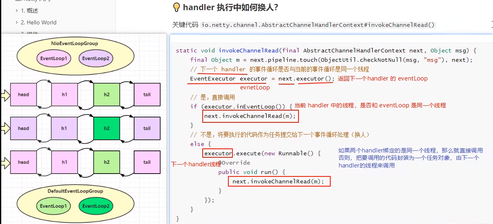


#### 2. Channel

channel的主要作用
- close()可以用来关闭channel
- closeFuture()用来处理channel的关闭
  - sync方法作用是同步等待channel关闭
  - 而addListener方法是异步等待channel关闭

- pipeline()方法添加处理器
- write()方法将数据写入
- writeAndFlush()方法将数据写入并刷出


#### 3.Future & Promise

在异步处理时，经常用到这两个接口

首先要说明 netty 中的 Future 与 jdk 中的 Future 同名，但是是两个接口，netty 的Future 继承自 jdk 的Future，而 Promise 又对 netty Future 进行了扩展

- jdk Future 只能同步等待任务结束 (或成功，或失败) 才能得到结果
- netty Future可以同步等待任务结束得到结果，也可以异步方式得到结果，但都是要等任务结束
- netty Promise不仅有netty Future的功能，而且脱离了任务独立存在，只作为两个线程间传递结果的容器


#### 4.Handler & Pipeline

ChannelHandler 用来处理 Channel 上的各种事件，分为入站、出站两种。所有 ChannelHandler 被连成一串，就是 Plpeline

- 入站处理器通常是 ChannelInboundHandlerAdapter 的子类，主要用来读取客户端教据，写回结果
- 出站处理器通常是 ChannelOutboundHandlerAdapter 的子类，主要对写回结果进行加工

打个比喻，每个 Channel是一个产品的加工车间，Pipeline 是车间中的流水线，ChannelHandler 就是流水线上的各道工序，而后面要讲的 ByteBuf是原材料，经过很多工序的加工：先经过一道道入站工序，再经过一道道出站工序最终变成产品

ChannellnboundHandlerAdapter 是按照 addLast 的顺序执行的，而ChannelOutboundHandlerAdapter 是按照 addLast的逆序执行的。ChannelPipeline 的实现是一个ChannelHandlerContext(包装了 ChannelHandler)组成的双向链表

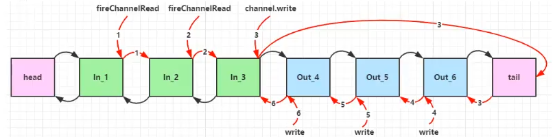

#### 5.ByteBuf

是对字节数据的封装

**1）创建**

```java
public static void main(String[] args) {
    ByteBuf buffer = ByteBufAllocator.DEFAULT.buffer(10);
    StringBuilder sb = new StringBuilder();
    for (int i = 0; i < 32; i++) {
        sb.append("a");
    }
    buffer.writeBytes(sb.toString().getBytes());
    log(buffer);
}

private static void log(ByteBuf buffer) {
    int length = buffer.readableBytes();
    int rows = length / 16 + (length % 15 == 0 ? 0 : 1) + 4;
    StringBuilder buf = new StringBuilder(rows * 80 * 2)
        .append("read index:").append(buffer.readerIndex())
        .append(" write index:").append(buffer.writerIndex())
        .append(" capacity:").append(buffer.capacity())
        .append(NEWLINE);
    appendPrettyHexDump(buf, buffer);
    System.out.println(buf.toString());
}
```

上面代码创建了一个默认的 ByteBuf(池化基于直接内存的 ByteBuf)，初始容量是 10

**2）直接内存 VS 堆内存**

可以使用下面的代码来创建池化**基于堆**的 ByteBuf

```java
ByteBuf buffer = ByteBufAllocator.DEFAULT,heapBuffer(10);
```

也可以便用下面的代码来创建池化**基于直接内存**的 ByteBuf

```java
ByteBuf buffer = ByteBufAllocator.DEFAULT.directBuffer(10);
```

- 直接内存创建和销毁的代价昂贵，但读写性能高(少一次内存复制)，适合配合池化功能一起用
- 直接内存对 GC压力小，因为这部分内存不受 JVM 垃圾回收的管理，但也要注意及时主动释放

**3）池化 VS 非池化**

池化的最大意义在于可以重用 ByteBuf，优点有

- 没有池化，则每次都得创建新的 ByteBuf 实例，这个操作对直接内存代价昂贵，就算是使用堆内存，也会增加 GC 压力
- 有了池化，则可以重用池中 ByteBuf实例，并且采用了与 jemalloc 类似的内存分配算法提升分配效率。
- 高并发时，池化功能更节约内存，减少内存溢出的可能

池化功能是否开启，可以通过下面的系统环境变量来设置

```java
-Dio.netty.allocator.type={unpooled | pooled}
```

- 4.1之前，池化功能还不成熟，默认是非池化实现
- 4.1以后，非 Android 平台默认启用池化实现，Android 平台启用非池化实现

```java
ByteBuf buffer = ByteBufAllocator.DEFAULT.buffer(10);
// class io.netty.buffer.PooledUnsafeDirectByteBuf
// 池化的直接内存
System.out.println(buffer.getClass());
ByteBuf buffer1 = ByteBufAllocator.DEFAULT.heapBuffer(10);
// class io.netty.buffer.PooledUnsafeHeapByteBuf
// 池化的堆内存
System.out.println(buffer1.getClass());
```

**4）组成**

ByteBuf由四部分组成

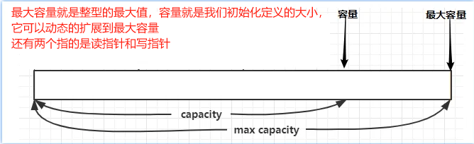

最开始读写指针都在0 位置

**5）扩容**

扩容规则是

- 如何写入后数据大小未超过 512，则选择下一个16 的整数倍，例如写入后大小为12，则扩容后 capacity是16
- 如果写入后数据大小超过 512，则选择下一个 2^n，例如写入后大小为513，则扩容后 capacity 是2^10=1024(2^9=512已经不够了)
- 扩容不能超过 max capacioy，否则会报错

**6）retain & release**

由于 Netty 中有堆外内存的 ByteBuf 实现，堆外内存最好是手动来释放，而不是等 GC垃圾回收。

- UnpooledHeapByteBuf 使用的是 JVM 内存，只需等GC回收内存即可
- UnpooledDirectByteBuf 便用的就是**直接内存**了，**需要特殊的方法来回收内存**
- PooledByteBuf和它的子类使用了池化机制，需要更复杂的规则来回收内存

>回收内存的源码实现，请关注下面方法的不同实现
>
>  protected abstract void deallocate()

Netty 这里采用了引用计数法来控制回收内存，每个 ByteBuf都实现了 ReferenceCounted 接口

- 每个 ByteBuf 对象的初始计数为 1
- 调用 release 方法计数减1，如果计数为 0，ByteBuf 内存被回收
- 调用 retain 方法计数加1，表示调用者没用完之前，其它 handler 即便调用了 release 也不会造成回收
- 当计数为0时，底层内存会被回收，这时即便 ByteBuf 对象还在，其各个方法均无法正常使用

**7）slice**

【零拷贝】的体现之一，对原始 ByteBuf 进行切片成多个 ByteBuf，切片后的 ByteBuf 并没有发生内存复制，还是使用原始 ByteBuf 的内存，切片后的 ByteBuf 维护独立的 read，write 指针

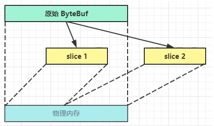

```java
package com.luojia.netty.nettypro.netty.basicapi;

import io.netty.buffer.ByteBuf;
import io.netty.buffer.ByteBufAllocator;

import static com.luojia.netty.nettypro.netty.basicapi.TestByteBuf.log;

public class TestSlice {

    public static void main(String[] args) {
        ByteBuf buf = ByteBufAllocator.DEFAULT.buffer(10);
        buf.writeBytes(new byte[]{'a', 'b', 'c', 'd', 'e', 'f', 'g', 'h', 'i', 'j'});
        // abcdefghij
        log(buf);

        // 在切片过程中，没有发生数据复制，相当于使用的还是原来的
        // 切片后的 ByteBuf 容量已经固定，不支持向后追加数据
        ByteBuf f1 = buf.slice(0, 5);
        ByteBuf f2 = buf.slice(5, 5);
        // abcde
        log(f1);
        // fghij
        log(f2);

        System.out.println("=================");
        f1.setByte(0, 'b');
        // bbcdefghij
        log(buf);
        // bbcde
        log(f1);
        
        System.out.println("释放原有的 byteBuf 内存");
        buf.release();
        // 原来的 buf 内存释放后，此处在使用会报错
        log(f1);
    }
}
```

**8）duplicate**

【零拷贝】的体现之一，就好比截取了原始 ByteBuf 所有内容，并且没有 max capacity的限制，也是与原始 ByteBuf 使用同一块底层内存，只是读写指针是独立的

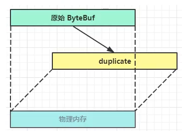

**9）copy**

会将底层内存数据进行深拷贝，因此无论读写，都与原始 ByteBuf无关

**10）Unpooled **

Unpooled 是一个工具类，类如其名，提供了非池化的ByteBuf创建、组合、复制等操作

这里仅介绍其跟【零拷贝】相关的 wrappedBuffer 方法，可以用来包装 ByteBuf

```java
ByteBuf buf1 = ByteBufAllocator.DEFAULT.buffer(5);
buf1.writeBytes(new byte[]{1, 2, 3, 4, 5});
ByteBuf buf2 = ByteBufAllocator.DEFAULT.buffer(5);
buf2.writeBytes(new byte[]{6, 7, 8, 9, 10});

// 当包装 ByteBuf 个数超过一个时， 底层使用了 CompositeByteBuf
ByteBuf buf3 = Unpooled.wrappedBuffer(buf1, buf2);
System.out.println(ByteBufUtil.prettyHexDump(buf3));
```

输出：

             +-------------------------------------------------+
             |  0  1  2  3  4  5  6  7  8  9  a  b  c  d  e  f |
    +--------+-------------------------------------------------+----------------+
    |00000000| 01 02 03 04 05 06 07 08 09 0a                   |..........      |
    +--------+-------------------------------------------------+----------------+

也可以用来包装普通字节数组，底层也不会有拷贝操作

```java
ByteBuf buf4 = Unpooled.wrappedBuffer(new byte[]{1, 2, 3}, new byte[]{4, 5, 6});
System.out.println(buf4.getClass());
System.out.println(ByteBufUtil.prettyHexDump(buf4));
```

输出：

```java
class io.netty.buffer.CompositeByteBuf
         +-------------------------------------------------+
         |  0  1  2  3  4  5  6  7  8  9  a  b  c  d  e  f |
+--------+-------------------------------------------------+----------------+
|00000000| 01 02 03 04 05 06                               |......          |
+--------+-------------------------------------------------+----------------+
```

:bell:**Bytebuf 优势​** 

池化-可以重用池中 ByteBuf实例，更节约内存，减少内存溢出的可能

读写指针分离，不需要像 ByteBuffer 一样切换读写模式

可以自动扩容

支持链式调用，使用更流畅

很多地方体现零拷贝，例如 slice、duplicate、CompositeByteBuf


### 工作原理示意图1-简单版

Netty主要基于主从 Reactors 多线程模型（如图）做了一定的改进，其中主从 Reactor 多线程模型有多个 Reactor

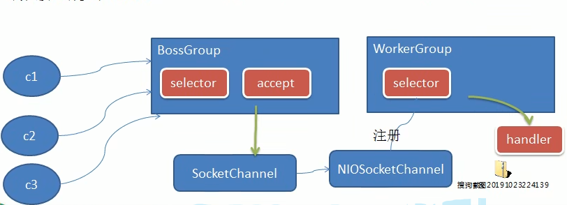

### 工作原理示意图2-进阶版

Netty主要基于主从Reactors 多线程模型(如图)做了一定的改进，其中主从 Reactor 多线程模型有多个 Reactor

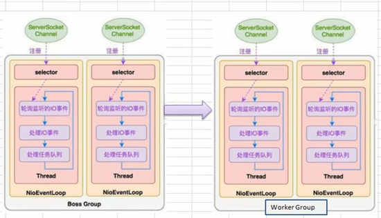

 ### 工作原理示意图3-详细版

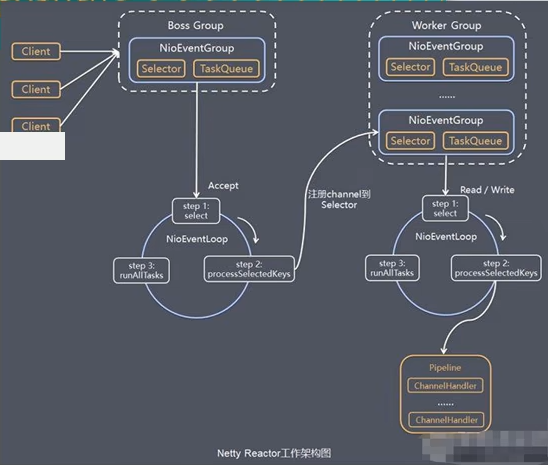

上图中NioEventGroup应该是NioEventLoop才对，每一个NioEvent都在不断的循环，然后过多NioEventLoop 才组成了NioEventGroup

1. Netty抽象出两组线程池 BossGroup专门负责接收客户端的连接，WorkerGroup 专门负责网络的读写
2. BossGroup和 WorkerGroup 类型都是 NioEventLoopGroup
3. NioEventLoopGroup 相当于一个事件循环组，这个组中含有多个事件循环，每一个事件循环是 NioEventLoop
4. NioEventLoop 表示一个不断循环的执行处理任务的线程，每个NioEventLoop都有一个selector,用于监听绑定在其上的socket的网络通讯
5. NioEventLoopGroup 可以有多个线程,即可以含有多个NioEventLoop
6. 每个Boss NioEventLoop循环执行的步骤有3步
   - 轮询accept事件
   - 处理accept事件，与client建立连接，生成**NioScocketChannel**，并将其注册到某个worker NlOEventLoop上的selector
   - 处理任务队列的任务，即runAllTasks
7. 每个Worker NIOEventLoop循环执行的步骤
   - 轮询read,write 事件
   - 处理i/o事件，在对应NioScocketChannel处理事件，即read,write事件
   - 处理任务队列的任务，即runAllTasks
8. 每个Worker NlOEventLoop 处理业务时，会使用pipeline(管道),pipeline 中包含了 channel,即通过pipeline 可以获取到对应通道,管道中维护了很多的 处理器

:bell: 提示

> 一开始需要树立正确的观念
>
> - 把 channel 理解为数据的通道
> - 把 msg理解为流动的数据，最开始输入是 ByteBuf，但经过 plpeline 的加工，会变成其它类型对象，最后输出又变成 ByteBuf
> - 把 handler 理解为数据的处理工序
>   - 工序有多道，合在一起就是 pipeline，pipeline 负责发布事件(读、读取完成..) 传播给每个handler， handler 对自己感兴趣的事件进行处理(重写了相应事件处理方法)
>   - handler 分 Inbound 和 Outbound 两类
> - 把 eventLoop 理解为处理数据的工人
>   - 工人可以管理多个 channel 的 IO 操作，并且一旦工人负责了某个channel，就要负责到底(绑定)
>   - 工人既可以执行 IO 操作也可以进行任务处理，每位工人有任务队列，队列里可以堆放多个 channel 的待处理任务，分为普通任务、定时任务
>   - 工人按照 pipeline 顺字，依次按照 handler 的规划（代码）处理数据，可以为每道工序指定不同的工人


---

设置NioEventLoopGroup 线程大小，不设置默认是CPU核数*2

此处意思为设置bossGroup 线程数为1，workerGroup线程数为2

```java
// bossGroup 和 workerGroup 含有的子线程(NioEventLoop)的个数，默认是 CPU 核数 * 2
NioEventLoopGroup bossGroup = new NioEventLoopGroup(1);
NioEventLoopGroup workerGroup = new NioEventLoopGroup(2);
```

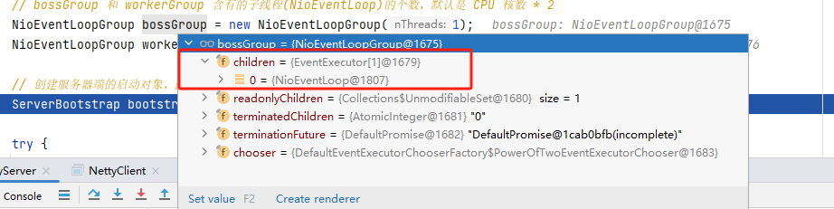

此图可以看出workerGroup线程数为2，同时每一个worker线程都有单独的一个Selector

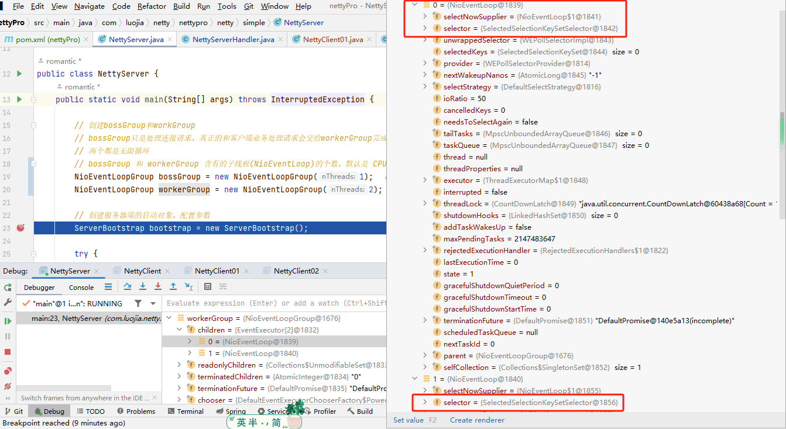

同时，当客户端连接个数超过定义线程个数时，会发现worker线程并不会由于之前的请求而一直阻塞，实现了线程的复用

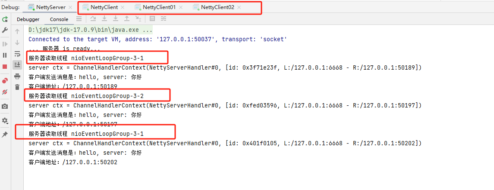

观察channel管道和 pipeline之间的关系(其实他们就是你中有我，我中有你的关系)

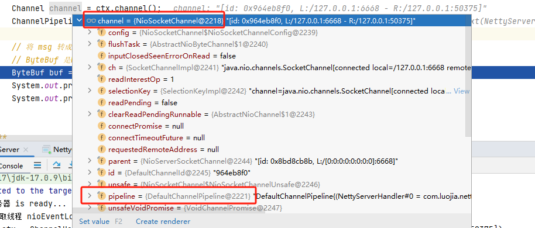

pipeline：pipeline 其实是一个双向链表，里面有头节点有尾节点，并且也有当前channel的信息

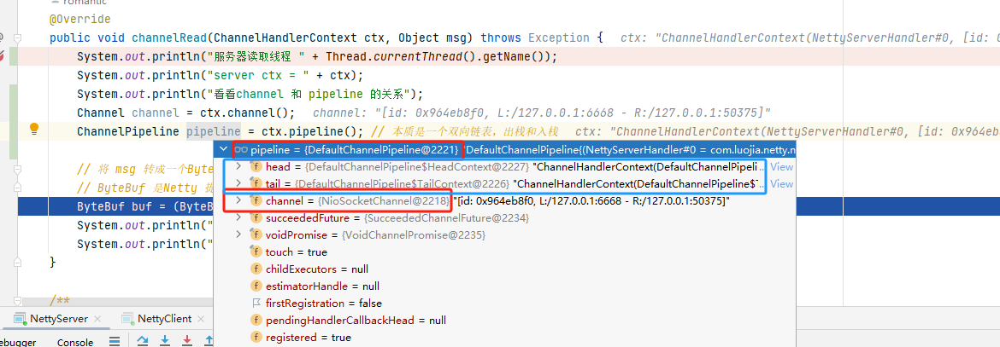

### 任务队列中的Task有三种典型使用场景

1）用户程序自定义的普通任务

taskqueue参数查看方法：找到ctx -> pipeline -> channel -> eventLoop -> taskQueue

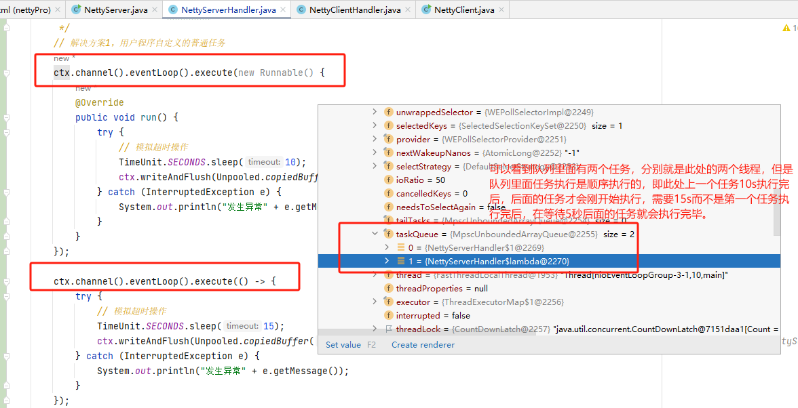

2）用户自定义定时任务

scheduleTaskQueue 参数查看方法：找到ctx -> pipeline -> channel -> eventLoop -> scheduleTaskQueue

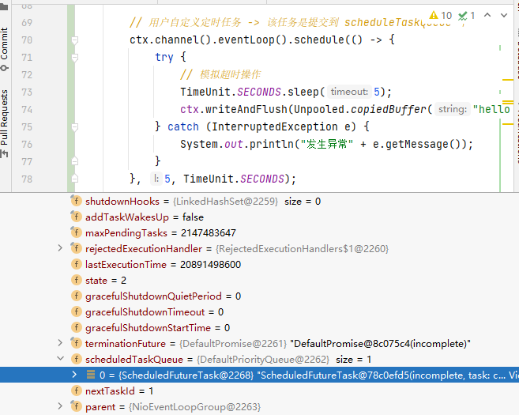

3）非当前Reactor线程调用Channel的各种方法

举个例子，在某**推送系统**的业务线程里面，根据用户的标识，找到对应的Channel引用，然后调用Write类方法向该用户推送消息，就会进入到这种场景。最终的Write会提交到任务队列中被**异步消费**。

### Netty 模型方案再说明

Netty抽象出**两组线程池**，BossGroup专门负责接收客户端连接，WorkerGroup 专门负击网络读写操作。

NioEventloop表示一个不断循环执行处理任务的线程，每个NioEventLoop都有一个selector，用于监听绑定在其上的 socket 网络通道。

NioEventloop内部采用**串行化设计**，从消息的读取->解码->处理->编码->发送，始终由IO 线程 NioEventLoop负责

- NioEventLoopGroup下包含多个NioEventLoop
- 每个 NioEventLoop中包含有一个Selector，taskQueue
- 每个NioEventLoop的Selector上可以注册监听多个NioChannel
- 每个NioChannel只会绑定在唯一的NioEventLoop上
- 每个 NioChannel都绑定有一个自己的ChannelPipeline

---

### 代码分析

NettyServer

```Java
package com.luojia.netty.nettypro.netty.simple;

import io.netty.bootstrap.ServerBootstrap;
import io.netty.channel.ChannelFuture;
import io.netty.channel.ChannelInitializer;
import io.netty.channel.ChannelOption;
import io.netty.channel.nio.NioEventLoopGroup;
import io.netty.channel.socket.SocketChannel;
import io.netty.channel.socket.nio.NioServerSocketChannel;

public class NettyServer {
    public static void main(String[] args) throws InterruptedException {

        // 创建bossGroup和workGroup
        // bossGroup只是处理连接请求，真正的和客户端业务处理请求会交给workerGroup完成
        // 两个都是无限循环
        // bossGroup 和 workerGroup 含有的子线程(NioEventLoop)的个数，默认是 CPU 核数 * 2
        NioEventLoopGroup bossGroup = new NioEventLoopGroup(1);
        NioEventLoopGroup workerGroup = new NioEventLoopGroup(2);

        // 创建服务器端的启动对象，配置参数
        ServerBootstrap bootstrap = new ServerBootstrap();

        try {
            // 使用链式编程来进行设置
            bootstrap.group(bossGroup, workerGroup) // 设置两个线程组
                    .channel(NioServerSocketChannel.class) // 使用 NioServerSocketChannel 作为服务器的通道实现
                    .option(ChannelOption.SO_BACKLOG, 128) // 设置线程队列等待连接个数
                    .childOption(ChannelOption.SO_KEEPALIVE, true) // 设置保持活动连接状态
                    .childHandler(new ChannelInitializer<SocketChannel>() {
                        // 给pipeline 设置处理器
                        @Override
                        protected void initChannel(SocketChannel ch) throws Exception {
                            ch.pipeline().addLast(new NettyServerHandler());
                        }
                    }); // 给我们的workGroup 的EventLoop 对应的管道设置处理器
            System.out.println("... 服务器 is ready...");
            // 绑定一个端口并且同步，生成一个 ChannelFuture 对象
            ChannelFuture cf = bootstrap.bind(6668).sync();
            // 对关闭通道进行监听
            cf.channel().closeFuture().sync();
        } finally {
            bossGroup.shutdownGracefully();
            workerGroup.shutdownGracefully();
        }
    }
}
```

NettyServerHandler

```Java
package com.luojia.netty.nettypro.netty.simple;

import io.netty.buffer.ByteBuf;
import io.netty.buffer.Unpooled;
import io.netty.channel.Channel;
import io.netty.channel.ChannelHandlerContext;
import io.netty.channel.ChannelInboundHandlerAdapter;
import io.netty.channel.ChannelPipeline;
import io.netty.util.CharsetUtil;

import java.util.concurrent.TimeUnit;

/**
 * 我们自定义一个Handler 需要继承netty 规定好的某个HandlerAdapter(规范)
 * 这时我们自定义一个Handler，才能称为一个handler
 */
public class NettyServerHandler extends ChannelInboundHandlerAdapter {

    /**
     * 读取数据（这里读取客户端发送的消息）
     * @param ctx 上下文对象，含有管道pipeline， 通道Channel，地址
     * @param msg 客户端发送的数据，默认Object
     * @throws Exception
     */
    @Override
    public void channelRead(ChannelHandlerContext ctx, Object msg) throws Exception {
        // 1.正常读写
        System.out.println("服务器读取线程 " + Thread.currentThread().getName());
        System.out.println("server ctx = " + ctx);
        System.out.println("看看channel 和 pipeline 的关系");
        Channel channel = ctx.channel();
        ChannelPipeline pipeline = ctx.pipeline(); // 本质是一个双向链表，出栈和入栈

        // 将 msg 转成一个ByteBuf
        // ByteBuf 是Netty 提供的，不是NIO的 ByteBuffer
        ByteBuf buf = (ByteBuf) msg;
        System.out.println("客户端发送消息是：" + buf.toString(CharsetUtil.UTF_8));
        System.out.println("客户端地址：" + ctx.channel().remoteAddress());

        // 2. 如果这里是一个非常耗时的业务 -> 异步执行 -> 提交该channel对应的 NIOEventLoop 的 taskQueue中
        /**
         * TimeUnit.SECONDS.sleep(10);
         * ctx.writeAndFlush(Unpooled.copiedBuffer("hello 这是一个耗时的操作", CharsetUtil.UTF_8));
         */
        // 解决方案1，用户程序自定义的普通任务
        ctx.channel().eventLoop().execute(new Runnable() {
            @Override
            public void run() {
                try {
                    // 模拟超时操作
                    TimeUnit.SECONDS.sleep(3);
                    ctx.writeAndFlush(Unpooled.copiedBuffer("hello 这是一个耗时的操作", CharsetUtil.UTF_8));
                } catch (InterruptedException e) {
                    System.out.println("发生异常" + e.getMessage());
                }
            }
        });

        ctx.channel().eventLoop().execute(() -> {
            try {
                // 模拟超时操作
                TimeUnit.SECONDS.sleep(5);
                ctx.writeAndFlush(Unpooled.copiedBuffer("hello 这是另一个耗时的操作", CharsetUtil.UTF_8));
            } catch (InterruptedException e) {
                System.out.println("发生异常" + e.getMessage());
            }
        });

        // 用户自定义定时任务 -> 该任务是提交到 scheduleTaskQueue 中
        ctx.channel().eventLoop().schedule(() -> {
            try {
                // 模拟超时操作
                TimeUnit.SECONDS.sleep(5);
                ctx.writeAndFlush(Unpooled.copiedBuffer("hello 这是 scheduleTaskQueue 的操作", CharsetUtil.UTF_8));
            } catch (InterruptedException e) {
                System.out.println("发生异常" + e.getMessage());
            }
        }, 5, TimeUnit.SECONDS);

        System.out.println("go on ...");

    }

    /**
     * 数据读取完后，执行的操作
     * @param ctx
     * @throws Exception
     */
    @Override
    public void channelReadComplete(ChannelHandlerContext ctx) throws Exception {
        // writeAndFlush 是 write和flush
        // 将数据写入缓存并刷新，一般我们需要对发送的数据进行编码
        ctx.writeAndFlush(Unpooled.copiedBuffer("hello, 客户端", CharsetUtil.UTF_8));
    }

    // 处理异常，需要关闭通道
    @Override
    public void exceptionCaught(ChannelHandlerContext ctx, Throwable cause) throws Exception {
        ctx.close();
    }
}
```

NettyClient

```Java
package com.luojia.netty.nettypro.netty.simple;

import io.netty.bootstrap.Bootstrap;
import io.netty.bootstrap.ServerBootstrap;
import io.netty.channel.ChannelFuture;
import io.netty.channel.ChannelInitializer;
import io.netty.channel.nio.NioEventLoopGroup;
import io.netty.channel.socket.SocketChannel;
import io.netty.channel.socket.nio.NioSocketChannel;

public class NettyClient {
    public static void main(String[] args) throws InterruptedException {

        // 客户端需要一个事件循环组
        NioEventLoopGroup group = new NioEventLoopGroup();

        try {
            // 创建客户端启动对象
            // 注意客户端使用的不是 ServerBootstrap 而是 Bootstrap
            Bootstrap bootstrap = new Bootstrap();
            bootstrap.group(group) // 设置线程组
                    .channel(NioSocketChannel.class) // 设置客户端通道的视线类(反射)
                    .handler(new ChannelInitializer<SocketChannel>() {
                        @Override
                        protected void initChannel(SocketChannel socketChannel) throws Exception {
                            // 加入自己的处理器
                            socketChannel.pipeline().addLast(new NettyClientHandler());
                        }
                    });

            System.out.println("客户端 OK ...");

            // 启动客户端连接服务端
            // 关于 ChannelFuture 要分析，设计到netty 的异步模型
            ChannelFuture channelFuture = bootstrap.connect("127.0.0.1", 6668).sync();
            // 对关闭进行监听
            channelFuture.channel().closeFuture().sync();
        } finally {
            group.shutdownGracefully();
        }
    }
}
```

NettyClientHandler

```Java
package com.luojia.netty.nettypro.netty.simple;

import io.netty.buffer.ByteBuf;
import io.netty.buffer.Unpooled;
import io.netty.channel.ChannelHandlerContext;
import io.netty.channel.ChannelInboundHandlerAdapter;
import io.netty.util.CharsetUtil;

import java.nio.charset.StandardCharsets;

public class NettyClientHandler extends ChannelInboundHandlerAdapter {

    /**
     * 当通道就绪就触发该方法
     * @param ctx
     * @throws Exception
     */
    @Override
    public void channelActive(ChannelHandlerContext ctx) throws Exception {
        System.out.println("client " + ctx);
        ctx.writeAndFlush(Unpooled.copiedBuffer("hello, server: 你好", StandardCharsets.UTF_8));
    }

    /**
     * 读取数据，当通道有数据时触发
     * @param ctx 上下文对象，含有管道pipeline， 通道Channel，地址
     * @param msg 客户端发送的数据，默认Object
     * @throws Exception
     */
    @Override
    public void channelRead(ChannelHandlerContext ctx, Object msg) throws Exception {
        System.out.println("client ctx = " + ctx);
        // 将 msg 转成一个ByteBuf
        // ByteBuf 是Netty 提供的，不是NIO的 ByteBuffer
        ByteBuf buf = (ByteBuf) msg;
        System.out.println("服务器回复的消息：" + buf.toString(CharsetUtil.UTF_8));
        System.out.println("服务器地址：" + ctx.channel().remoteAddress());
    }

    @Override
    public void exceptionCaught(ChannelHandlerContext ctx, Throwable cause) throws Exception {
        ctx.close();
    }
}
```

