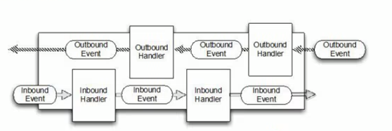
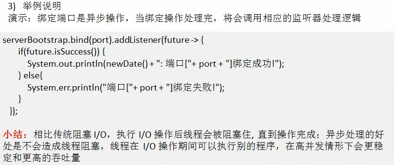

# 异步模型

### 基本介绍

异步的概念和同步相对。当一个异步过程调用发出后，调用者不能立刻得到结果。实际处理这个调用的组件在完成后，通过状态、通知和回调来通知调用者。

Netty 中的 I/O 操作是异步的，包括 Bind、Write、Connect等操作会简单的返回一个ChannelFuture 。

调用者并不能立刻获得结果，而是通过 Future-Listener机制，用户可以方便的主动获取或者通过通知机制获得IO操作结果

Netty 的异步模型是建立在 future 和 callback之上的。callback 就是回调。重点说Future，它的核心思想是：假设一个方法 fun，计算过程可能非常耗时，等待 fun返回显然不合适。那么可以在调用 fun的时候，立马返回一个 Future，后续可以通过Future去监控方法fun的处理过程(即：Future-Listener 机制)

### Future说明

表示异步的执行结果，可以通过它提供的方法来检测执行是否完成，比如检索计算等等.
ChannelFuture是一个接口：public interface ChannelFuture extends Future<Void>我们可以添加监听器，当监听的事件发生时，就会通知到监听器，案例说明

### 工作原理示意图

在使用 Netty进行编程时，拦截操作和转换出入站数据只需要提供 callback 或利用future 即可。这使得链式操作简单、高效，并有利于编写可重用的、通用的代码。Netly框架的目标就是让你的业务逻辑从网络基础应用编码中分离出来、解脱出来

### Future-Listener机制

当 Future 对象刚刚创建时，处于非完成状态，调用者可以通过返回的 ChannelFuture来获取操作执行的状态，注册监听函数来执行完成后的操作。

常见有如下操作

- 通过 isDone方法来判断当前操作是否完成；
- 通过 issuccess 方法来判断已完成的当前操作是否成功；
- 通过 getCause 方法来获取已完成的当前操作失败的原因；
- 通过 isCancelled方法来判断已完成的当前操作是否被取消；
- 通过 addListener方法来注册监听器，当操作已完成(isDone 方法返回完成)，将会通知指定的监听器:如果 Future 对象已完成，则通知指定的监听器

