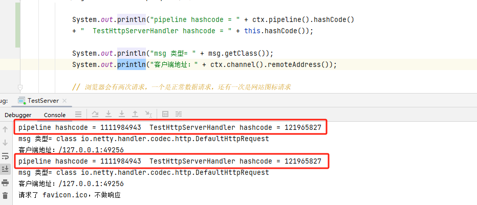
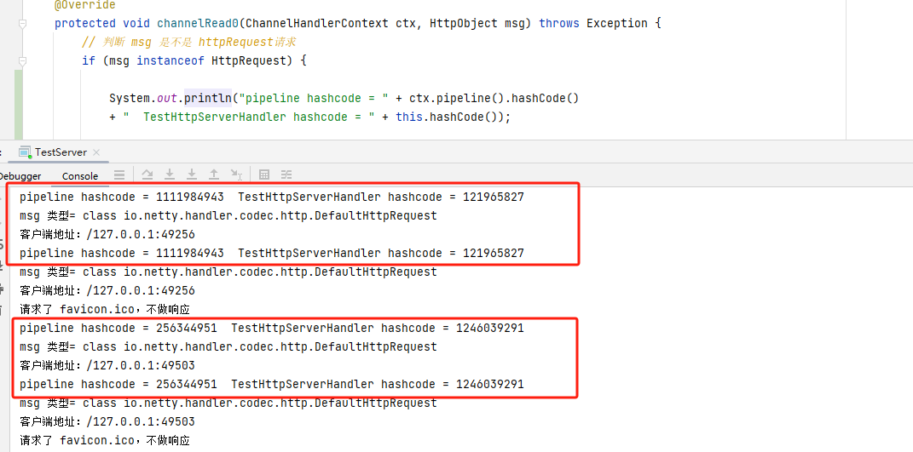

# 4.快速入门实例-HTTP服务

对于浏览器发出的同一个长链接请求，都会使用同一个管道进行处理



当重启浏览器或者其他浏览器访问时，会发现管道hashcode发生了变化，因为请求不是同一个长链接



TestServer

```java
package com.luojia.netty.nettypro.netty.http;

import io.netty.bootstrap.ServerBootstrap;
import io.netty.channel.ChannelFuture;
import io.netty.channel.EventLoopGroup;
import io.netty.channel.nio.NioEventLoopGroup;
import io.netty.channel.socket.nio.NioServerSocketChannel;

public class TestServer {
    public static void main(String[] args) throws InterruptedException {
        EventLoopGroup bossGroup = new NioEventLoopGroup(1);
        EventLoopGroup workerGroup = new NioEventLoopGroup();

        try {
            ServerBootstrap bootstrap = new ServerBootstrap();
            bootstrap.group(bossGroup, workerGroup)
                    .channel(NioServerSocketChannel.class)
                    .childHandler(new TestServerInitializer());

            // 通过浏览器当客户端访问时，端口号需要大于7000才行，不然会被认为不安全禁止访问
            ChannelFuture channelFuture = bootstrap.bind(7001).sync();
            channelFuture.channel().closeFuture().sync();
        } finally {
            bossGroup.shutdownGracefully();
            workerGroup.shutdownGracefully();
        }
    }
}
```

TestServerInitializer

```java
package com.luojia.netty.nettypro.netty.http;

import io.netty.channel.ChannelInitializer;
import io.netty.channel.ChannelPipeline;
import io.netty.channel.socket.SocketChannel;
import io.netty.handler.codec.http.HttpServerCodec;

public class TestServerInitializer extends ChannelInitializer<SocketChannel> {
    @Override
    protected void initChannel(SocketChannel ch) throws Exception {
        // 向官方中加入处理器
        // 得到管道
        ChannelPipeline pipeline = ch.pipeline();
        // 加入一个netty 提供的 HttpServerCodec codec => [codec - decoder]
        // HttpServerCodec 说明
        // 1.HttpServerCodec 是netty 提供的处理http 的编-解码器
        pipeline.addLast("MyHttpServerCodec", new HttpServerCodec());
        // 2.增加一个自定义的handler
        pipeline.addLast("MyTestHttpServerHandler", new TestHttpServerHandler());
    }
}
```

TestHttpServerHandler

```java
package com.luojia.netty.nettypro.netty.http;

import io.netty.buffer.ByteBuf;
import io.netty.buffer.Unpooled;
import io.netty.channel.ChannelHandlerContext;
import io.netty.channel.SimpleChannelInboundHandler;
import io.netty.handler.codec.http.*;
import io.netty.util.CharsetUtil;

import java.net.URI;
import java.nio.charset.StandardCharsets;

/**
 * 说明
 * SimpleChannelInboundHandler 是 ChannelInboundHandlerAdapter
 * HttpObject 客户端和服务器端相互通讯的数据被封装成HttpObject
 */
public class TestHttpServerHandler extends SimpleChannelInboundHandler<HttpObject> {

    // channelRead0 读取客户端数据
    @Override
    protected void channelRead0(ChannelHandlerContext ctx, HttpObject msg) throws Exception {
        // 判断 msg 是不是 httpRequest请求
        if (msg instanceof HttpRequest) {

            System.out.println("pipeline hashcode = " + ctx.pipeline().hashCode()
            + "  TestHttpServerHandler hashcode = " + this.hashCode());

            System.out.println("msg 类型= " + msg.getClass());
            System.out.println("客户端地址：" + ctx.channel().remoteAddress());

            // 浏览器会有两次请求，一个是正常数据请求，还有一次是网站图标请求
            // 获取到数据
            HttpRequest httpRequest = (HttpRequest)msg;
            // 获取URI
            URI uri = new URI(httpRequest.uri());
            if ("/favicon.ico".equals(uri.getPath())) {
                System.out.println("请求了 favicon.ico，不做响应");
                return;
            }

            // 回复信息给浏览器[http 协议]
            ByteBuf content = Unpooled.copiedBuffer("hello，我是服务器，现在给你返回数据", CharsetUtil.UTF_8);
            // 构建一个http响应，即httpresponse
            // 当前响应的版本号和状态码
            FullHttpResponse response = new DefaultFullHttpResponse(HttpVersion.HTTP_1_1, HttpResponseStatus.OK, content);
            response.headers().set(HttpHeaderNames.CONTENT_TYPE, "text/plain;charset=utf-8");
            response.headers().set(HttpHeaderNames.CONTENT_LENGTH, content.readableBytes());
            // 返回请求
            ctx.writeAndFlush(response);
        }
    }
}
```


