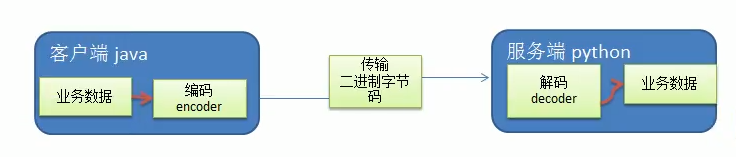
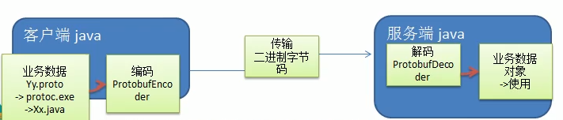

# Google Protobuf

### 自定义协议要素

- 魔数，用来在第一时间判定是否是无效数据包
- 版本号，可以支持协议的升级
- 序列化算法，消息正文到底采用哪种序列化反序列化方式，可以由此扩展，例如：json、protobuf、hessian、jdk
- 指令类型，是登录、注册、单聊、群聊... 跟业务相关
- 请求序号，为了双工通信，提供异步能力
- 正文长度
- 消息正文

### 编码和解码的基本介绍

编写网络应用程序时，因为数据在网络中传输的都是二进制字节码数据，在发送数据时就需要编码,接收数据时就需要解码

codec(编解码器)的组成部分有两个：decoder(解码器)和encoder(编码器)

encoder负责把业务数据转换成字节码数据，decoder负责把字节码数据转换成业务数据



### Netty 本身的编码解码的机制和问题分析

1)Netty自身提供了一些codec(编解码器)

2) Netty提供的编码器

- StringEncoder，对字符串数据进行编码 
- ObjectEncoder，对Java对象进行编码
- ...

3) Netty提供的解码器

- StringDecoder,对字符串数据进行解码
- ObjectDecoder，对Java对象进行解码
- ...

4) Netty本身自带的ObjectDecoder和 ObjectEncoder可以用来实现POJO对象或各种业务对象的编码和解码，底层使用的仍是Java序列化技术，而lava序列化技术本身效率就不高，存在如下问题

- 无法跨语言
- 序列化后的体积太大,是二进制编码的5倍多。
- 序列化性能太低
  引出新的解决方空【Google 的 Protobuf】

## Protobuf

### Protobuf 基本介绍和使用示意图

1) Protobuf 是Google发布的开源项目，全称Google Protocol Buffers，是一种轻便高
效的结构化数据存储格式，可以用于结构化数据串行化，或者说序列化。它很适合做
数据存储或<font color = 'red'> RPC[远程过程调用 remote procedure call] 数据交换格式。</font>

2)参考文档：https://developers.google.com/protocol-buffers/docs/proto

3) Protobuf 是以message的方式来管理数据的。

4)支持跨平台、<font color = 'red'> 跨语言</font>，即[客户端和服务器端可以是不同的语言编写的] (<font color = 'red'> 支持 目前绝大多数语言</font>，例如C++、C#、Java、 python 等)；**对上图理解**(编解码器.jpg)，如果客户端是Java语言，服务端是Python语言，使用Protobuf  能正常的进行编解码

5)高性能，高可靠性

6)使用protobuf编译器能自动生成代码，Protobuf 是将类的定义使用 .proto文件进行描述。说明，在idea 中编写.proto 文件时，会自动提示是否下载.ptotot 编写插件.可
以让语法高亮。

7)然后通过protoc.exe编译器根据.proto自动生成java文件

8) protobuf 使用示意图：



### Protubuf 快速入门

编写程序，使用Protobuf完成如下功能

1)客户端可以发送一个Student PoJo 对象到服务器(通过Protobuf编码)

2)服务端能接收Student PoJo对象，并显示信息(通过Protobuf解码)

首先需要在pom.xml文件中导入 protobuf-java ，并且在打包插件中加入protobuf打包插件

```xml
<dependency>
    <groupId>com.google.protobuf</groupId>
    <artifactId>protobuf-java</artifactId>
    <version>3.7.1</version>
</dependency>

<build>
    <extensions>
        <extension>
            <groupId>kr.motd.maven</groupId>
            <artifactId>os-maven-plugin</artifactId>
            <version>1.4.1.Final</version>
        </extension>
    </extensions>
    <plugins>
        <plugin>
            <groupId>org.xolstice.maven.plugins</groupId>
            <artifactId>protobuf-maven-plugin</artifactId>
            <version>0.5.0</version>
            <configuration>
                <protocArtifact>     com.google.protobuf:protoc:3.1.0:exe:${os.detected.classifier}
                </protocArtifact>
                <pluginId>grpc-java</pluginId>
                <!--
                    只要根据实际工程目录，修改一下两个配置。
                    protoSourceRoot：表示proto源文件所在的目录
                    outputDirectory：生成java类文件包所在的目录
                    如果输出目录不配置，会默认到 target\generated-sources\protobuf\java
                    -->
                <protoSourceRoot>src/main/proto</protoSourceRoot>
                <outputDirectory>src/main/proto/java</outputDirectory>
            </configuration>
            <executions>
                <execution>
                    <goals>
                        <goal>compile</goal>
                        <goal>compile-custom</goal>
                    </goals>
                </execution>
            </executions>
        </plugin>
    </plugins>
</build>
```

NettyServer

```java
package com.luojia.netty.nettypro.netty.codec;

import io.netty.bootstrap.ServerBootstrap;
import io.netty.channel.ChannelFuture;
import io.netty.channel.ChannelInitializer;
import io.netty.channel.ChannelOption;
import io.netty.channel.ChannelPipeline;
import io.netty.channel.nio.NioEventLoopGroup;
import io.netty.channel.socket.SocketChannel;
import io.netty.channel.socket.nio.NioServerSocketChannel;
import io.netty.handler.codec.protobuf.ProtobufDecoder;

public class NettyServer {
    public static void main(String[] args) throws InterruptedException {

        // 创建bossGroup和workGroup
        // bossGroup只是处理连接请求，真正的和客户端业务处理请求会交给workerGroup完成
        // 两个都是无限循环
        // bossGroup 和 workerGroup 含有的子线程(NioEventLoop)的个数，默认是 CPU 核数 * 2
        NioEventLoopGroup bossGroup = new NioEventLoopGroup(1);
        NioEventLoopGroup workerGroup = new NioEventLoopGroup(2);

        // 创建服务器端的启动对象，配置参数
        ServerBootstrap bootstrap = new ServerBootstrap();

        try {
            // 使用链式编程来进行设置
            bootstrap.group(bossGroup, workerGroup) // 设置两个线程组
                    .channel(NioServerSocketChannel.class) // 使用 NioServerSocketChannel 作为服务器的通道实现
                    .option(ChannelOption.SO_BACKLOG, 128) // 设置线程队列等待连接个数
                    .childOption(ChannelOption.SO_KEEPALIVE, true) // 设置保持活动连接状态
                    .childHandler(new ChannelInitializer<SocketChannel>() {
                        // 给pipeline 设置处理器
                        @Override
                        protected void initChannel(SocketChannel ch) throws Exception {
                            ChannelPipeline pipeline = ch.pipeline();
                            // 在服务端加入解码器,指定对哪种对象进行解码，ChannelInboundHandler
                            pipeline.addLast("decoder", new ProtobufDecoder(StudentPOJO.Student.getDefaultInstance()));
                            pipeline.addLast(new NettyServerHandler());
                        }
                    }); // 给我们的workGroup 的EventLoop 对应的管道设置处理器

            System.out.println("... 服务器 is ready...");
            // 绑定一个端口并且同步，生成一个 ChannelFuture 对象
            ChannelFuture cf = bootstrap.bind(6668).sync();

            // 对关闭通道进行监听
            cf.channel().closeFuture().sync();
        } finally {
            bossGroup.shutdownGracefully();
            workerGroup.shutdownGracefully();
        }
    }
}
```

NettyServerHandler

```java
package com.luojia.netty.nettypro.netty.codec;

import io.netty.buffer.ByteBuf;
import io.netty.buffer.Unpooled;
import io.netty.channel.Channel;
import io.netty.channel.ChannelHandlerContext;
import io.netty.channel.ChannelInboundHandlerAdapter;
import io.netty.channel.ChannelPipeline;
import io.netty.util.CharsetUtil;

import java.util.concurrent.TimeUnit;

/**
 * 我们自定义一个Handler 需要继承netty 规定好的某个HandlerAdapter(规范)
 * 这时我们自定义一个Handler，才能称为一个handler
 */
public class NettyServerHandler extends ChannelInboundHandlerAdapter {

    /**
     * 读取数据（这里读取客户端发送的消息）
     * @param ctx 上下文对象，含有管道pipeline， 通道Channel，地址
     * @param msg 客户端发送的数据，默认Object
     * @throws Exception
     */
    @Override
    public void channelRead(ChannelHandlerContext ctx, Object msg) throws Exception {
        // 读取从客户端发送的 StudentPojo.Student
        // 或者 NettyServerHandler 类继承 SimpleChannelInboundHandler，直接获取到 StudentPOJO.Student 对象
        StudentPOJO.Student student = (StudentPOJO.Student) msg;
        System.out.println("客户端发送的数据 id = " + student.getId() + " 名字 = " + student.getName());
    }

    /**
     * 数据读取完后，执行的操作
     * @param ctx
     * @throws Exception
     */
    @Override
    public void channelReadComplete(ChannelHandlerContext ctx) throws Exception {
        // writeAndFlush 是 write和flush
        // 将数据写入缓存并刷新，一般我们需要对发送的数据进行编码
        ctx.writeAndFlush(Unpooled.copiedBuffer("hello, 客户端", CharsetUtil.UTF_8));
    }

    // 处理异常，需要关闭通道
    @Override
    public void exceptionCaught(ChannelHandlerContext ctx, Throwable cause) throws Exception {
        ctx.close();
    }
}
```

Student.proto

```protobuf
syntax = "proto3"; // 协议版本
option java_outer_classname = "StudentPOJO";// 生成的外部类名，同时也是文件名
// Protobuf 使用message 管理数据
message Student { // 会在 StudentPOJO 外部类生成一个内部类 Student，他是真正发送的POJO对象
  // Student 类中有一个属性，名字为id 类型为 int32（Protobuf类型），1表示序列号，不是值
  int32 id = 1;
  string name = 2;
}
```

NettyClient

```java
package com.luojia.netty.nettypro.netty.codec;

import io.netty.bootstrap.Bootstrap;
import io.netty.channel.ChannelFuture;
import io.netty.channel.ChannelInitializer;
import io.netty.channel.ChannelPipeline;
import io.netty.channel.nio.NioEventLoopGroup;
import io.netty.channel.socket.SocketChannel;
import io.netty.channel.socket.nio.NioSocketChannel;
import io.netty.handler.codec.protobuf.ProtobufDecoder;
import io.netty.handler.codec.protobuf.ProtobufEncoder;

public class NettyClient {
    public static void main(String[] args) throws InterruptedException {

        // 客户端需要一个事件循环组
        NioEventLoopGroup group = new NioEventLoopGroup();

        try {
            // 创建客户端启动对象
            // 注意客户端使用的不是 ServerBootstrap 而是 Bootstrap
            Bootstrap bootstrap = new Bootstrap();
            bootstrap.group(group) // 设置线程组
                    .channel(NioSocketChannel.class) // 设置客户端通道的实现类(反射)
                    .handler(new ChannelInitializer<SocketChannel>() {
                        @Override
                        protected void initChannel(SocketChannel socketChannel) throws Exception {
                            ChannelPipeline pipeline = socketChannel.pipeline();
                            // 在客户端加入编码器，发送数据要进行编码 ChannelOutboundHandler
                            pipeline.addLast("encoder", new ProtobufEncoder());
                            // 加入自己的处理器，接受入站数据 ChannelInboundHandler
                            pipeline.addLast(new NettyClientHandler());
                        }
                    });

            System.out.println("客户端 OK ...");

            // 启动客户端连接服务端
            // 关于 ChannelFuture 要分析，设计到netty 的异步模型
            ChannelFuture channelFuture = bootstrap.connect("127.0.0.1", 6668).sync();
            // 对关闭进行监听
            channelFuture.channel().closeFuture().sync();
        } finally {
            group.shutdownGracefully();
        }
    }
}
```

NettyClientHandler

```java
package com.luojia.netty.nettypro.netty.codec;

import io.netty.buffer.ByteBuf;
import io.netty.buffer.Unpooled;
import io.netty.channel.ChannelHandlerContext;
import io.netty.channel.ChannelInboundHandlerAdapter;
import io.netty.util.CharsetUtil;

import java.nio.charset.StandardCharsets;

public class NettyClientHandler extends ChannelInboundHandlerAdapter {

    /**
     * 当通道就绪就触发该方法
     * @param ctx
     * @throws Exception
     */
    @Override
    public void channelActive(ChannelHandlerContext ctx) throws Exception {
        // 发送一个Student 对象到服务器
        StudentPOJO.Student romantic = StudentPOJO.Student.newBuilder().setId(3).setName("romantic").build();
        ctx.writeAndFlush(romantic);
    }

    /**
     * 读取数据，当通道有数据时触发
     * @param ctx 上下文对象，含有管道pipeline， 通道Channel，地址
     * @param msg 客户端发送的数据，默认Object
     * @throws Exception
     */
    @Override
    public void channelRead(ChannelHandlerContext ctx, Object msg) throws Exception {
        System.out.println("client ctx = " + ctx);
        // 将 msg 转成一个ByteBuf
        // ByteBuf 是Netty 提供的，不是NIO的 ByteBuffer
        ByteBuf buf = (ByteBuf) msg;
        System.out.println("服务器回复的消息：" + buf.toString(CharsetUtil.UTF_8));
        System.out.println("服务器地址：" + ctx.channel().remoteAddress());
    }

    @Override
    public void exceptionCaught(ChannelHandlerContext ctx, Throwable cause) throws Exception {
        ctx.close();
    }
}
```

### 快速入门2

NettyServer

```java
package com.luojia.netty.nettypro.netty.codec2;

import com.luojia.netty.nettypro.netty.codec.StudentPOJO;
import io.netty.bootstrap.ServerBootstrap;
import io.netty.channel.ChannelFuture;
import io.netty.channel.ChannelInitializer;
import io.netty.channel.ChannelOption;
import io.netty.channel.ChannelPipeline;
import io.netty.channel.nio.NioEventLoopGroup;
import io.netty.channel.socket.SocketChannel;
import io.netty.channel.socket.nio.NioServerSocketChannel;
import io.netty.handler.codec.protobuf.ProtobufDecoder;

public class NettyServer {
    public static void main(String[] args) throws InterruptedException {

        // 创建bossGroup和workGroup
        // bossGroup只是处理连接请求，真正的和客户端业务处理请求会交给workerGroup完成
        // 两个都是无限循环
        // bossGroup 和 workerGroup 含有的子线程(NioEventLoop)的个数，默认是 CPU 核数 * 2
        NioEventLoopGroup bossGroup = new NioEventLoopGroup(1);
        NioEventLoopGroup workerGroup = new NioEventLoopGroup(2);

        // 创建服务器端的启动对象，配置参数
        ServerBootstrap bootstrap = new ServerBootstrap();

        try {
            // 使用链式编程来进行设置
            bootstrap.group(bossGroup, workerGroup) // 设置两个线程组
                    .channel(NioServerSocketChannel.class) // 使用 NioServerSocketChannel 作为服务器的通道实现
                    .option(ChannelOption.SO_BACKLOG, 128) // 设置线程队列等待连接个数
                    .childOption(ChannelOption.SO_KEEPALIVE, true) // 设置保持活动连接状态
                    .childHandler(new ChannelInitializer<SocketChannel>() {
                        // 给pipeline 设置处理器
                        @Override
                        protected void initChannel(SocketChannel ch) throws Exception {
                            ChannelPipeline pipeline = ch.pipeline();
                            // 在服务端加入解码器,指定对哪种对象进行解码，ChannelInboundHandler
                            pipeline.addLast("decoder", new ProtobufDecoder(MyDataInfo.Mymessage.getDefaultInstance()));
                            // 加入自己的处理器，接受入站数据 ChannelInboundHandler
                            pipeline.addLast(new NettyServerHandler());
                        }
                    }); // 给我们的workGroup 的EventLoop 对应的管道设置处理器
            System.out.println("... 服务器 is ready...");
            // 绑定一个端口并且同步，生成一个 ChannelFuture 对象
            ChannelFuture cf = bootstrap.bind(6668).sync();

            // 对关闭通道进行监听
            cf.channel().closeFuture().sync();
        } finally {
            bossGroup.shutdownGracefully();
            workerGroup.shutdownGracefully();
        }
    }
}
```

NettyServerHandler

```java
package com.luojia.netty.nettypro.netty.codec2;

import com.luojia.netty.nettypro.netty.codec.StudentPOJO;
import io.netty.buffer.Unpooled;
import io.netty.channel.ChannelHandlerContext;
import io.netty.channel.ChannelInboundHandlerAdapter;
import io.netty.channel.SimpleChannelInboundHandler;
import io.netty.util.CharsetUtil;

/**
 * 我们自定义一个Handler 需要继承netty 规定好的某个HandlerAdapter(规范)
 * 这时我们自定义一个Handler，才能称为一个handler
 */
public class NettyServerHandler extends SimpleChannelInboundHandler<MyDataInfo.Mymessage> {

    /**
     * 读取数据（这里读取客户端发送的消息）
     * @param ctx 上下文对象，含有管道pipeline， 通道Channel，地址
     * @param msg 客户端发送的数据，默认Object
     * @throws Exception
     */
    @Override
    public void channelRead0(ChannelHandlerContext ctx, MyDataInfo.Mymessage msg) throws Exception {
        MyDataInfo.Mymessage.DataType dataType = msg.getDataType();
        if (dataType == MyDataInfo.Mymessage.DataType.StudentType) {
            MyDataInfo.Student student = msg.getStudent();
            System.out.println("客户端发送的学生 id = " + student.getId() + " 学生名字 = " + student.getName());
        } else if (dataType == MyDataInfo.Mymessage.DataType.WorkerType) {
            MyDataInfo.Worker worker = msg.getWorker();
            System.out.println("客户端发送的工人年龄 = " + worker.getAge() + " 工人名字 = " + worker.getName());
        } else {
            System.out.println("传输的类型不正确");
        }
    }

    /**
     * 数据读取完后，执行的操作
     * @param ctx
     * @throws Exception
     */
    @Override
    public void channelReadComplete(ChannelHandlerContext ctx) throws Exception {
        // writeAndFlush 是 write和flush
        // 将数据写入缓存并刷新，一般我们需要对发送的数据进行编码
        ctx.writeAndFlush(Unpooled.copiedBuffer("hello, 客户端", CharsetUtil.UTF_8));
    }

    // 处理异常，需要关闭通道
    @Override
    public void exceptionCaught(ChannelHandlerContext ctx, Throwable cause) throws Exception {
        ctx.close();
    }
}
```

NettyClient

```java
package com.luojia.netty.nettypro.netty.codec2;

import io.netty.bootstrap.Bootstrap;
import io.netty.channel.ChannelFuture;
import io.netty.channel.ChannelInitializer;
import io.netty.channel.ChannelPipeline;
import io.netty.channel.nio.NioEventLoopGroup;
import io.netty.channel.socket.SocketChannel;
import io.netty.channel.socket.nio.NioSocketChannel;
import io.netty.handler.codec.protobuf.ProtobufEncoder;

public class NettyClient {
    public static void main(String[] args) throws InterruptedException {

        // 客户端需要一个事件循环组
        NioEventLoopGroup group = new NioEventLoopGroup();

        try {
            // 创建客户端启动对象
            // 注意客户端使用的不是 ServerBootstrap 而是 Bootstrap
            Bootstrap bootstrap = new Bootstrap();
            bootstrap.group(group) // 设置线程组
                    .channel(NioSocketChannel.class) // 设置客户端通道的实现类(反射)
                    .handler(new ChannelInitializer<SocketChannel>() {
                        @Override
                        protected void initChannel(SocketChannel socketChannel) throws Exception {
                            ChannelPipeline pipeline = socketChannel.pipeline();
                            // 在客户端加入编码器，发送数据要进行编码 ChannelOutboundHandler
                            pipeline.addLast("encoder", new ProtobufEncoder());
                            // 加入自己的处理器，接受入站数据 ChannelInboundHandler
                            pipeline.addLast(new NettyClientHandler());
                        }
                    });

            System.out.println("客户端 OK ...");

            // 启动客户端连接服务端
            // 关于 ChannelFuture 要分析，设计到netty 的异步模型
            ChannelFuture channelFuture = bootstrap.connect("127.0.0.1", 6668).sync();
            // 对关闭进行监听
            channelFuture.channel().closeFuture().sync();
        } finally {
            group.shutdownGracefully();
        }
    }
}
```

NettyClientHandler

```java
package com.luojia.netty.nettypro.netty.codec2;

import com.luojia.netty.nettypro.netty.codec.StudentPOJO;
import io.netty.buffer.ByteBuf;
import io.netty.channel.ChannelHandlerContext;
import io.netty.channel.ChannelInboundHandlerAdapter;
import io.netty.util.CharsetUtil;

import java.util.Random;

public class NettyClientHandler extends ChannelInboundHandlerAdapter {

    /**
     * 当通道就绪就触发该方法
     * @param ctx
     * @throws Exception
     */
    @Override
    public void channelActive(ChannelHandlerContext ctx) throws Exception {
        // 发送一个Student 对象到服务器
        int random = new Random().nextInt(3);
        MyDataInfo.Mymessage mymessage = null;

        if (0 == random) {
            // 发送 Student 对象
            mymessage = MyDataInfo.Mymessage.newBuilder()
                    .setDataType(MyDataInfo.Mymessage.DataType.StudentType)
                    .setStudent(MyDataInfo.Student.newBuilder().setId(1).setName("romantic").build())
                    .build();
        } else {
            // 发送 Worker 对象
            mymessage = MyDataInfo.Mymessage.newBuilder()
                    .setDataType(MyDataInfo.Mymessage.DataType.WorkerType)
                    .setWorker(MyDataInfo.Worker.newBuilder().setAge(18).setName("luojia").build())
                    .build();
        }
        ctx.writeAndFlush(mymessage);
    }

    /**
     * 读取数据，当通道有数据时触发
     * @param ctx 上下文对象，含有管道pipeline， 通道Channel，地址
     * @param msg 客户端发送的数据，默认Object
     * @throws Exception
     */
    @Override
    public void channelRead(ChannelHandlerContext ctx, Object msg) throws Exception {
        System.out.println("client ctx = " + ctx);
        // 将 msg 转成一个ByteBuf
        // ByteBuf 是Netty 提供的，不是NIO的 ByteBuffer
        ByteBuf buf = (ByteBuf) msg;
        System.out.println("服务器回复的消息：" + buf.toString(CharsetUtil.UTF_8));
        System.out.println("服务器地址：" + ctx.channel().remoteAddress());
    }

    @Override
    public void exceptionCaught(ChannelHandlerContext ctx, Throwable cause) throws Exception {
        ctx.close();
    }
}
```


```protobuf
syntax = "proto3"; // 协议版本
option optimize_for = SPEED; // 加快解析
// 指定生成到哪个包下
option java_package = "com.luojia.netty.nettypro.netty.codec2";
// 外部类名
option java_outer_classname = "MyDataInfo";

// protobuf 可以使用message 管理其他的 message
message Mymessage {
  // 定义一个枚举类型
  enum DataType {
    StudentType = 0;// 在 proto3 要求enum 的编号从0开始
    WorkerType = 1; //
  }

  // 用 data_type 来标识传来的事哪一个枚举类型
  DataType data_type = 1;
  // 表示每次枚举类型最多只能出现其中一个，节省空间
  oneof dataBody {
    Student student = 2;
    Worker worker = 3;
  }

}

message Student {
  int32 id = 1;
  string name = 2;
}

message Worker {
  string name = 1;
  int32 age = 2;
}
```


