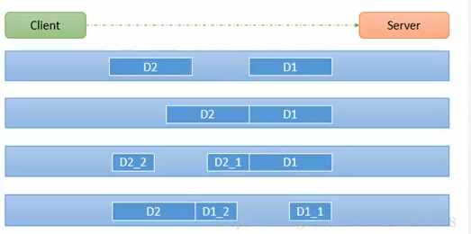
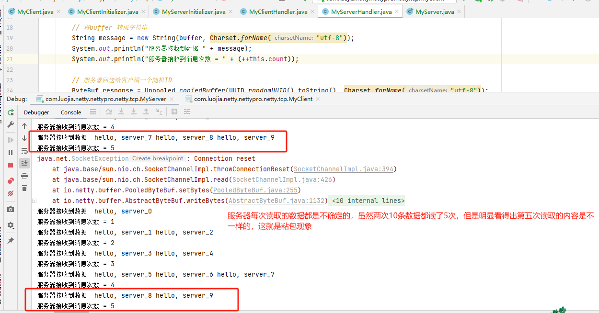
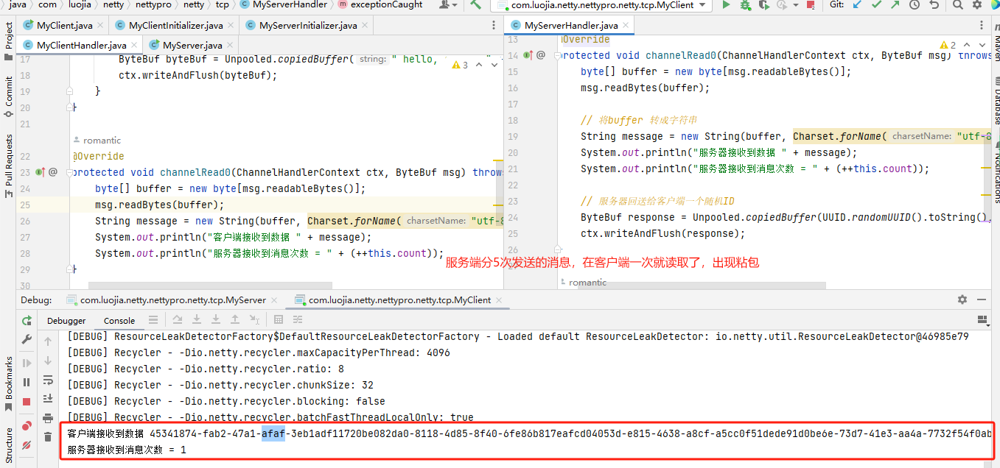
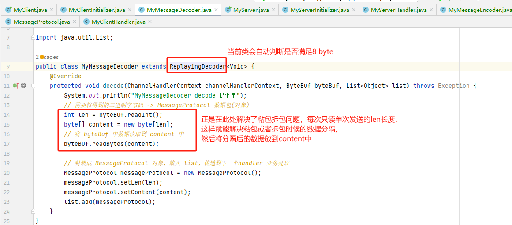

# 滑动窗口

TCP 以一个段(segment)为单位，每发送一个段就需要进行一次确认应答(ack)处理，但如果这么做，缺点是包的往返时间越长性能就越差

为了解决此问题，引入了窗口概念，窗口大小即决定了无需等待应答而可以继续发送的数据最大值

窗口实际就起到一个缓冲区的作用，同时也能起到流量控制的作用


# TCP粘包和半包基本介绍

## 现象分析

### 粘包

- 现象，发送 abc def，接收 abcdef
- 原因
  - 应用层：接收方 ByteBuf 设置太大(Netty默认1024)
  -  滑动窗口：假设发送方 256 bytes 表示一个完整报文，但由于接收方处理不及时且窗口大小足够大，这256 bytes 字节就会缓冲在接收方的滑动窗口中，当滑动窗口中缓冲了多个报文就会粘包
  - Nagle 算法:会造成粘包

### 半包

-  现象，发送 abcdef，按收 abc def
- 原因
  - 应用层：接收方 ByteBuf 小于实际发送数据量
  - 滑动窗口：假设接收方的窗口只剩了 128 bytes，发送方的报文大小是 256 bytes，这时放不下了，只能先发送前 128 bytes，等待 ack 后才能发送剩余部分，这就造成了半包
  - MSS 限制：当发送的数据超过 M55 限制后，会将数据切分发送，就会造成半包

**本质是因为 TCP 是流式协议，消息无边界**

## 基本介绍

1）TCP是面向连接的，面向流的，提供高可靠性服务。收发两端(客户端和服务器端)都要有一一成对的socket，因此，发送端为了将多个发给接收端的包，能更有效的发给对方，使用了优化方法(Nagle算法)，将多次间隔较小且数据量小的数据，合并成一个大的数据块，然后进行封包。这样做虽然提高了效率，但是接收端就难于分辨出完整的数据包了，因为<font color = 'red'>面向流的通信是无消息保护边界的</font>

2）由于TCP无消息保护边界，需要在接收端处理消息边界问题，也就是我们所说的粘包、拆包问题，看一张图



假设客户端分别发送了两个数据包D1和D2给服务端，由于**服务端一次读取到字节数是不确定的**，故可能存在以下四种情况:

1)服务端**分两次**读取到了两个独立的数据包分别是D1和D2，没有粘包和半包

2)服务端**一次**接受到了两个数据包，D1和D2粘合在一起，称之为TCP粘包

3)服务端分两次读取到了数据包，第一次读取到了完整的D1包和D2包的部分内容，第二次读取到了D2包的剩余内容，这称之为TCP半包

4)服务端分两次读取到了数据包，第一次读取到了D1包的部分内容D1_1，第二次读取到了D1包的剩余部分内容D1_2和完整的D2包。

tcp 粘包演示





### TCP 粘包和半包解决方案

1）使用自定义协议 +编解码器 来解决
2）关键就是要解决 服务器端每次读取数据长度的问题，这个问题解决，就不会出现服务器多读或少读数据的问题，从而避免的TCP粘包、拆包。

**自定义解码器实现粘包原理**



MyServer

```java
package com.luojia.netty.nettypro.netty.tcp.protocoltcp;

import io.netty.bootstrap.ServerBootstrap;
import io.netty.channel.ChannelFuture;
import io.netty.channel.EventLoopGroup;
import io.netty.channel.nio.NioEventLoopGroup;
import io.netty.channel.socket.nio.NioServerSocketChannel;

public class MyServer {
    public static void main(String[] args) throws InterruptedException {
        EventLoopGroup bossGroup = new NioEventLoopGroup(1);
        EventLoopGroup workerGroup = new NioEventLoopGroup();

        try {
            ServerBootstrap serverBootstrap = new ServerBootstrap();
            serverBootstrap.group(bossGroup, workerGroup)
                    .channel(NioServerSocketChannel.class)
                    .childHandler(new MyServerInitializer());

            ChannelFuture future = serverBootstrap.bind(7001).sync();
            future.channel().closeFuture().sync();
        } finally {
            bossGroup.shutdownGracefully();
            workerGroup.shutdownGracefully();
        }
    }
}
```

MyServerInitializer

```java
package com.luojia.netty.nettypro.netty.tcp.protocoltcp;

import io.netty.channel.ChannelInitializer;
import io.netty.channel.ChannelPipeline;
import io.netty.channel.socket.SocketChannel;

public class MyServerInitializer extends ChannelInitializer<SocketChannel> {
    @Override
    protected void initChannel(SocketChannel ch) throws Exception {
        ChannelPipeline pipeline = ch.pipeline();
        pipeline.addLast(new MyMessageDecoder()); // 解码器
        pipeline.addLast(new MyMessageEncoder()); // 编码器
        pipeline.addLast(new MyServerHandler());
    }
}
```

MyMessageDecoder

```java
package com.luojia.netty.nettypro.netty.tcp.protocoltcp;

import io.netty.buffer.ByteBuf;
import io.netty.channel.ChannelHandlerContext;
import io.netty.handler.codec.ReplayingDecoder;

import java.util.List;

public class MyMessageDecoder extends ReplayingDecoder<Void> {
    @Override
    protected void decode(ChannelHandlerContext channelHandlerContext, ByteBuf byteBuf, List<Object> list) throws Exception {
        System.out.println("MyMessageDecoder decode 被调用");
        // 需要将得到的二进制字节码 -> MessageProtocol 数据包(对象)
        int len = byteBuf.readInt();
        byte[] content = new byte[len];
        // 将 byteBuf 中数据读取到 content 中
        byteBuf.readBytes(content);

        // 封装成 MessageProtocol 对象，放入 list，传递到下一个handler 业务处理
        MessageProtocol messageProtocol = new MessageProtocol();
        messageProtocol.setLen(len);
        messageProtocol.setContent(content);
        list.add(messageProtocol);
    }
}
```

MyMessageEncoder


```java
package com.luojia.netty.nettypro.netty.tcp.protocoltcp;

import io.netty.buffer.ByteBuf;
import io.netty.channel.ChannelHandlerContext;
import io.netty.handler.codec.MessageToByteEncoder;

public class MyMessageEncoder extends MessageToByteEncoder<MessageProtocol> {
    @Override
    protected void encode(ChannelHandlerContext channelHandlerContext, MessageProtocol messageProtocol, ByteBuf byteBuf) throws Exception {
        System.out.println("MyMessageEncoder encode 方法被调用");
        byteBuf.writeInt(messageProtocol.getLen());
        byteBuf.writeBytes(messageProtocol.getContent());
    }
}
```

MyServerHandler

```java
package com.luojia.netty.nettypro.netty.tcp.protocoltcp;

import io.netty.buffer.ByteBuf;
import io.netty.buffer.Unpooled;
import io.netty.channel.ChannelHandlerContext;
import io.netty.channel.SimpleChannelInboundHandler;

import java.nio.charset.Charset;
import java.util.UUID;

public class MyServerHandler extends SimpleChannelInboundHandler<MessageProtocol> {
    private int count;
    @Override
    protected void channelRead0(ChannelHandlerContext ctx, MessageProtocol msg) throws Exception {
        // 接受数据并处理
        int len = msg.getLen();
        byte[] content = msg.getContent();
        System.out.println("服务器接收到数据如下");
        System.out.println("长度 = " + len);
        System.out.println("内容 = " + new String(content, Charset.forName("utf-8")));
        System.out.println("服务器接收到消息次数 = " + (++this.count));

        // 回复消息
        String responseContent = UUID.randomUUID().toString();
        int length = responseContent.getBytes("utf-8").length;
        // 构建一个协议包
        MessageProtocol messageProtocol = new MessageProtocol();
        messageProtocol.setLen(length);
        messageProtocol.setContent(responseContent.getBytes("utf-8"));
        ctx.writeAndFlush(messageProtocol);
        System.out.println("服务端回复消息\n");
    }

    @Override
    public void exceptionCaught(ChannelHandlerContext ctx, Throwable cause) throws Exception {
        cause.printStackTrace();
        ctx.close();
    }
}
```

MyClient

```java
package com.luojia.netty.nettypro.netty.tcp.protocoltcp;

import io.netty.bootstrap.Bootstrap;
import io.netty.channel.ChannelFuture;
import io.netty.channel.EventLoopGroup;
import io.netty.channel.nio.NioEventLoopGroup;
import io.netty.channel.socket.nio.NioSocketChannel;

public class MyClient {

    public static void main(String[] args) throws InterruptedException {
        EventLoopGroup group = new NioEventLoopGroup();
        try {
            Bootstrap bootstrap = new Bootstrap();
            bootstrap.group(group)
                    .channel(NioSocketChannel.class)
                    // 自定义一个初始化类
                    .handler(new MyClientInitializer());
            ChannelFuture future = bootstrap.connect("localhost", 7001).sync();
            future.channel().closeFuture().sync();
        } finally {
            group.shutdownGracefully();
        }
    }
}
```

MyClientInitializer

```java
package com.luojia.netty.nettypro.netty.tcp.protocoltcp;

import io.netty.channel.ChannelInitializer;
import io.netty.channel.ChannelPipeline;
import io.netty.channel.socket.SocketChannel;

public class MyClientInitializer extends ChannelInitializer<SocketChannel> {
    @Override
    protected void initChannel(SocketChannel ch) throws Exception {
        ChannelPipeline pipeline = ch.pipeline();
        pipeline.addLast(new MyMessageDecoder()); // 加入解码器
        pipeline.addLast(new MyMessageEncoder()); // 加入编码器
        pipeline.addLast(new MyClientHandler());
    }
}
```

MyClientHandler

```java
package com.luojia.netty.nettypro.netty.tcp.protocoltcp;

import io.netty.buffer.ByteBuf;
import io.netty.buffer.Unpooled;
import io.netty.channel.ChannelHandlerContext;
import io.netty.channel.SimpleChannelInboundHandler;

import java.nio.charset.Charset;

public class MyClientHandler extends SimpleChannelInboundHandler<MessageProtocol> {
    private int count;

    @Override
    public void channelActive(ChannelHandlerContext ctx) throws Exception {
        // 使用客户端发送10条数据，今天天气晴朗 编号
        for (int i = 0; i < 10; ++i) {
            String mes = " 今天天气晴朗" + i;
            byte[] bytes = mes.getBytes(Charset.forName("utf-8"));
            int length = bytes.length;

            // 创建协议包对象，并发送
            MessageProtocol messageProtocol = new MessageProtocol();
            messageProtocol.setLen(length);
            messageProtocol.setContent(bytes);
            ctx.writeAndFlush(messageProtocol);
        }
    }

    @Override
    protected void channelRead0(ChannelHandlerContext ctx, MessageProtocol msg) throws Exception {
        int len = msg.getLen();
        byte[] content = msg.getContent();
        System.out.println("客户端接收到消息如下");
        System.out.println("长度 = " + len);
        System.out.println("内容 = " + new String(content, Charset.forName("utf-8")));

        System.out.println("客户端接收消息数量 = " + (++count));
    }

    @Override
    public void exceptionCaught(ChannelHandlerContext ctx, Throwable cause) throws Exception {
        System.out.println("异常消息 = " + cause.getMessage());
        ctx.close();
    }
}
```


