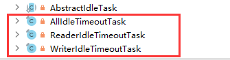

# 剖析目的

Netty 作为一个网络框架，提供了诸多功能，比如编码解码等，Netty 还提供了非常重要的一个服务-----心跳机制heartbeat。通过心跳检查对方是否有效，这是 RPC框架中是必不可少的功能。

## 源码剖析

### 说明

1） Netty提供了 IdleStateHandler ，ReadTimeoutHandler, WriteTimeoutHandler 三
个Handler检测连接的有效性，重点分析 IdleStateHandler 

2）心跳类图示


3）ReadTimeout 事件和 WriteTimeout 事件都会自动关闭连接，而且，属于异常处理，所以，这里只是介绍以下，我们重点看 IdleStateHadler。

### IdleStateHandler 分析

#### 4个属性

```Java
// 是否考虑出站时较慢的情况，默认值是 false
private final boolean observeOutput;
// 读事件空闲时间，0 则禁用事件
private final long readerIdleTimeNanos;
// 写事件空闲时间，0 则禁用事件
private final long writerIdleTimeNanos;
// 读或写事件空闲时间，0 则禁用事件
private final long allIdleTimeNanos;
```

#### handlerAdder 方法

当该handler 被添加到pipeline 中时，则调用 initialize 方法

```java
private void initialize(ChannelHandlerContext ctx) {
    switch (this.state) {
        case 1:
        case 2:
            return;
        default:
            this.state = 1;
            this.initOutputChanged(ctx);
            this.lastReadTime = this.lastWriteTime = this.ticksInNanos();
            if (this.readerIdleTimeNanos > 0L) {
                this.readerIdleTimeout = this.schedule(ctx, new ReaderIdleTimeoutTask(ctx), this.readerIdleTimeNanos, TimeUnit.NANOSECONDS);
            }

            if (this.writerIdleTimeNanos > 0L) {
                this.writerIdleTimeout = this.schedule(ctx, new WriterIdleTimeoutTask(ctx), this.writerIdleTimeNanos, TimeUnit.NANOSECONDS);
            }

            if (this.allIdleTimeNanos > 0L) {
                this.allIdleTimeout = this.schedule(ctx, new AllIdleTimeoutTask(ctx), this.allIdleTimeNanos, TimeUnit.NANOSECONDS);
            }
    }
}
```

只要给定的参数大于0，就创建一个定时任务， 每个事件都创建。同时，将state 状态设置为1，防止重复初始化。调用 initOutputChanged 方法，初始化“ 监控出站数据属性”。

#### 该类内部的3个定时任务，都是内部类



1) 这3个定时任务分别对应 读或者写事件，读事件，写事件。共有一个父类(AbstractIdleTask). 这个父类提供了一个模板方法

#### AbstractIdleTask 源码

```java
private abstract static class AbstractIdleTask implements Runnable {

    private final ChannelHandlerContext ctx;

    AbstractIdleTask(ChannelHandlerContext ctx) {
        this.ctx = ctx;
    }

    @Override
    public void run() {
        // 当通道关闭了就不执行任务了
        if (!ctx.channel().isOpen()) {
            return;
        }

        // 执行子类的run 方法
        run(ctx);
    }

    protected abstract void run(ChannelHandlerContext ctx);
}
```

#### ReaderIdleTimeoutTask 源码

**读事件 run 方法分析**

```java
private final class ReaderIdleTimeoutTask extends AbstractIdleTask {
    ReaderIdleTimeoutTask(ChannelHandlerContext ctx) {
        super(ctx);
    }

    @Override
    protected void run(ChannelHandlerContext ctx) {
        // 获取用户设置的超时时间
        long nextDelay = readerIdleTimeNanos;
        if (!reading) {
            nextDelay -= ticksInNanos() - lastReadTime;
        }

        if (nextDelay <= 0) {
            // Reader is idle - set a new timeout and notify the callback.
            // 用于取消任务 promise
            readerIdleTimeout = schedule(ctx, this, readerIdleTimeNanos, TimeUnit.NANOSECONDS);

            boolean first = firstReaderIdleEvent;
            firstReaderIdleEvent = false;

            try {
                // 再次提交任务
                IdleStateEvent event = newIdleStateEvent(IdleState.READER_IDLE, first);
                // 触发用户  handler use
                channelIdle(ctx, event);
            } catch (Throwable t) {
                ctx.fireExceptionCaught(t);
            }
        } else {
            // Read occurred before the timeout - set a new timeout with shorter delay.
            readerIdleTimeout = schedule(ctx, this, nextDelay, TimeUnit.NANOSECONDS);
        }
    }
}
```

**解读：**

1）获取用户设置的超时时间

2）如果读取操作结束了（执行了 channelReadComplete方法设置），就用当前时间减去给定时间和最后一次读操作的时间（执行了channelReadComplete方法设置），如果小于0。就触发事件。反之，继续放入队列。间隔时间是新的计算时间。

3）触发的逻辑是，首先将任务再次放到队列，时间是刚开始设置的时间，返回一个promise对象，用于做取消操作。然后，设置 first 属性为 false，表示，下一次读取不再是第一次了，这个属性在channelRead方法会被改成true。

4）创建一个 IdleStateEvent 类型的写事件对象，将此对象传递给用户的 UserEventTriggered 方法。完成触发事件的操作。

5）总的来说，每次读取操作都会记录一个时间，定时任务时间到了，会计算当前时间和最后一次读的时间的间隔，如果间隔超过了设置的时间，就触发UserEventTriggered 方法。// 前面介绍IdleStateHandler说过可以看一下

**写事件 run 方法分析**

```java
private final class WriterIdleTimeoutTask extends AbstractIdleTask {

    WriterIdleTimeoutTask(ChannelHandlerContext ctx) {
        super(ctx);
    }

    @Override
    protected void run(ChannelHandlerContext ctx) {

        long lastWriteTime = IdleStateHandler.this.lastWriteTime;
        long nextDelay = writerIdleTimeNanos - (ticksInNanos() - lastWriteTime);
        if (nextDelay <= 0) {
            // Writer is idle - set a new timeout and notify the callback.
            writerIdleTimeout = schedule(ctx, this, writerIdleTimeNanos, TimeUnit.NANOSECONDS);

            boolean first = firstWriterIdleEvent;
            firstWriterIdleEvent = false;

            try {
                if (hasOutputChanged(ctx, first)) {
                    return;
                }

                IdleStateEvent event = newIdleStateEvent(IdleState.WRITER_IDLE, first);
                channelIdle(ctx, event);
            } catch (Throwable t) {
                ctx.fireExceptionCaught(t);
            }
        } else {
            // Write occurred before the timeout - set a new timeout with shorter delay.
            writerIdleTimeout = schedule(ctx, this, nextDelay, TimeUnit.NANOSECONDS);
        }
    }
```

**解读：**

写任务的 run 代码逻辑基本和读任务的逻辑一样，唯一不同的就是有一个针对 出站较慢数据的判断 hasOutputChanged 

**读写事件 run 方法分析**

```java
private final class AllIdleTimeoutTask extends AbstractIdleTask {
    AllIdleTimeoutTask(ChannelHandlerContext ctx) {
        super(ctx);
    }

    @Override
    protected void run(ChannelHandlerContext ctx) {

        long nextDelay = allIdleTimeNanos;
        if (!reading) {
            nextDelay -= ticksInNanos() - Math.max(lastReadTime, lastWriteTime);
        }
        if (nextDelay <= 0) {
            // Both reader and writer are idle - set a new timeout and
            // notify the callback.
            allIdleTimeout = schedule(ctx, this, allIdleTimeNanos, TimeUnit.NANOSECONDS);

            boolean first = firstAllIdleEvent;
            firstAllIdleEvent = false;

            try {
                if (hasOutputChanged(ctx, first)) {
                    return;
                }

                IdleStateEvent event = newIdleStateEvent(IdleState.ALL_IDLE, first);
                channelIdle(ctx, event);
            } catch (Throwable t) {
                ctx.fireExceptionCaught(t);
            }
        } else {
            // Either read or write occurred before the timeout - set a new
            // timeout with shorter delay.
            allIdleTimeout = schedule(ctx, this, nextDelay, TimeUnit.NANOSECONDS);
        }
    }
}
```

**解读：**

1)表示这个监控着所有的事件。当读写事件发生时，都会记录。代码逻和写事件的的基本一致

2)需要大家注意的地方是
long nextDelay = allldleTimeNanos:
if(reading){
  //当前时间减去 最后一次写或读 的时间。若大于0，说明超时了
  nextDelay = ticksInNanos() - Math max(lastReadTime, lastWriteTime);

}

3)这里的时间计算是取读写事件中的最大值来的。然后像写事件一样，判断是否发生了写的慢的情况

### 小结 Netty 的心跳机制

1）IdleStateHandler 可以实现心跳功能，当服务器和客户端没有任何读写交互时，并超过了给定的时间，则会触发用户 handler 的 userEventTriggered 方法。用户可以在这个方法中尝试向对方发送信息，如果发送失败，则关闭连接。

2）IdleStateHandler 的实现基于 EventLoop 的定时任务，每次读写都会记录一个值，在定时任务运行的时候,通过计算当前时间和设置时间和上次事件发生时间的结果，来判断是否空闲。

3）内部有 3个定时任务，分别对应读事件，写事件，读写事件。通常用户监听该写事件就足够了。

4）同时，IdleStateHandler 内部也考虑了一些极端情况，客户端接收缓慢，一次接收数据的速度超过了设置的空闲时间。Netty 通过构造方法中的 observeOutput 属性来决定是否对出站缓冲区的情况进行判断。

5）如果出站缓慢，Netty 不认为这是空闲，也就不触发空闲事件。但第一次无论如何也是要触发的。因为第一次无法判断是出站缓慢还是空闲。当然，出站缓慢的话，可能造成OOM，OOM 比空闲的问题更大。

6）所以，当你的应用出现了内存溢出，OOM之类，并且写空闲极少发生(使用了observeOutput 为 true) 那么就需要往意是不是数据出站速度过慢。

7）还有一个注意的地方:就是 ReadTimeoutHandler ，它继承自 IdleStateHandler，当触发读空闲事件的时候，就触发 ctx.fireExceptionCaught 方法，并传入一个 ReadTimeoutException，然后关闭 Socket。

8）而 WriteTimeoutHandler 的实现不是基于 IdleStateHandler的，他的原理是，当调用 write 方法的时候，会创建一个定时任务，任务内容是根据传入的 promise 的完成情况来判断是否超出了写的时间。当定时任务根据指定时间开始运行，发现 promise的 isDone方法返回 false，表明还没有写完，说明超时了，则抛出异常。当 write方法完成后，会打断定时任务。


