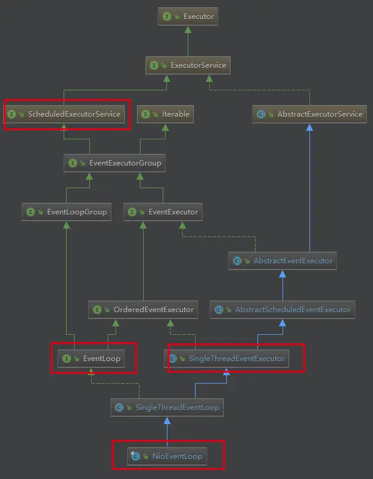

# Netty 核心组件 EventLoop 源码剖析

## 源码剖析目的

Echo第一行代码就是:EventLoopGroup bossGroup =new NioEventLoopGroup(1);

下面分析其最核心的组件 EventLoop。



说明重点:

1）ScheduledExecutorService 接口表示是一个定时任务接口，EventLoop 可以接受定时任务。

2）EventLoop 接口：Netty 接口文档说明该接口作用，一旦 Channel 注册了，就处理该Channel 对应的所有IO 操作。

3）SingleThreadEventExecutor 表示这是一个单个线程的线程池

4）EventLoop 是一个单例的线程池，里面含有一个**死循环的线程**不断的做着3件事情：监听端口，处理端口事件，处理队列事件。每个EventLoop都可以绑定多个 Channel，而每个 Channel 始终只能由一个 EventLoop 来处理

## NioEventLoop 剖析

- **Selector**

  ```Java
  public final class NioEventLoop extends SingleThreadEventLoop {
      
      ...
          
      // selector中的selectedKeys是基于数组的
      // unwrappedSelector中的selectedKeys是基于HashSet的    
      private Selector selector;
      private Selector unwrappedSelector;
      private SelectedSelectionKeySet selectedKeys;
      
      ...
  }
  ```

- **Thread与TaskQueue**

  关键代码  <font color = 'orange'>`io.netty.util.concurrent.SingleThreadEventExecutor#execute`</font>

  ```java
  public abstract class SingleThreadEventExecutor extends AbstractScheduledEventExecutor implements OrderedEventExecutor {
      // 任务队列
      private final Queue<Runnable> taskQueue;
  
      // 线程
      private volatile Thread thread;
      
      public void execute(Runnable task) {
          if (task == null) {
              throw new NullPointerException("task");
          }
  
          boolean inEventLoop = inEventLoop();
          // 添加任务，其中队列使用了 jctools 提供的 mpsc 无锁队列
          addTask(task);
          if (!inEventLoop) {
              // inEventLoop 如果为 false 表示由其它线程来调用 execute，即首次调用，这时需要向 eventLoop 提交首个任务，启动死循环，会执行到下面的 doStartThread
              startThread();
              if (isShutdown()) {
                  // 如果已经 shutdown，做拒绝逻辑，代码略...
              }
          }
  
          if (!addTaskWakesUp && wakesUpForTask(task)) {
              // 如果线程由于 IO select 阻塞了，添加的任务的线程需要负责唤醒 NioEventLoop 线程
              wakeup(inEventLoop);
          }
      }
  }
  ```

  唤醒 select 阻塞线程<font color = 'orange'>`io.netty.channel.nio.NioEventLoop#wakeup`</font>

  ```java
  @Override
  protected void wakeup(boolean inEventLoop) {
      if (!inEventLoop && wakenUp.compareAndSet(false, true)) {
          selector.wakeup();
      }
  }
  ```
  
  #### Selector的创建
  
  Selector是在NioEventLoop的构造方法中被创建的
  
  ```java
  NioEventLoop(NioEventLoopGroup parent, Executor executor, SelectorProvider selectorProvider, SelectStrategy strategy, RejectedExecutionHandler rejectedExecutionHandler, EventLoopTaskQueueFactory queueFactory) {
      
          ...
             
          // 初始化selector，初始化过程在openSelector中
          final SelectorTuple selectorTuple = openSelector();
          this.selector = selectorTuple.selector;
          this.unwrappedSelector = selectorTuple.unwrappedSelector;
  }
  
  
  private SelectorTuple openSelector() {
      final Selector unwrappedSelector;
      try {
          // 此处等同于 Selector.open()方法
          // 创建了unwrappedSelector对象
          unwrappedSelector = provider.openSelector();
      } catch (IOException e) {
          throw new ChannelException("failed to open a new selector", e);
      }
  }
  ```
  
  NioEventLoop的构造方法中，调用了`openSelector()`方法， 该方法会返回一个**SelectorTuple**对象，该方法**是创建Selector的核心方法**。`openSelector()`方法内部调用了
  
  ```java
  unwrappedSelector = provider.openSelector();
  ```
  
  获得了Selector对象`unwrappedSelector`
  
  后面会通过反射，修改 `unwrappedSelector` 中SelectedKeys的实现，然后通过`SelectedSelectionKeySetSelector`方法获得selector。**最后通过SelectorTuple的构造方法，将该Selector的值赋给SelectorTuple类中的selector与unwrappedSelector**
  
  ```java
  private static final class SelectorTuple {
      final Selector unwrappedSelector;
      final Selector selector;
  
      SelectorTuple(Selector unwrappedSelector) {
          this.unwrappedSelector = unwrappedSelector;
          this.selector = unwrappedSelector;
      }
  
      /**
      * 一般调用的是这个构造方法
      */
      SelectorTuple(Selector unwrappedSelector, Selector selector) {
          this.unwrappedSelector = unwrappedSelector;
          this.selector = selector;
      }
  }
  ```
  
  **再通过NioEventLoop的构造方法，将SelectorTuple中的Selector赋值给NioEventLoop中的Selector**
  
  #### 两个Selector
  
  NioEventLoop中有selector和unwrappedSelector两个Selector，**它们的区别主要在于SelectedKeys的数据结构**
  
  - selector中的SelectedKeys是**基于数组**的
  - unwrappedSelector中的是**基于HashSet**的
  
  这样做的主要目的是，**数组的遍历效率要高于HashSet**
  
  ```java
  private SelectorTuple openSelector() {
      final Selector unwrappedSelector;
      try {
          unwrappedSelector = provider.openSelector();
      } catch (IOException e) {
          throw new ChannelException("failed to open a new selector", e);
      }
  
      ...
      
      // 获得基于数组的selectedKeySet实现
      final SelectedSelectionKeySet selectedKeySet = new SelectedSelectionKeySet();
  
  
      Object maybeException = AccessController.doPrivileged(new PrivilegedAction<Object>() {
          @Override
          public Object run() {
              try {
                  // 通过反射拿到unwrappedSelector中的selectedKeys属性
                  Field selectedKeysField = selectorImplClass.getDeclaredField("selectedKeys");
                  Field publicSelectedKeysField = selectorImplClass.getDeclaredField("publicSelectedKeys");
  
                  ...
  	
                  // 暴力反射，修改私有属性
                  Throwable cause = ReflectionUtil.trySetAccessible(selectedKeysField, true);
                  if (cause != null) {
                      return cause;
                  }
                  cause = ReflectionUtil.trySetAccessible(publicSelectedKeysField, true);
                  if (cause != null) {
                      return cause;
                  }
  
                  // 替换为基于数组的selectedKeys实现
                  selectedKeysField.set(unwrappedSelector, selectedKeySet);
                  publicSelectedKeysField.set(unwrappedSelector, selectedKeySet);
                  return null;
              } catch (NoSuchFieldException e) {
                  return e;
              } catch (IllegalAccessException e) {
                  return e;
              }
          }
      });
  
      selectedKeys = selectedKeySet;
      
      // 调用构造函数，创建unwrappedSelector与selector
      return new SelectorTuple(unwrappedSelector,
                               new SelectedSelectionKeySetSelector(unwrappedSelector, selectedKeySet));
  }
  ```
  
  获得数组实现SelectedKeys的Selector的原理是反射，主要步骤如下
  
  - 获得**基于数组**的selectedKeySet实现
  
    ```java
    // 获得基于数组的selectedKeySet实现
    final SelectedSelectionKeySet selectedKeySet = new SelectedSelectionKeySet();
    
    SelectedSelectionKeySet() {
    	keys = new SelectionKey[1024];
    }
    ```
  
  - 通过**反射**拿到unwrappedSelector中的SelectedKeySet并将其**替换为selectedKeySet**
  
  - **通过Selector的构造方法**获得selector
  
    ```java
    new SelectedSelectionKeySetSelector(unwrappedSelector, selectedKeySet)
    ```
  
  - **通过SelectorTuple的构造方法**获得拥有两种Selector的SelectorTuple对象，并返回给NioEventLoop
  
    ```java
    // 调用构造函数，创建unwrappedSelector与selector
    return new SelectorTuple(unwrappedSelector, new SelectedSelectionKeySetSelector(unwrappedSelector, selectedKeySet));
    ```
  
  ### NIO线程启动时机
  
  #### 启动
  
  NioEventLoop中的线程，**在首次执行任务时，才会被创建，且只会被创建一次**
  
  **测试代码**
  
  ```java
  public class TestNioEventLoop {
      public static void main(String[] args) {
          EventLoop eventLoop = new NioEventLoopGroup().next();
          // 使用NioEventLoop执行任务
          eventLoop.execute(()->{
              System.out.println("hello");
          });
      }
  }
  ```
  
  进入`execute`执行任务 <font color = 'orange'> `io.netty.util.concurrent.SingleThreadEventExecutor#execute0 `</font>
  
  ```java
  private void execute0(@Schedule Runnable task) {
      // 检测传入的任务是否为空，为空会抛出NullPointerException
      ObjectUtil.checkNotNull(task, "task");
      // 执行任务
      // 此处判断了任务是否为懒加载任务，wakesUpForTask的返回值只会为true
      execute(task, !(task instanceof LazyRunnable) && wakesUpForTask(task));
  }
  ```
  
  进入上述代码的 execute 方法  <font color = 'orange'> `io.netty.util.concurrent.SingleThreadEventExecutor#execute(java.lang.Runnable, boolean)`</font>
  
  ```java
  private void execute(Runnable task, boolean immediate) {
      // 判断当前线程是否为NIO线程
      // 判断方法为 return thread == this.thread;
      // this.thread即为NIO线程，首次执行任务时，其为null
      boolean inEventLoop = inEventLoop();
      
      // 向任务队列taskQueue中添加任务
      addTask(task);
      
      // 当前线程不是NIO线程，则进入if语句
      if (!inEventLoop) {
          // 启动NIO线程的核心方法
          startThread();
          
          ...
          
      }
  	
      // 有任务需要被执行时，唤醒阻塞的NIO线程
      if (!addTaskWakesUp && immediate) {
          wakeup(inEventLoop);
      }
  }
  ```
  
  唤醒 select 阻塞线程<font color = 'orange'> `io.netty.channel.nio.NioEventLoop#wakeup`</font>
  
  ```java
  @Override
  protected void wakeup(boolean inEventLoop) {
      if (!inEventLoop && wakenUp.compareAndSet(false, true)) {
          selector.wakeup();
      }
  }
  ```
  
  进入`startThread`方法<font color = 'orange'> `io.netty.util.concurrent.SingleThreadEventExecutor#startThread`</font>
  
  ```java
  private void startThread() {
      // 查看NIO线程状态是否为未启动
      // 该if代码块只会执行一次
      // state一开始的值就是ST_NOT_STARTED
      // private volatile int state = ST_NOT_STARTED;
      if (state == ST_NOT_STARTED) {
          // 通过原子属性更新器将状态更新为启动（ST_STARTED）
          if (STATE_UPDATER.compareAndSet(this, ST_NOT_STARTED, ST_STARTED)) {
              boolean success = false;
              try {
                  // 执行启动线程
                  doStartThread();
                  success = true;
              } finally {
                  if (!success) {
                      STATE_UPDATER.compareAndSet(this, ST_STARTED, ST_NOT_STARTED);
                  }
              }
          }
      }
  }
  ```
  
  **进入`doStartThread`，真正创建NIO线程并执行任务** <font color = 'orange'>`io.netty.util.concurrent.SingleThreadEventExecutor#doStartThread`</font>
  
  ```java
  private void doStartThread() {
      assert thread == null;
      // 创建NIO线程并执行任务
      executor.execute(new Runnable() {
          @Override
          public void run() {
              // thread即为NIO线程
              thread = Thread.currentThread();
              if (interrupted) {
                  thread.interrupt();
              }
  
              boolean success = false;
              updateLastExecutionTime();
              try {
                  // 执行内部run方法
                  SingleThreadEventExecutor.this.run();
                  success = true;
              } 
              
              ...
      });
  }
  ```
  
  通过`SingleThreadEventExecutor.this.run()`执行传入的任务（task）
  
  该run方法是**NioEvnetLoop的run方法**
  
  <font color = 'orange'>`io.netty.channel.nio.NioEventLoop#run`</font>
  
  ```java
  @Override
  protected void run() {
      int selectCnt = 0;
      // 死循环，不断地从任务队列中获取各种任务来执行
      for (;;) {	
          // 执行各种任务
          try {
              int strategy;
              try {
                  strategy = selectStrategy.calculateStrategy(selectNowSupplier, hasTasks());
                  switch (strategy) {
                      case SelectStrategy.CONTINUE:
                          continue;
  
                      case SelectStrategy.BUSY_WAIT:
                          // fall-through to SELECT since the busy-wait is not supported with NIO
  
                      case SelectStrategy.SELECT:
                          long curDeadlineNanos = nextScheduledTaskDeadlineNanos();
                          if (curDeadlineNanos == -1L) {
                              curDeadlineNanos = NONE; // nothing on the calendar
                          }
                          nextWakeupNanos.set(curDeadlineNanos);
                          try {
                              if (!hasTasks()) {
                                  strategy = select(curDeadlineNanos);
                              }
                          } finally {
                              // This update is just to help block unnecessary selector wakeups
                              // so use of lazySet is ok (no race condition)
                              nextWakeupNanos.lazySet(AWAKE);
                          }
                          // fall through
                      default:
                  }
              }
          }
      }
  }
  ```
  
  
  
  
  
  
  
  
  
  
  
  
  
  


### NioEventLoop 的使用 -- execute 方法

```java
public void execute(Runnable task) {
    execute0(task);
}

private void execute0(@Schedule Runnable task) {
    ObjectUtil.checkNotNull(task, "task");
    execute(task, wakesUpForTask(task));
}

private void execute(Runnable task, boolean immediate) {
    // 判断当前线程是不是Nio线程
    boolean inEventLoop = inEventLoop();
    // 添加任务，其中队列使用了 jctools 提供的 mpsc 无锁队列
    addTask(task);
    if (!inEventLoop) {
        // inEventLoop 如果为 false 表示新开一个线程作为Nio线程，即首次调用，这时需要向 eventLoop 提交首个任务，启动死循环，会执行到下面的 doStartThread
        startThread();
        if (isShutdown()) {
            boolean reject = false;
            try {
                if (removeTask(task)) {
                    reject = true;
                }
            } catch (UnsupportedOperationException e) {

            }
            if (reject) {
                reject();
            }
        }
    }

    if (!addTaskWakesUp && immediate) {
        // 如果线程由于 IO select 阻塞了，添加的任务的线程需要负责唤醒 NioEventLoop 线程
        wakeup(inEventLoop);
    }
}
```

**代码说明：**

1）首先直接添加到任务队列中去，然后判断该 EventLoop 的线程是否是当前线程，如果不是，则尝试启动线程(但由于线程是单个的，因此只能启动一次)

2）如果线程已经停止，则移除任务，成功后执行拒绝策略，则执行拒绝策略，默认是抛出异常。

3）如果 addTaskWakesUp是 false，并且任务不是 NonWakeupRunnable 类型的，就尝试唤醒 selector。这个时候，阻塞在 selector 的线程就会立即返回

### NIOEventLoop 的父类 SingleThreadEventExecutor 的 startThread 方法

当执行 execute 方法的时候,如果当前线程不是 EventLoop 所属线程,则尝试启动线程,也就是 startThread 方法 

```java
private void startThread() {
    if (state == ST_NOT_STARTED) {
        if (STATE_UPDATER.compareAndSet(this, ST_NOT_STARTED, ST_STARTED)) {
            boolean success = false;
            try {
                doStartThread();
                success = true;
            } finally {
                if (!success) {
                    STATE_UPDATER.compareAndSet(this, ST_STARTED, ST_NOT_STARTED);
                }
            }
        }
    }
}
```

该方法首先判断是否启动过了，保证 EventLoop 只有一个线程，如果没有启动过，则尝试使用 cas 将 state 状态改为 ST_STARTED，也就是已启动。然后调用 doStartThread 方法。如果失败，则进行回滚

**doStartThread 代码**

```java
private void doStartThread() {
    assert thread == null;
    executor.execute(new Runnable() {
        @Override
        public void run() {
            // 将当前线程赋值给 thread
            thread = Thread.currentThread();
            if (interrupted) {
                thread.interrupt();
            }

            boolean success = false;
            updateLastExecutionTime();
            try {
                // 这里是重点，调用 NioEventLoop 的run方法，进入死循环
                SingleThreadEventExecutor.this.run();
                success = true;
            } catch (Throwable t) {
                logger.warn("Unexpected exception from an event executor: ", t);
            } finally {
                for (;;) {
                    int oldState = state;
                    if (oldState >= ST_SHUTTING_DOWN || STATE_UPDATER.compareAndSet(
                        SingleThreadEventExecutor.this, oldState, ST_SHUTTING_DOWN)) {
                        break;
                    }
                }

                // Check if confirmShutdown() was called at the end of the loop.
                if (success && gracefulShutdownStartTime == 0) {
                    if (logger.isErrorEnabled()) {
                        logger.error("Buggy " + EventExecutor.class.getSimpleName() + " implementation; " +
                                     SingleThreadEventExecutor.class.getSimpleName() + ".confirmShutdown() must " +
                                     "be called before run() implementation terminates.");
                    }
                }

                try {
                    // Run all remaining tasks and shutdown hooks. At this point the event loop
                    // is in ST_SHUTTING_DOWN state still accepting tasks which is needed for
                    // graceful shutdown with quietPeriod.
                    for (;;) {
                        if (confirmShutdown()) {
                            break;
                        }
                    }

                    // Now we want to make sure no more tasks can be added from this point. This is
                    // achieved by switching the state. Any new tasks beyond this point will be rejected.
                    for (;;) {
                        int oldState = state;
                        if (oldState >= ST_SHUTDOWN || STATE_UPDATER.compareAndSet(
                            SingleThreadEventExecutor.this, oldState, ST_SHUTDOWN)) {
                            break;
                        }
                    }

                    // We have the final set of tasks in the queue now, no more can be added, run all remaining.
                    // No need to loop here, this is the final pass.
                    confirmShutdown();
                } finally {
                    try {
                        cleanup();
                    } finally {
                        // Lets remove all FastThreadLocals for the Thread as we are about to terminate and notify
                        // the future. The user may block on the future and once it unblocks the JVM may terminate
                        // and start unloading classes.
                        // See https://github.com/netty/netty/issues/6596.
                        FastThreadLocal.removeAll();

                        STATE_UPDATER.set(SingleThreadEventExecutor.this, ST_TERMINATED);
                        threadLock.countDown();
                        int numUserTasks = drainTasks();
                        if (numUserTasks > 0 && logger.isWarnEnabled()) {
                            logger.warn("An event executor terminated with " +
                                        "non-empty task queue (" + numUserTasks + ')');
                        }
                        terminationFuture.setSuccess(null);
                    }
                }
            }
        }
    });
}
```

1)首先调用 executor 的 execute 方法，这个 cxecutor 就是在创建 EventLoopGroup 的时候创建的ThreadPerTaskExecutor类。该execute 方法会将 Runnable 包装成Netty的 FastThreadLocalThread。

2)任务中，首先判断线程中断状态，然后设置最后一次的执行时间。

3)执行当前 NioEventLoop 的 run 方法，注意:这个方法是个死循环。是整个 EventLoop 的核心

4)在 finally 块中，使用 CAS 不断修改 state状态，改成 ST_SHUTTING_DOWN。也就是当线程 Loop 结束的时候。关闭线程。最后还要死循环确认是否关闭，否则不会break。然后，执行 cleanup 操作，更新状态为 ST_TERMINATED，并释放当前线程锁。如果任务队列不是空，则打印队列中还有多少个未完成的任务。并回调 temminationFuture 方法

6)其实最核心的就是 EventLoop 自身的 run 方法。再继续深入 run 方法

### EventLoop 中的 Loop 是靠 run 实现的，分析 run方法

由 doStartThread方法  中的 SingleThreadEventExecutor.this.run() 方法触发进入

```java
protected void run() {
    int selectCnt = 0;
    for (;;) {
        try {
            int strategy;
            try {
                strategy = selectStrategy.calculateStrategy(selectNowSupplier, hasTasks());
                switch (strategy) {
                    case SelectStrategy.CONTINUE:
                        continue;

                    case SelectStrategy.BUSY_WAIT:
                        // fall-through to SELECT since the busy-wait is not supported with NIO

                    case SelectStrategy.SELECT:
                        long curDeadlineNanos = nextScheduledTaskDeadlineNanos();
                        if (curDeadlineNanos == -1L) {
                            curDeadlineNanos = NONE; // nothing on the calendar
                        }
                        nextWakeupNanos.set(curDeadlineNanos);
                        try {
                            if (!hasTasks()) {
                                strategy = select(curDeadlineNanos);
                            }
                        } finally {
                            // This update is just to help block unnecessary selector wakeups
                            // so use of lazySet is ok (no race condition)
                            nextWakeupNanos.lazySet(AWAKE);
                        }
                        // fall through
                    default:
                }
            } catch (IOException e) {
                // If we receive an IOException here its because the Selector is messed up. Let's rebuild
                // the selector and retry. https://github.com/netty/netty/issues/8566
                rebuildSelector0();
                selectCnt = 0;
                handleLoopException(e);
                continue;
            }

            selectCnt++;
            cancelledKeys = 0;
            needsToSelectAgain = false;
            final int ioRatio = this.ioRatio;
            boolean ranTasks;
            if (ioRatio == 100) {
                try {
                    if (strategy > 0) {
                        processSelectedKeys();
                    }
                } finally {
                    // Ensure we always run tasks.
                    ranTasks = runAllTasks();
                }
            } else if (strategy > 0) {
                final long ioStartTime = System.nanoTime();
                try {
                    processSelectedKeys();
                } finally {
                    // Ensure we always run tasks.
                    final long ioTime = System.nanoTime() - ioStartTime;
                    ranTasks = runAllTasks(ioTime * (100 - ioRatio) / ioRatio);
                }
            } else {
                ranTasks = runAllTasks(0); // This will run the minimum number of tasks
            }

            if (ranTasks || strategy > 0) {
                if (selectCnt > MIN_PREMATURE_SELECTOR_RETURNS && logger.isDebugEnabled()) {
                    logger.debug("Selector.select() returned prematurely {} times in a row for Selector {}.",
                                 selectCnt - 1, selector);
                }
                selectCnt = 0;
            } else if (unexpectedSelectorWakeup(selectCnt)) { // Unexpected wakeup (unusual case)
                selectCnt = 0;
            }
        } catch (CancelledKeyException e) {
            // Harmless exception - log anyway
            if (logger.isDebugEnabled()) {
                logger.debug(CancelledKeyException.class.getSimpleName() + " raised by a Selector {} - JDK bug?",
                             selector, e);
            }
        } catch (Error e) {
            throw e;
        } catch (Throwable t) {
            handleLoopException(t);
        } finally {
            // Always handle shutdown even if the loop processing threw an exception.
            try {
                if (isShuttingDown()) {
                    closeAll();
                    if (confirmShutdown()) {
                        return;
                    }
                }
            } catch (Error e) {
                throw e;
            } catch (Throwable t) {
                handleLoopException(t);
            }
        }
    }
}
```

**说明：**

从上面的步骤可以看出，整个 nn 方法做了3件事情:

​	select 获取感兴趣的事件。

​	processSelectedKeys 处理事件

​	runAllTasks 执行队列中的任务。


