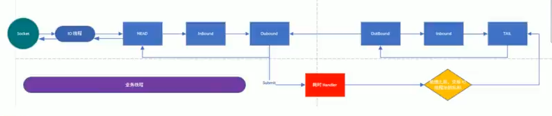

# Handler 中加入线程池和 Context 中添加线程池的源码剖析

1)在 Netty 中做耗时的，不可预料的操作，比如数据库，网络请求，会严重影响Netty 对 Socket 的处理速度。而解决方法就是将耗时任务添加到异步线程池中。但就添加线程池这步操作来讲，可以有2种方式，而且这2种方式实现的区别也非常大。

2)处理耗时业务的第一种方式 --- handler 中加入线程池

3)处理耗时业务的第二种方式 --- Context 中添加线程池

### handler 中加入线程池

```java
package com.luojia.netty.nettypro.netty.simple;

import io.netty.buffer.ByteBuf;
import io.netty.buffer.Unpooled;
import io.netty.channel.Channel;
import io.netty.channel.ChannelHandlerContext;
import io.netty.channel.ChannelInboundHandlerAdapter;
import io.netty.channel.ChannelPipeline;
import io.netty.util.CharsetUtil;
import io.netty.util.concurrent.DefaultEventExecutor;
import io.netty.util.concurrent.DefaultEventExecutorGroup;
import io.netty.util.concurrent.EventExecutor;
import io.netty.util.concurrent.EventExecutorGroup;

import java.util.concurrent.Callable;
import java.util.concurrent.TimeUnit;

/**
 * 我们自定义一个Handler 需要继承netty 规定好的某个HandlerAdapter(规范)
 * 这时我们自定义一个Handler，才能称为一个handler
 */
public class NettyServerHandler extends ChannelInboundHandlerAdapter {

    static final EventExecutorGroup group = new DefaultEventExecutorGroup(16);

    /**
     * 读取数据（这里读取客户端发送的消息）
     * @param ctx 上下文对象，含有管道pipeline， 通道Channel，地址
     * @param msg 客户端发送的数据，默认Object
     * @throws Exception
     */
    @Override
    public void channelRead(ChannelHandlerContext ctx, Object msg) throws Exception {
        // 1.正常读写
        System.out.println("服务器读取线程 " + Thread.currentThread().getName());
        System.out.println("server ctx = " + ctx);
        System.out.println("看看channel 和 pipeline 的关系");
        Channel channel = ctx.channel();
        ChannelPipeline pipeline = ctx.pipeline(); // 本质是一个双向链表，出栈和入栈

        // 将 msg 转成一个ByteBuf
        // ByteBuf 是Netty 提供的，不是NIO的 ByteBuffer
        ByteBuf buf = (ByteBuf) msg;
        System.out.println("客户端发送消息是：" + buf.toString(CharsetUtil.UTF_8));
        System.out.println("客户端地址：" + ctx.channel().remoteAddress());
        // 主线程是：nioEventLoopGroup-3-1
        System.out.println("主线程是：" + Thread.currentThread().getName());

        // 2. 如果这里是一个非常耗时的业务 -> 异步执行 -> 提交该channel对应的 NIOEventLoop 的 taskQueue中
        /**
         * TimeUnit.SECONDS.sleep(10);
         * ctx.writeAndFlush(Unpooled.copiedBuffer("hello 这是一个耗时的操作", CharsetUtil.UTF_8));
         */
        // 解决方案1，用户程序自定义的普通任务
        ctx.channel().eventLoop().execute(new Runnable() {
            @Override
            public void run() {
                try {
                    // 模拟超时操作
                    TimeUnit.SECONDS.sleep(3);
                    // 异步线程1是：nioEventLoopGroup-3-1
                    System.out.println("异步线程1是：" + Thread.currentThread().getName());
                    ctx.writeAndFlush(Unpooled.copiedBuffer("hello 这是一个耗时的操作", CharsetUtil.UTF_8));
                } catch (InterruptedException e) {
                    System.out.println("发生异常" + e.getMessage());
                }
            }
        });

        ctx.channel().eventLoop().execute(() -> {
            try {
                // 模拟超时操作
                TimeUnit.SECONDS.sleep(2);
                // 异步线程2是：nioEventLoopGroup-3-1
                System.out.println("异步线程2是：" + Thread.currentThread().getName());
                ctx.writeAndFlush(Unpooled.copiedBuffer("hello 这是另一个耗时的操作", CharsetUtil.UTF_8));
            } catch (InterruptedException e) {
                System.out.println("发生异常" + e.getMessage());
            }
        });

        // 用户自定义定时任务 -> 该任务是提交到 scheduleTaskQueue 中
        ctx.channel().eventLoop().schedule(() -> {
            try {
                // 模拟超时操作
                TimeUnit.SECONDS.sleep(5);
                // 异步线程3是：nioEventLoopGroup-3-1
                System.out.println("异步线程3是：" + Thread.currentThread().getName());
                ctx.writeAndFlush(Unpooled.copiedBuffer("hello 这是 scheduleTaskQueue 的操作", CharsetUtil.UTF_8));
            } catch (InterruptedException e) {
                System.out.println("发生异常" + e.getMessage());
            }
        }, 5, TimeUnit.SECONDS);

        /**
         * ctx.channel().eventLoop() 后面异步线程和主线程都是同一个
         * 所以 虽然前面有异步处理，但实际都是一个线程，只是把这三个请求放入到了异步请求中
         * 这三个请求实际在执行时是顺序执行的
         * group.submit 其实是真的启动了一个新的异步线程
         * 这四个异步请求根据目前处理时长，输出顺序为异步线程1、异步线程2、异步线程4、异步线程3
         */
        group.submit(new Callable<Object>() {
            @Override
            public Object call() throws Exception {
                // 模拟超时操作
                TimeUnit.SECONDS.sleep(6);
                // 异步线程4 Callable是：defaultEventExecutorGroup-4-1
                System.out.println("异步线程4 Callable是：" + Thread.currentThread().getName());
                ctx.writeAndFlush(Unpooled.copiedBuffer("hello 这是一个耗时的操作", CharsetUtil.UTF_8));
                return null;
            }
        });

        // group 是真正的异步线程池，不会排队执行
        group.submit(new Callable<Object>() {
            @Override
            public Object call() throws Exception {
                // 模拟超时操作
                TimeUnit.SECONDS.sleep(6);
                // 异步线程4 Callable是：defaultEventExecutorGroup-4-1
                System.out.println("异步线程5 Callable是：" + Thread.currentThread().getName());
                ctx.writeAndFlush(Unpooled.copiedBuffer("hello 这是一个耗时的操作", CharsetUtil.UTF_8));
                return null;
            }
        });
        System.out.println("go on ...");
    }

    /**
     * 数据读取完后，执行的操作
     * @param ctx
     * @throws Exception
     */
    @Override
    public void channelReadComplete(ChannelHandlerContext ctx) throws Exception {
        // writeAndFlush 是 write和flush
        // 将数据写入缓存并刷新，一般我们需要对发送的数据进行编码
        ctx.writeAndFlush(Unpooled.copiedBuffer("hello, 客户端", CharsetUtil.UTF_8));
    }

    // 处理异常，需要关闭通道
    @Override
    public void exceptionCaught(ChannelHandlerContext ctx, Throwable cause) throws Exception {
        ctx.close();
    }
}
```



1)解释一下上图，当 IO 线程轮询到一个 socket 事件，然后，IO 线程开始处理，当走到耗时 handler 的时候，将耗时任务交给业务线程池。

2)当耗时任务执行完毕再执行 pipeline write 方法的时候，(代码中使用的是 context 的 write 方法,上图画的是执行 pipeline 力法，是一个意思)会将这个任务交给 IO 线程

### 处理耗时业务的第二种方式Context中添加线程池

在添加 pipeline 中的 handler 时候，添加一个线程池

```java
package com.luojia.netty.nettypro.netty.simple;

import io.netty.bootstrap.ServerBootstrap;
import io.netty.channel.ChannelFuture;
import io.netty.channel.ChannelInitializer;
import io.netty.channel.ChannelOption;
import io.netty.channel.nio.NioEventLoopGroup;
import io.netty.channel.socket.SocketChannel;
import io.netty.channel.socket.nio.NioServerSocketChannel;
import io.netty.util.concurrent.DefaultEventExecutorGroup;
import io.netty.util.concurrent.EventExecutorGroup;

public class NettyServer {

    static final EventExecutorGroup group = new DefaultEventExecutorGroup(2);
    public static void main(String[] args) throws InterruptedException {

        NioEventLoopGroup bossGroup = new NioEventLoopGroup(1);
        NioEventLoopGroup workerGroup = new NioEventLoopGroup(2);

        // 创建服务器端的启动对象，配置参数
        ServerBootstrap bootstrap = new ServerBootstrap();

        try {
            // 使用链式编程来进行设置
            bootstrap.group(bossGroup, workerGroup) // 设置两个线程组
                    .channel(NioServerSocketChannel.class) // 使用 NioServerSocketChannel 作为服务器的通道实现
                    .childHandler(new ChannelInitializer<SocketChannel>() {
                        // 给pipeline 设置处理器
                        @Override
                        protected void initChannel(SocketChannel ch) throws Exception {
                            // 如果在 addLast 添加 handler，前面有指定的线程池，那么该handler 会优先加入到该线程池中
                            ch.pipeline().addLast(group, new NettyServerHandler());
                        }
                    }); // 给我们的workGroup 的EventLoop 对应的管道设置处理器

            System.out.println("... 服务器 is ready...");
            // 绑定一个端口并且同步，生成一个 ChannelFuture 对象
            ChannelFuture cf = bootstrap.bind(6668).sync();

            // 对关闭通道进行监听
            cf.channel().closeFuture().sync();
        } finally {
            bossGroup.shutdownGracefully();
            workerGroup.shutdownGracefully();
        }
    }
}
```

说明：

1）handler 中的代码就可以使用普通的方式来处理耗时业务。

2）当我们在调用 addLast 方法添加线程池后，handler 将优先使用这个线程池，如果不添加，将使用 IO 线程

4）当我们在handler中，使用

```java
ctx.channel().eventLoop().execute(new Runnable() {
     @Override
     public void run() {
     }
 }
                                   
ctx.channel().eventLoop().schedule(() -> {
    // do something
}, 5, TimeUnit.SECONDS);
```

这两种方式是，会用到 IO 线程


