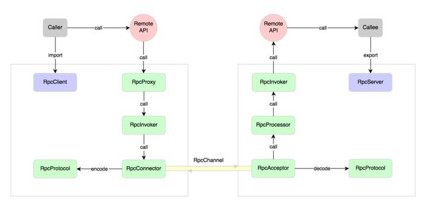
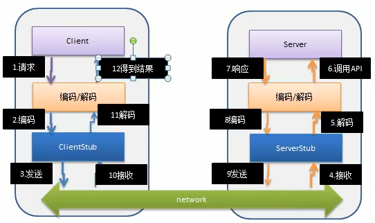

### RPC基本介绍

1)RPC(Remote Procedure Call) --- 远程过程调用，是一个计算机通信协议。该协议允许运行于一台计算机的程序调用另一台计算机的子程序而程序员无需额外地为这个交互作用编程

2)两个或多个应用程序都分布在不同的服务器上，它们之间的调用都像是本地方法调用一样(如图)

3)常见的 RPC 框架有: 比较知名的如阿里的Dubbo、google的gRPC、Go语言的rpcx、Apache的thrift，Spring 旗下的 Spring Cloud.

### RPC调用流程图

**术语说明**：在RPC中，Client 叫服务消费者，Server 叫服务提供者

**RPC调用流程图说明**

1）服务消费方(client)以本地调用方式调用服务

2）client stub 接收到调用后负责将方法、参数等封装成能够进行网络传输的消息体

3）client stub 将消息进行编码并发送到服务端

4）server stub 收到消息后进行解码

5）server stub 根据解码结果调用本地的服务

6）本地服务执行并将结果返回给 server stub

7）server stub 将返回导入结果进行编码并发送至消费方

8）client stub 接收到消息并进行解码

9）服务消费方(client)得到结果

小结：RPC 的目标就是将 2-8这些步骤都封装起来，用户无需关心这些细节，可以像调用本地方法一样即可完成远程服务调用。

